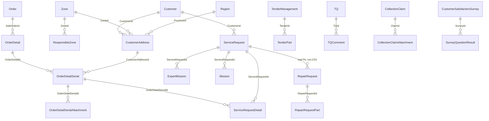

# After-Sales Service System — Overview & Shared Conventions

> Read this file first. It applies to every numbered spec in this folder. Queried **2026-09-15** from `TotalSystem` (`172.20.40.27`) via SqlClient (`sa2`). Raw extracts: `_extract/*.csv`.

## 1. Purpose

Migration of the HTS menu **«سیستم خدمات پس از فروش»** (`SystemType.Sale = 14`, `Gnr_System.System_Name = Sale`) into HavayarApp as normal Panel CRUD / cartable / report pages.

Source: `D:\Projects\Hts Project\Hts Project\HtsProject\Presentation\WebApplication\HtsWebApplication\Areas\SaleSystem\` (and CRM after-sale survey pages under `Areas\CrmSystem`). Live menu: `_SaleSystemMenu.cshtml`.

Target: HavayarApp Panel. Follow `havayar-add-new-page.mdc`, `havayar-js-jquery-conventions.mdc`, `havayar-appcontroller-navigation.mdc`, `havayar-reports.mdc`, `havayar-dataprofile-savedquery.mdc`.

**Do not restore** the deleted incomplete `ServiceRequest`/`Rpr` port that talked to `HtsDbContext` from Panel controllers. Rebuild from HTS + TotalSystem.

## 2. Schema / module naming

| Concern | HTS prefix | Havayar schema | Namespace | Route | Views |
|---|---|---|---|---|---|
| Order, CSS, tender, webshop, collection, TQ, agency, OAG work report | `Sale_*` | **`Sale`** | `Entities.App.Sale` | `Panel/Sale/[controller]` | `Views/Panel/Sale/{Entity}/` |
| Repairs | `Rpr_*` / `Sale_Rpr_*` | **`Rpr`** | `Entities.App.Rpr` | `Panel/Rpr/[controller]` | `Views/Panel/Rpr/{Entity}/` |
| Zone + after-sale surveys | `Crm_Zone`, `Crm_CustomerSatisfactionSurvey` | **`Crm`** | `Entities.App.Crm` | `Panel/Crm/[controller]` | `Views/Panel/Crm/{Entity}/` |
| Customer site address | `Crm_Customer_Address` | **`SLS`** (next to existing `SLS.Customer`) | `Entities.App.SLS` | `Panel/SLS/[controller]` | `Views/Panel/SLS/{Entity}/` |

Enums: `Entities/App/Sale/Enums/`, `Entities/App/Rpr/Enums/`, `Entities/App/Crm/Enums/`, `Entities/App/SLS/Enums/`.

All new entities inherit `BaseEntity`. **Do not** port HTS `CreatedUserId` overwrite-on-update. Add **`HtsId`** (`long`, default `0`) + unique filtered index `WHERE [HtsId] <> CAST(0 AS bigint)` (BPM pattern) on every synced row.

Logic lives in controllers + `WebApp/Actions/{Module}/...Action.cs`. **No new service layer.**

## 3. Scope vs out of scope

### In scope (spec files)

| Part | Spec | What |
|---|---|---|
| 0 | this file | Lookups, System 14 reports, permission map, empty menu |
| 1 | `01-SaleMasters-OrderSerialAddressZone.md` | Field gaps on existing Order/Detail/Serial, `CustomerAddress`, `Zone`, حواله / پیوست سریال / مانیتورینگ |
| 2 | `02-SaleSubmenu-Price-WebShop.md` | `PriceConfig`, `PartPrice`, `WebShopOrder`, `WebShopPartForSale` |
| 3 | `03-Tenders.md` | `TenderManagement` + approve queue (not EPMS) |
| 4 | `04-CssMasters.md` | Order point, allowed guarantee, zone responsible, periodic service items, part-to-product, request types |
| 5 | `05-ServiceRequest.md` | Header + detail + expert mission + cartable + print |
| 6 | `06-ServiceRequestOperations.md` | Mission, work report, mission salary, parts (Inv adapter) |
| 7 | `07-CollectionClaim.md` | وصول مطالبات |
| 8 | `08-Repairs.md` | Rpr estimated cost, repair request, contractor order, delay reports |
| 9 | `09-TechnicalQuery.md` | TQ + approve cartable |
| 10 | `10-Agency.md` | Part cardex + agency cartable (Inv adapter) |
| 11 | `11-OilGas-Equipment-MobileUsers.md` | OAG work report, equipment monitoring, mobile app users (no API) |
| 12 | `12-Reports-and-Dashboard.md` | `Gnr_Report` System 14 + fixed menu reports |
| 13 | `13-CrmAfterSaleSurvey.md` | After-sale / CNG / compressed-air service surveys |
| 14 | `14-Cutover-Permissions-Jobs.md` | Full RoleAccess, menu, jobs, HTS cutover checklist |

### Explicitly out of scope

| Item | Why |
|---|---|
| Mobile AfterSale API (`HtsWebApiService/Areas/AfterSaleModule`) | User decision |
| HTS commented menu: گارانتی مجاز سفارش ساخت (`Sale_AllowedGuarantee` page 173), هدر سرویس دوره‌ای (`Sale_ProductActivity` page 211) | Commented in `_SaleSystemMenu.cshtml` |
| Exhibition (`Sale_Exhibition` 516 / 517) | In `Gnr_Page` System 14 but **not** in the live menu |
| Return remittance pages 134/135 | Not in live menu |
| Full CRM (profile, complaint `1007`/`2256`/`1691`, صدای مشتری) | Only after-sale surveys |
| `ServiceSystem` (vehicle/assets) | Different HTS system |
| Full warehouse documents in Havayar | `Inv` has Part only; parts/cardex use a thin TotalSystem adapter until Inv documents exist |
| Recreating `Sale.Order` / `OrderDetail` / `OrderDetailSerial` / `SLS.Customer` / `ProductionOrder` | Already exist — **gap fields + pages only** |
| EPMS tender | Different product from `Sale_TenderManagement` |
| `Sale_RepairsType` as an enum | **9564** live rows — product catalog entity in part 8, not a C# enum |
| Dedicated `Data/Services/Sale/*Service.cs` | Project convention |

## 4. Already in Havayar (do not duplicate)

| Havayar | HTS | Notes |
|---|---|---|
| `Sale.Order` | `Sale_Order` | Add `HtsId` + missing FKs (stock, operator, confirmer, base voucher type). `HamkaranId` ≈ `VchHdrId` |
| `Sale.OrderDetail` | `Sale_OrderDetail` | Add `HtsId`, `IsPackage`, `NotComplete`, `HamkaranInvVchItmId` |
| `Sale.OrderDetailSerial` | `Sale_OrderDetail_Serial` | Add `HtsId` + remaining serial fields. **Fix** `CustomerAddressId` — today it is typed as `Customer`; it must become `SLS.CustomerAddress` |
| `Sale.ProjectUtilizedMaterial` | `Sale_ProjectUtilizedMaterial` | Entity exists; add `HtsId` + List/Edit + sync |
| `Sale.Branch` | `Sale_Branch` | Exists; add `HtsId` if syncing |
| `SLS.Customer` | `Crm_Customer` | `Customer.HamkaranId` = Rahkaran `CustomerID`. HTS `Crm_Customer.Customer_ID` maps via `ManCompany_FK` → `Gnr.Party.HamkaranId` → `SLS.Customer.PartyId`. Add optional `HtsId` on Customer only if that join is unreliable |
| `Gnr.Region` | `Gnr_Province` / city | Province on address → `Region` (`Type` = province) |
| `Inv.Part` | `Inv_Part` | `Part.HtsId` already used elsewhere |
| `Sale.ProductionOrder*` | Production system | **Do not touch** unless an FK is required |

Live TotalSystem counts (2026-09-15): `Sale_Order` 140 564, `Sale_OrderDetail` 356 758, `Sale_OrderDetail_Serial` 20 559, `Crm_Customer_Address` 13 659, `Crm_Zone` 72.

## 5. Target ERD (high level)



## 6. Legacy menu → Panel menu

Top group **سیستم خدمات پس از فروش** (`system.SystemMenu.Name = AfterSalesServiceSystem`). Paths **lowercase**.

```
سیستم خدمات پس از فروش
├── مدیریت مناقصات
│   ├── مناقصه                         /panel/sale/tendermanagement/list
│   └── بررسی/تایید                    /panel/sale/tendermanagement/approvequeue
├── فروش
│   ├── تنظیمات فروش                   /panel/sale/priceconfig/list
│   ├── حواله‌های فروش                 /panel/sale/orderdetail/list          (exists)
│   ├── قیمت مصوب                      /panel/sale/partprice/list
│   ├── سفارشات فروشگاه                /panel/sale/webshoporder/list
│   └── محصولات فروشگاه                /panel/sale/webshoppartforsale/list
├── خدمات پس از فروش
│   ├── نقطه سفارش                     /panel/sale/orderpoint/list
│   ├── وصول مطالبات                   /panel/sale/collectionclaim/list
│   ├── اقلام مصرفی پروژه              /panel/sale/projectutilizedmaterial/list
│   ├── حق ماموریت                     /panel/sale/personelmissionsalary/list
│   ├── مدیریت درخواست پشتیبانی        /panel/sale/servicerequest/list
│   ├── اعزام کارشناس                  /panel/sale/servicerequest/sendexpert
│   ├── درخواست مشتریان                /panel/sale/customerrequest/list
│   ├── مانیتورینگ فروش                /panel/sale/orderdetailserial/monitoring
│   ├── کارتابل مسئول منطقه            /panel/sale/servicerequest/zonecartable
│   ├── پیوست سریال                    /panel/sale/orderdetailserial/list
│   ├── گارانتی مجاز مشتریان           /panel/sale/customerallowedguarantee/list
│   ├── مسئولین مناطق                  /panel/sale/responsiblezone/list
│   ├── وصول مسئولین                   /panel/sale/responsiblezonereceipt/list
│   ├── جزئیات سرویس دوره‌ای           /panel/sale/productactivityitem/list
│   ├── اختصاص قطعه به محصول           /panel/sale/orderdetailproduct/list
│   └── سایت‌های مشتریان               /panel/sls/customeraddress/list
├── گزارشات                            (part 12 — Data Profile / Apex / Stimulsoft)
├── تعمیرات
│   ├── هزینه تقریبی                   /panel/rpr/estimatedcost/list
│   ├── درخواست تعمیر                  /panel/rpr/repairrequest/list
│   ├── سفارش پیمانکار                 /panel/rpr/contractororder/list
│   ├── تاخیرات جدولی                  /panel/rpr/repairrequestdelay/list
│   └── تاخیرات نموداری                /panel/rpr/repairrequestdelay/chart
├── پرسش فنی
│   ├── TQ                             /panel/sale/technicalquery/list
│   └── بررسی/تایید                    /panel/sale/technicalquery/approvequeue
├── نمایندگی
│   ├── کاردکس                         /panel/sale/agencypartcardex/list
│   └── کارتابل                        /panel/sale/agencycartable/list
├── نفت و گاز
│   └── گزارش کار                      /panel/sale/oilandgasworkreport/list
├── مدیریت کاربران موبایل              /panel/sale/mobileappuser/list
├── مانیتورینگ تجهیزات                 /panel/sale/equipmentmonitoring/list
└── رضایت‌سنجی (CRM, same top group)
    ├── بعد از فروش (هوای فشرده)       /panel/crm/customersatisfactionsurvey/list?type=1008
    ├── بعد از فروش (CNG)              /panel/crm/customersatisfactionsurvey/list?type=1942
    ├── خدمات هوای فشرده               /panel/crm/customersatisfactionsurvey/list?type=2332
    └── گزارش‌ها                       Data Profile + Apex + Stimulsoft
```

Phase 0 seeds the **group folders only** (no leaf paths). Later parts append leaves. Seed: `Data/Scripts/Seed_AfterSalesServiceSystem_Menu.sql`.

Oil & Gas work report is `Gnr_Page` **562** / `System_FK = 36` (not 14) but it is rendered inside `_SaleSystemMenu.cshtml` — keep it in this menu.

## 7. Canonical TotalSystem queries

```sql
-- System 14
SELECT System_ID, System_Name, System_Title
FROM Gnr_System WHERE System_ID = 14;
-- 14 | Sale | سیستم خدمات پس از فروش

-- Catalog reports (column is System_FK, not System_ID)
SELECT Report_ID, Report_Name, Report_Title, Report_Order, Report_Parent_FK
FROM Gnr_Report
WHERE System_FK = 14
ORDER BY Report_Order, Report_ID;

-- Pages
SELECT Page_ID, PageTitle, PageName, Report_FK
FROM Gnr_Page
WHERE System_FK = 14
ORDER BY Page_ID;

-- Lookups (keep Lookup_ID as C# enum value)
SELECT glt.LookupType_ID, glt.LookupType_Title_Fa,
       gl.Lookup_ID, RTRIM(gl.Lookup_Title_Fa) AS Lookup_Title_Fa, gl.LookupCode
FROM Gnr_Lookup gl
JOIN Gnr_LookupType glt ON gl.LookupType_FK = glt.LookupType_ID
WHERE gl.LookupType_FK IN (
  9,30,40,42,55,56,62,67,69,71,75,88,94,95,96,132,142,146,
  174,175,200,201,213,221,246,292,303,305,306,333,340,341,364,368,369,371
)
ORDER BY glt.LookupType_ID, gl.Lookup_ID;

-- CRM survey TypeId (Gnr_Lookup type 156 «نوع سوال CRM»)
SELECT Lookup_ID, Lookup_Title_Fa, LookupType_FK
FROM Gnr_Lookup
WHERE Lookup_ID IN (1007, 1008, 1942, 2332, 1691, 2256);

SELECT TypeId, COUNT(*) Cnt
FROM Crm_CustomerSatisfactionSurvey
GROUP BY TypeId ORDER BY TypeId;

-- Request types (table, not lookup)
SELECT RequestType_ID, RequestType_Title FROM Sale_RequestType ORDER BY RequestType_ID;
```

## 8. `Gnr_Report` System 14 (32 rows) — implementation kind

Tabular → Data Profile. Charts → ApexCharts. Print → Stimulsoft. See `havayar-reports.mdc`.

| Report_ID | Report_Name | Title | Kind |
|---|---|---|---|
| 6 | Sale_Mission | گزارش حق ماموریت پرسنل | Data Profile |
| 7 | Sale_RequestPart | گزارش قطعات مصرفی در محصولات | Data Profile |
| 8 | Sale_CustomerLastBuy | گزارش مشتریان فعال و غیر فعال | Data Profile |
| 9 | Sale_Report | گزارش کار ماموریت ها | Data Profile |
| 10 | Sale_ServiceRequestPart | گزارش درخواست های پشتیبانی | Data Profile |
| 11 | Sale_Order | گزارش حواله های فروش | Data Profile (existing OrderDetail profiles) |
| 12 | Sale_Customer | گزارش مدیریت مشتریان | Data Profile |
| 13 | Sale_CustomerDebit | گزارش مانده حساب مشتری | Data Profile (also menu page 310) |
| 14 | Sale_CustomerDebit_Detail | گزارش ریز مانده حساب مشتری | Data Profile (child of 13) |
| 16 | Sale_Crm | گزارش جامع CRM | **out of scope** (full CRM) |
| 18 | Sale_AllowedGuarantee | گزارش گارانتی مجاز در سفارش ساخت | skip (commented menu) |
| 19 | Sale_PeridateEndGarantee | گزارش پیش بینی اتمام گارانتی | Data Profile |
| 20 | Sale_MaxCostOfPartPerCustomer | بیشترین هزینه گارانتی قطعات | Data Profile |
| 21 | Sale_MaxCosOfMission | بیشترین هزینه ماموریت | Data Profile |
| 22 | Sale_MaxCostOfPart | بیشترین هزینه قطعات | Data Profile |
| 23 | Sale_ProductActivity | گزارش سرویس دوره ای | Data Profile |
| 24 | Sale_DifferentFactPrice | گزارش فاکتور فروش | Data Profile |
| 25 | Sale_TotalReport | گزارش جامع فروش | Data Profile (menu page 329) |
| 26 | Sale_SaleOrdersByDateFilter | حواله ها در بازه زمانی | Data Profile |
| 27 | Sale_GeneralGuaranteeReport | گزارش جامع گارانتی | Data Profile |
| 28 | Sale_GeneralWarrantyReport | گزارش جامع وارانتی | Data Profile |
| 29 | Sale_FactorAggregationAndReturns | سرجمع فاکتور و برگشت | Data Profile |
| 30 | Sale_AgencyProductRequest | کالا-نمایندگان | Data Profile |
| 31 | Sale_SalePrice | قیمت فروش کالا | Data Profile (ShowPrice) |
| 32 | Sale_RepairsReport | گزارش شناسنامه تعمیر | Data Profile |
| 33 | Sale_EstimateCost | گزارش هزینه تقریبی | Data Profile |
| 34 | Sale_ContractorsStatus | وضعیت پیمانکاران | Data Profile |
| 35 | Sale_SalesAndReturnSalesFactors | فروش و برگشت از فروش | Data Profile |
| 36 | Sale_DifferentFactPrice_Rahkaran | فاکتور فروش راهکاران | Data Profile |
| 37 | Sale_FactorAggregationAndReturns_Rahkaran | سرجمع فاکتور راهکاران | Data Profile |
| 38 | Sale_ConsumableItemsReport | اقلام مصرفی شناسنامه تعمیر | Data Profile |
| 39 | Sale_ManHourReport | نفرساعت تعمیرات | Data Profile |

Fixed menu reports (not only `Gnr_Report`): استطاعت (237), وصول فیش (303), مانده بدهی (310), جامع فروش (329), داشبورد فروش (358) = **ApexCharts**. Printable service-request paper / repair label = **Stimulsoft**.

Pages with empty `PageTitle` and a `Report_FK` (188–200, 207, 208, 217, 258, 295, 321, 322, 324, 413, 539, 544) are the permission shells for catalog reports — they are **not** extra CRUD screens.

## 9. Shared enum conversion (`Lookup_ID` is the C# value)

HavayarApp does **not** use `Gnr_Lookup` for these. Each type → C# enum with `[Display(Name = "...")]` = trimmed `Lookup_Title_Fa`.

Confirmed 2026-09-15. Full row dump: `_extract/lookups.csv`.

### 9.1 Used from part 1

| Type | Title | Enum | Values |
|---|---|---|---|
| 62 | گرید مشتری | `CustomerGradeEnum` | `239` A, `240` B, `242` C, `243` تعطیل |
| *(table)* | `Crm_ZoneType` | `ZoneTypeEnum` | `1` هوای فشرده, `2` CNG, `3` فرآیندی |

Existing order enums already keep Lookup_IDs: `SaleOrderStatusEnum` (92–95, 2546–2548, 2713), `SaleOrderTypeEnum` (97–99, 3172–3174), `SaleOrderPayMethodEnum` (111, 113, 114).

### 9.2 Part 2+ (create when that part is implemented)

| Type | Title | Enum | Sample / complete set |
|---|---|---|---|
| 67 | نوع قطعه (وب‌شاپ) | `WebShopPartTypeEnum` | 277 روغن … 283 کیت |
| 9 | واحد قیمت | `PriceUnitEnum` | 36 ریال, 37 دلار, 38 درهم, 39 یورو, 475 یوان |
| 88 | ارزش مالی پروژه | `ProjectFinancialValueEnum` | 406 کوچک, 407 متوسط, 408 بزرگ |
| 75 | اولویت | `TenderPriorityEnum` | 320–324 |
| 142 | نتیجه نهایی | `TenderFinalResultEnum` | 876–887, 906, 1073, 1116, 1117, 2257 |
| 303 | وضعیت مناقصات خدمات پس از فروش | `TenderStatusEnum` | 892, 895, 898–900, 904, 905, 2308–2322, 2324, 2565. UI hides 904/905 on create (HTS). Prefer **2308–2322** as the live set; keep 892/895/898–900 as legacy aliases |
| 292 | نمایندگی های فروش مناقصه | `TenderSalesAgentEnum` | 2213–2225, 2745 |
| 305 | نوع ضمانت نامه | `WarrantyTypeEnum` | 2328 بانکی, 2329 چک |
| 306 | وضعیت ضمانت نامه | `WarrantyStatusEnum` | 2330 ابطال, 2331 تمدید |
| 333 | موضوع اصلی شکایت (علت شکست مناقصه) | `TenderFailureCauseEnum` | 2551–2564 (UI hides 2560–2564) |
| 146 | واحد های فروش | `SalesDepartmentEnum` | 924–934, 1072, 1451, 1670, 2091, 2538, 2819 |
| 55 | نوع فعالیت | `ProductActivityTypeEnum` | 203 تعویض قطعه, 204 سرویس, 229 اورهال |
| 56 | مجری فعالیت | `ActivityExecutorEnum` | 205 هوایار, 206 کارفرما, 207 هوایار-کارفرما |
| 40 | نتیجه ماموریت | `MissionResultEnum` | 140 انجام شده, 141 انجام نشده, 142 انجام شده با نقص |
| 42 | نوع خدمت | `ServiceKindEnum` | 148 مصرف پروژه, 149 گارانتی, 150 وارانتی, 151 گارانتی مشروط, 157 تخفیفی, 185 مصرف پروژه گارانتی |
| 132 | نوع داغی | `DamagedPartConditionEnum` | 785 سالم, 786 معیوب |
| 200 | نوع درخواست (مشتری) | `CustomerRequestKindEnum` | 1330–1332, 1557–1560, 1777, 2702, 2761–2763 |
| 201 | وضعیت درخواست مشتری | `CustomerRequestStatusEnum` | 1381–1386 |
| 94 | نوع واریزی | `SettlementTypeEnum` | 477 چک, 478 کارت به کارت, 479 واریز به حساب |
| 95 | درخواست کننده (نمایندگی) | `AgencyRequesterEnum` | 480 مشتری, 481 نمایندگی |
| 96 | مجری (نمایندگی) | `AgencyPresenterEnum` | 482 هوایار, 483 نمایندگی |
| 69 | مقصد پس از تعمیر | `RepairDestinationEnum` | 293–296, 2700 |
| 71 | در حال تعمیر | `RepairStatusEnum` | 301, 302, 304, 305, 1535–1537, 1774, 1871, 2092, 2093, 2236, 2413, 3169, 3175, 3176 |
| 221 | شرح کار | `RepairJobDescriptionEnum` | 1547–1551, 1922 |
| 246 | وضعیت سفارش به پیمانکار | `ContractorOrderStatusEnum` | 1864–1868 |
| 364 | پکت های مانیتورینگ | `EquipmentPacketTypeEnum` | 2967–2988 (use LookupCode as protocol id) |
| 368 | OAG وضعیت پروژه | `OagProjectStatusEnum` | 3039–3043 |
| 369 | OAG نوع خدمت | `OagServiceTypeEnum` | 3044–3049 |
| 371 | OAG نوع پیوست | `OagAttachmentTypeEnum` | 3052–3055 |
| 30 | نوع اشخاص | already close to CRM customer type 106/107 — use if survey needs حقیقی/حقوقی | |
| 213 | وضعیت فعلی نظرسنجی | `SurveyStatusEnum` | 1452–1455 |
| 340 | نحوه آشنایی | `FamiliarizationWayEnum` | 2714–2722 |
| 341 | دلیل خرید | `PurchaseReasonEnum` | 2723–2735 |
| 174 | موضوع شکایت | **too large for an enum dump here** (~150+ rows) — entity or generated enum in part 13 | |
| 175 | نقص فنی کمپرسور | `CompressorFailureEnum` | 1157–1161, 1329, 1402, 1473, 1493, 1563, 1776, 1817–1819, 1845 |

`Sale_RequestType` (13 rows, ids 1–13) and `Sale_ActionType` (1 تعویض قطعه, 2 سرویس) become **entities or small enums** in part 4 — they are not `Gnr_Lookup`. Prefer enum (`ServiceRequestTypeEnum` / `MissionActionTypeEnum`) because the id set is closed.

## 10. CRM survey `TypeId` (confirmed)

| Lookup_ID | LookupType 156 title | Live rows | In this project? |
|---|---|---|---|
| 1007 | فروش (هوای فشرده) | 940 | **No** (general CRM) |
| 1008 | بعد از فروش (هوای فشرده) | 556 | **Yes** |
| 1942 | بعد از فروش (CNG) | 14 | **Yes** (HTS `CngCustomerSatisfactionSurveyAfterSaleController` still filters `TypeId==1008` — treat as a legacy quirk; new system uses **1942** for CNG after-sale) |
| 2332 | رضایت سنجی از خدمات | 124 | **Yes** (compressed-air services; CNG services menu reuses the same HTS page with a `pageTypeId`) |
| 1691 / 2256 | شکایت / رضایت از روند شکایت | — | **No** |

## 11. Permission mapping (HTS `Gnr_Page` + `PermissionType` → Havayar)

Standard CRUD → `[ActionDisplayName(..., List/Create/Update/Delete/FetchData/Save)]`.

**Special `PermissionType` values must be their own actions** (`ActionAccessItemType.Custom`), never a single checkbox:

| PermissionType | Title | HTS pages | Havayar action (name) |
|---|---|---|---|
| 8 | مشاهده قیمت | OrderDetail 132, monitoring 151, several reports | `ShowPrice` on the List/Fetch of that controller |
| 39 | درخواست کالا | ServiceRequest manage 137 | `RequestPart` |
| 40 | ماموریت | 137 | `Mission` |
| 41 | گزارش کار | 137 | `WorkReport` |
| 42 | ارسال پیوست | 137 | `SendAttachment` |
| 53 | تایید صنایع | monitoring 151 | `IndustrialConfirm` |
| 70 | دسترسی خدمات (AfterSaleAccess) | RepairRequest 270 | `AfterSaleAccess` |
| 71 | دسترسی تعمیرات (RepairsAccess) | RepairRequest 270, Inspection 284 | `RepairsAccess` |
| 110 | دسترسی فروش به گزارشات کار | ServiceRequest 136 | `SaleAccessToWorkReports` |
| 151 | دسترسی های اضافی مناقصات | Tender 493 | `TendersExtraOperations` |
| 152 | مناقصات هوای فشرده | 493 | `TendersCompressedAir` |
| 153 | مناقصات نفت و گاز | 493 | `TendersOilGas` |
| 154 | تایید نهایی مناقصات | 493, 503 | `TendersManagerApprove` |
| 157 | مدیر سوال فنی | TQ manage 505 | `TqManager` |
| 158 | کارشناس فنی سوال فنی | 505 | `TqTechnicalTechnician` |
| 167 | اقدام کننده (پرسش فنی) | 505 | `TqActorTechnician` |
| 163 | دسترسی نمایندگی | Agency cardex 518 | `AgencyPermission` |
| 174 | ارسال لینک رضایت سنجی | ServiceRequest manage 137 | `SendingSatisfactionLink` |
| 188 | مانیتورینگ — ثبت ساعت خروج | 151 | `MonitoringExitAccess` |
| 189 | مانیتورینگ — انبار | 151 | `MonitoringInventoryAccess` |

Restart WebApp after new controllers so `EndpointService.GetAllEndpoints` picks them up. Tick Role boxes on `/panel/Role/List`. Full RoleAccess seed is part 14; each part lists the roles it needs.

## 12. Customer / user / unit / part maps (same as Training/BPM)

```sql
-- Users
SELECT CAST(ou.User_ID AS BIGINT) OldUserId, MIN(nu.Id) NewUserId
FROM [TMS].[TotalSystem].[dbo].[Gnr_User] ou
INNER JOIN [system].[User] nu
  ON nu.Username = ou.Username
  OR (NULLIF(LTRIM(RTRIM(ou.ActiveDirectoryUsername)), N'') IS NOT NULL
      AND nu.Username = LTRIM(RTRIM(ou.ActiveDirectoryUsername)))
GROUP BY CAST(ou.User_ID AS BIGINT);

-- Org units
SELECT CAST(o.OrgUnit_ID AS BIGINT) OldOrgUnitId, MIN(n.Id) NewOrgUnitId
FROM [TMS].[TotalSystem].[dbo].[HRM_OrgUnit] o
INNER JOIN [Hrm].[OrgUnit] n ON n.HamkaranUnitId = o.Hamkaran_Unit_FK
WHERE o.Hamkaran_Unit_FK IS NOT NULL AND o.Hamkaran_Unit_FK <> 0
GROUP BY CAST(o.OrgUnit_ID AS BIGINT);

-- Parts
-- Inv.Part.HtsId = Inv_Part.Part_ID  (already used in other sync scripts)

-- Customers (HTS Crm_Customer → SLS.Customer)
-- Crm_Customer.ManCompany_FK → Gnr.Party.HamkaranId → SLS.Customer.PartyId
-- Fallback: SLS.Customer.Code = Crm_Customer.Customer_Code
```

Unmapped FKs: log and skip the row (or insert with NULL if the FK is optional). Do not invent customers.

## 13. Implementation conventions (every part)

- Controller shape = `CourseBankController` / `ProductionOrderItemController`: `Save`/`Add`/`Update`/`Delete`/`Edit`/`New`/`List`/`FetchData`/`ExportToExcel`.
- List view = `<datatableprofile entity-Type="typeof(Entity)">`.
- Edit view = `form-action-buttons` + `form-group-inline` + `data-bind` / `asp-for` + `data-invalidmessagespan`.
- FK pickers = `Html.EntitySelector<T>(...)`.
- Child rows = own controller + `ListByParentId` opened with `appController.addPage(...)`.
- Dates = Shamsi/Miladi pair (`data-bind` Shamsi, `value` Miladi).
- Files = `FileEntity`, never `byte[]`.
- Navigation = `appController.addPage` / `refreshCurrentPage` — never `location.href`.
- Page scripts = inline `<script>` with tab-scoped `$$`.
- Sync = `Data/Scripts/Sync{Name}FromTotalSystem.sql`, idempotent `MERGE` on `HtsId`, linked server `[TMS]`.
- Inventory documents (service-request parts, agency cardex): **thin adapter** (background job or shared helper talking to TotalSystem), **not** raw SQL inside Panel controllers. Documented in part 6 / 10.

## 14. Suggested order

`00` (this file + empty menu) → `01` (address/zone/serial gaps — **required before ServiceRequest**) → `02` (independent) and `03` (independent) in parallel with `04` (CSS masters, FK for part 5) → `05` → `06` → `07` → `08` → `09`/`10` → `11` → `12` → `13` → `14`.

Do **not** start part 5 before 1–4.

## 15. Definition of done (each part)

- Every HTS form/grid field (except old audit) is on the Panel or listed as a conscious drop.
- Workflow (status, cartable, special button) has an equivalent action.
- Page + special `PermissionType`s are `[ActionDisplayName]` actions.
- Sync script is idempotent on `HtsId`; a sample row checked against HTS.
- UI is Panel standard — not a Kendo/DevExpress copy.
