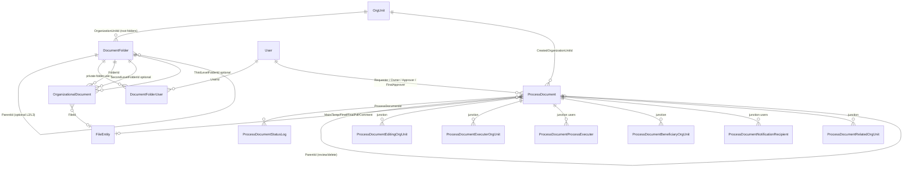

# BPM / Organizational Document System — Overview & Shared Conventions

> Read this file first. It applies to every other spec file in this folder. Each numbered spec file (`01-...` … `08-...`) is otherwise self-contained, but assumes the schema codes, enum tables, naming bans, and conventions defined here.
>
> Confirmed against TotalSystem (`172.20.40.27 / TotalSystem`) and HTS source on **2026-09-14**. Lookup labels/codes below are the live `Gnr_Lookup` / `Gnr_LookupType` rows. Process-document **status** labels come from table `dbo.Bpm_DocumentStatus`, **not** from the inverted comments in `Hts.Core.Enums.BpmDocumentStatus`.

## 1. Purpose

Migration spec set for bringing the legacy HTS menu **"سیستم مدیریت اسناد"** (`DocumentsManagementSystem` in `_DocumentsModuleMenu.cshtml`) into HavayarApp as normal Panel CRUD + cartable pages.

This is **not** engineering EDMS/PLM. HavayarApp already has `Entities.App.Edms` (project, VPIS, transmittal, engineering cartable). That module stays untouched. New process-document types **must not** be named `Edms.Document` or live in schema `Edms`.

Source system: `D:\Projects\Hts Project\Hts Project\HtsProject\` — mainly:

- Org archive: `Areas\SharedSystem\Controllers\ArchiveModule\Document*.cs` + `Gnr_Document*`
- Process docs: `Areas\SharedSystem\Controllers\BpmModule\Bpm*Document*.cs` + `Bpm_Document*`
- Numbering / files / email: `Hts.EntityServices\Common\Shared\BpmDocumentService.cs`, `BpmDocumentDetailService.cs`

Target system: `D:\Projects\Havayar\HavayarApp\` (ASP.NET Core MVC, EF Core Code-First, jQuery/Bootstrap Panel). Follow workspace rules `havayar-add-new-page.mdc` and `havayar-js-jquery-conventions.mdc` — Entity → Controller (logic in the controller, **no** dedicated service layer) → Views → `[ActionDisplayName]` / Role → Menu.

## 2. Schema / module naming

Two schemas, matching the HTS table prefixes:

| Concern | HTS | Havayar schema | C# namespace | Controller route | Views |
|---|---|---|---|---|---|
| Org folders + org files | `Gnr_Document*` | **`Gnr`** | `Entities.App.Gnr` | `Panel/Gnr/[controller]` | `WebApp/Views/Panel/Gnr/{Entity}/` |
| Process documents + status log | `Bpm_Document*` | **`Bpm`** | `Entities.App.Bpm` | `Panel/Bpm/[controller]` | `WebApp/Views/Panel/Bpm/{Entity}/` |

Enums: `Entities/App/Gnr/Enums/` and `Entities/App/Bpm/Enums/`.

**Forbidden names:** `Edms.Document`, `Bpm.Document`, a generic `Document` entity under `Edms`. Use **`ProcessDocument`** / **`ProcessDocumentStatusLog`** for process docs and **`OrganizationalDocument`** / **`DocumentFolder`** for the org archive.

All entities inherit `Entities.Base.BaseEntity` (`Id`, audit, `IsActive`). Do **not** port HTS `CreatedUserId` / `CreatedDateInText` overwrite-on-update. Add **`HtsId`** (`long`) on every row that is synced from TotalSystem.

## 3. Scope

### In scope (one spec file each)

| Legacy | New | Spec |
|---|---|---|
| `Gnr_Document1stLevel` (+ 2nd/3rd tables, menus commented out) | `Gnr.DocumentFolder` + optional child folders | `01-DocumentFolder.md` |
| `Gnr_Document` | `Gnr.OrganizationalDocument` | `02-OrganizationalDocument.md` |
| `Bpm_Document` + lookups 229–234 + `Bpm_DocumentStatus` + CSV multi-selects | `Bpm.ProcessDocument` + enums + junction tables + `ProcessDocumentStatusLog` | `03-ProcessDocument-Entity-and-Enums.md` |
| `BpmDocumentController` / `_BpmDocument.cshtml` | Request List/Edit + requester cartable | `04-ProcessDocument-Request.md` |
| `BpmManageDocumentController` / `_BpmManageDocument.cshtml` + `BpmDocumentDetailService` | Manage page + status machine | `05-ProcessDocument-Manage-and-Workflow.md` |
| `LoadReportPage` / `GetReportGridData` / `_BpmDocumentReport.cshtml` | Published list | `06-ProcessDocument-PublishedList.md` |
| `GetDocumentNumber`, file folders, emails, `Bpm_LastAnnouncementNumber` | EntityAction numbering, `FileEntity`, `NotifitactionBuilder` + `EmailJob` | `07-Numbering-Files-Notifications.md` |
| Menu, `PermissionType` 128/129/143, groups 353/354/355/418, sync | Roles, menu paths, TotalSystem sync script | `08-Permissions-Menu-DataSync.md` |

Live row counts (TotalSystem, 2026-09-14): `Gnr_Document1stLevel` 65, `Gnr_Document2ndLevel` 3, `Gnr_Document3rdLevel` 1, `Gnr_Document` 428, `Bpm_Document` 1178, `Bpm_DocumentDetail` 3643. About **983 / 1178 (83%)** process docs are `LastStatusId = 18` (Notified); the rest are still in circulation and must keep working after sync.

### Explicitly out of scope

| Item | Why |
|---|---|
| `Entities.App.Edms` / engineering DCC / VPIS / transmittal | Different product; user decision. Do not reuse those types. |
| `Qa_CorrectiveActionActions` navigation on `Bpm_Document` | QA corrective-action module is not in Havayar yet. Do not add an FK. |
| Separate Panel menu for Document2ndLevel / Document3rdLevel | HTS menu entries are commented out (`_DocumentsModuleMenu.cshtml`). Keep the hierarchy in the data model; no extra menu items. |
| Porting SQL triggers `UpdateBpmDocumentLastStatus` / `UpdateBpmDocumentTrigger` | Same behaviour via `WebApp/Actions/Bpm/...Action.cs` (EntityAction). No SQL trigger in Havayar. |
| Dedicated `Data/Services/Bpm/*Service.cs` | Project convention: logic in controllers + EntityAction. |
| `PermissionType.Bpm_PrivateDocumentPermission = 130` | Present on the HTS enum; **not referenced** by BPM/archive controllers or views. Do not invent a Havayar role for it. |
| Kendo grids, Session-stored upload lists, CSV user/unit ids | Replaced by `datatableprofile`, `FileEntity`, junction tables. |

## 4. Entity relationship diagram (target)



## 5. Legacy menu → new Panel menu

HTS live menu (`_DocumentsModuleMenu.cshtml`):

```
سیستم مدیریت اسناد
├── اسناد سازمانی
│   ├── پوشه سطح مدرک          (SystemPage.Gnr_Document1stLevel = 316)
│   └── اسناد                  (SystemPage.Gnr_Document = 319)
└── اسناد فرآیندی
    ├── درخواست ایجاد/تغییر     (SystemPage.Bpm_Document = 446)
    ├── مدیریت درخواست‌ها       (SystemPage.Bpm_ManageDocuments = 447)
    └── لیست اسناد فرآیندی      (SystemPage.Bpm_DocumentReport = 450)
```

`Gnr_Document2ndLevel = 317` and `Gnr_Document3rdLevel = 318` exist as pages but the menu items are commented out.

New lowercase Panel paths (wired in `08-Permissions-Menu-DataSync.md`):

- `/panel/gnr/documentfolder/list`
- `/panel/gnr/organizationaldocument/list`
- `/panel/bpm/processdocument/list` — requester cartable
- `/panel/bpm/processdocument/manage` — supervisor/expert/approver cartable
- `/panel/bpm/processdocument/published` — notified list

## 6. Shared enum conversion (HTS Lookup_ID is the C# value)

HavayarApp does **not** use `Gnr_Lookup` for these. Each type becomes a C# enum with `[Display(Name = "...")]` set to the Persian `Lookup_Title_Fa` (trimmed). **Keep the numeric `Lookup_ID`.**

Confirmed 2026-09-14 from `TotalSystem.dbo.Gnr_Lookup` ⨝ `Gnr_LookupType` (53 rows for types 229–234).

### 6.1 Request type — LookupType 229 `Bpm_RequestType` / «نوع درخواست»

Enum: `ProcessDocumentRequestTypeEnum`

| Lookup_ID | Display | Notes |
|---|---|---|
| 1719 | ایجاد | Auto-number on insert (see `07`) |
| 1720 | حذف | `ParentId` required; **no** new number; on notify, previous same-number rows `IsDeprecate` |
| 1721 | بازنگری | `ParentId` required; number copied from parent; UI sets `Revision = parent.Revision + 1` |
| 1722 | مکانیزاسیون فرآیند | 2 live rows; document type not required on request form |
| 1723 | تغییر فرآیند مکانیزه | **0 live rows**; still an enum member; same UI rules as 1722 |

Live `Bpm_Document.RequestTypeId`: 1719=860, 1721=232, 1720=84, 1722=2, 1723=0.

On **ایجاد (1719)** the HTS request UI **hides** document types `1727` (BPM), `1730` (QM), `1731` (QP) from the dropdown (`_BpmDocument.cshtml`). Port that filter.

### 6.2 Document type — LookupType 230 `Bpm_DocumentType` / «نوع سند»

Enum: `ProcessDocumentTypeEnum`. Member **name** = `LookupCode` when the code is a valid C# identifier; otherwise a readable name. Numbering uses `LookupCode` (see `07`).

| Lookup_ID | LookupCode | Display |
|---|---|---|
| 1724 | R | آیین نامه |
| 1725 | CL | طبقه بندی فرآیند |
| 1726 | FL | فلوچارت فرآیند |
| 1727 | BPM | نقشه فرآیندی |
| 1728 | PI | شناسنامه فرآیند |
| 1729 | IN | شناسنامه شاخص |
| 1730 | QM | نظامنامه کیفیت |
| 1731 | QP | خط مشی کیفیت |
| 1732 | P | روش اجرایی |
| 1733 | W | دستورالعمل کاری |
| 1734 | WT | دستورالعمل فنی |
| 1735 | C | بخشنامه |
| 1793 | F | فرم |
| 1794 | M | ماتریس |
| 1823 | T | جدول |
| 1824 | CO | کمیته کارگروه |
| 1832 | WM | نظامنامه گارانتی |
| 2566 | HI | نمودار سلسله مراتبی |
| 2995 | ST | سند استراتژی |

HTS `GetDocumentNumber` comments mention `1736 OC` (ساختار سازمانی) — **that Lookup_ID does not exist** in type 230. Do not add it.

Auto-number on create applies only to **R / P / W / WT / C / F / M / T** (`1724, 1732, 1733, 1734, 1735, 1793, 1794, 1823`) and **CL** (`1725`). Other types get an empty number unless a supervisor types one (see `07`).

### 6.3 Access level — LookupType 231 `Bpm_PermissionType` / «سطح دسترسی سند»

Enum: `ProcessDocumentAccessLevelEnum` (HTS name `BpmDocumentPermissionType`)

| Lookup_ID | Display | HTS enum name |
|---|---|---|
| 1737 | محرمانه | Secret |
| 1738 | محدود | Limit |
| 1739 | عمومی | Public |

Live counts: 1739=1111, 1738=64, 1737=3.

Published-list visibility (HTS `GetReportGridData` non-admin path — **this** is the business rule, not the buggy client `any()` in `_BpmDocumentReport.cshtml`):

- **عمومی:** any user who can open the published page
- **محدود:** creator **or** current user's org unit is in executer units
- **محرمانه:** creator **or** current user is in notification recipients
- Always: `LastStatus = Notified`, `RequestType ≠ حذف (1720)`, `IsDeprecate = false` (non-admin / non-ShowAll — see `06` for the admin/ShowAll split)

### 6.4 Source — LookupType 232 `Bpm_RequestSource` / «ورودی سند»

Enum: `ProcessDocumentSourceEnum`

| Lookup_ID | Display |
|---|---|
| 1740 | شکایات مشتری |
| 1741 | جلسات بهبود فرآیند |
| 1742 | عدم انطباق ممیزی داخلی/ شخص ثالث |
| 1743 | پیشنهاد بهبود |
| 1744 | پروژه بهبود/ استراتژیک |
| 1745 | تجربه مصوب |
| 1746 | سایر |
| 1915 | عارضه / مشکل فرآیندی |
| 2253 | جلسات بازنگری مدیریت |

(`1915` has a trailing space in `Lookup_Title_Fa`; trim it in `[Display]`.)

### 6.5 Priority — LookupType 233 `Bpm_RequestPrority` / «فوریت درخواست»

Enum: `ProcessDocumentPriorityEnum`

| Lookup_ID | Display |
|---|---|
| 1747 | آنی/ بحرانی |
| 1748 | نرمال |
| 1749 | فوری |

### 6.6 Process set — LookupType 234 `Bpm_ProcessType` / «نوع مجموعه فرآیندی»

Enum: `ProcessDocumentProcessSetEnum`. Numbering for CL uses `LookupCode`.

| Lookup_ID | LookupCode | Display |
|---|---|---|
| 1750 | *(empty)* | مدیریت استراتژیک |
| 1751 | MS | بازاریابی و فروش محصولات و خدمات (MS) |
| 1752 | PM | مدیریت پروژه (PM) |
| 1753 | DE | طراحی، مهندسی و توسعه محصول (DE) |
| 1754 | PU | تأمین متریال و خدمات (PU) |
| 1755 | LW | مدیریت لجستیک و انبارداری (LW) |
| 1756 | PD | تولید، تحویل محصول و ارائه خدمات (PD) |
| 1757 | CS | مدیریت خدمات مشتریان(CS) |
| 1758 | FI | مدیریت منابع مالی(FI) |
| 1759 | RM | مدیریت ارتباطات (RM) |
| 1760 | **TI** | مدیریت فناوری اطلاعات (IT) |
| 1761 | BM | توسعه و مدیریت قابلیتهای کسب و کار (BM) |
| 1762 | AS | مدیریت زیرساختها و داراییها (AS) |
| 1763 | HC | توسعه و مدیریت سرمایه های انسانی (HC) |

**HTS fact vs plan wording:** plan examples said `MS/PM/DE/…`. Live code for 1760 is **`TI`**, while the Persian title says `(IT)`. Numbering must use `TI`. 1750 has no code — CL numbering with this process set cannot build `CL-{code}-01` until a code exists (HTS would emit `CL--01`).

### 6.7 Process document status — table `Bpm_DocumentStatus` (19 rows)

Enum: `ProcessDocumentStatusEnum` : `byte`. **Source of truth is the table**, confirmed 2026-09-14.

HTS C# enum *member names* already match the table (`FinalApproverApproved = 16`, `FinalApproverCommented = 17`). The **comments** above those members in `BpmDocumentStatus.cs` are swapped (both say “Commented”; 16’s comment has کامنت and 17’s has تایید). Use the table:

| Id | Title (enum member) | TitleInText (`[Display]`) | TitleInView (action button, may be empty) |
|---|---|---|---|
| 1 | Issue | ایجاد شده | |
| 2 | Updated | ویرایش شده | |
| 9 | Reject | رد شده | عدم تایید |
| 10 | InProgress | در جریان | در دست اقدام |
| 11 | BpmApproved | در انتظار تایید مالک | تایید |
| 12 | ProcessOwnerCommented | کامنت مالک فرآیند | کامنت |
| 13 | ProcessOwnerApproved | در انتظار تایید | تایید |
| 14 | ApproverCommented | کامنت، تایید کننده | کامنت |
| 15 | ApproverApproved | در انتظار تصویب | تایید |
| 16 | FinalApproverApproved | تایید، تصویب کننده | تایید |
| 17 | FinalApproverCommented | کامنت، تصویب کننده | کامنت |
| 18 | Notified | ابلاغ شده | صدور ابلاغیه |
| 19 | BpmExpertApproved | جمع بندی نظرات ذینفعان | ارسال به سرپرست |
| 20 | BpmUpdated | ویراش سیستم ها و روش ها | |
| 21 | BpmReject | عدم تایید سرپرست | عدم تایید |
| 22 | CancelRequest | لغو درخواست | لغو درخواست |
| 23 | BpmCancelRequest | رد درخواست | رد درخواست |
| 24 | BpmAcceptComments | قبول کامنت ها | قبول کامنت ها و تایید |
| 26 | IgnoreProcessAndForceToNotify | عدم گردش فرآیند و ابلاغ | |

There is **no** Id 3–8, 25. Do not invent them.

`TitleInText` is what emails use (`Bpm_DocumentStatus.TitleInText`). `TitleInView` is what the HTS status combo shows as the *action* caption when present; if empty, fall back to `TitleInText`. Keep the HTS typo «ویراش» in `BpmUpdated` Display unless a later UI pass explicitly corrects it (do not silently “fix” in code review of another phase).

Live `LastStatusId` snapshot: 18=983, 9=86, 22=48, 23=32, 21=12, 13=5, 16=4, 11=3, 19=2, 24=2, 26=1. No rows currently sitting in 1/2/10/12/14/15/17/20 — the transitions still must be implemented.

## 7. Workflow transitions (canonical — copy into `05`)

Allowed next statuses from `_BpmManageDocument.cshtml` `bpmManageDocument_loadDocumentStatus`. Anything else is invalid.

```
Issue(1) / Updated(2) / BpmUpdated(20)     → Reject(9) | InProgress(10)
InProgress(10) / BpmAcceptComments(24)     → BpmExpertApproved(19)
BpmExpertApproved(19)                      → BpmReject(21) | BpmApproved(11) | BpmCancelRequest(23)
BpmApproved(11)                            → if current user is FinalApprover: 16|17
                                           → else if Approver: 14|15
                                           → else (process owner): 12|13
ProcessOwnerCommented(12) / ApproverCommented(14) / FinalApproverCommented(17)
                                           → BpmCancelRequest(23) | BpmAcceptComments(24) | BpmApproved(11)
ProcessOwnerApproved(13)                   → Approver 14|15
ApproverApproved(15)                       → FinalApprover 16|17
FinalApproverApproved(16)                  → Notified(18)
BpmReject(21)                              → BpmExpertApproved(19)
Shortcut: IgnoreProcessAndForceToNotify(26) then immediately Notified(18)
```

Requester “delete” is **not** physical delete: it inserts `CancelRequest(22)`.

When `BpmApproved(11)` is saved and `ProcessOwnerId == FinalApproverId`, HTS auto-inserts a second StatusLog `ProcessOwnerApproved(13)` with comment `بصورت اتوماتیک بعلت تطابق مالک و تصویب کننده`. Port that in EntityAction / manage action, not SQL.

## 8. SQL triggers → EntityAction (do not port SQL)

Live TotalSystem triggers (enabled):

| Trigger | Table | Behaviour to reimplement |
|---|---|---|
| `UpdateBpmDocumentLastStatus` | `Bpm_DocumentDetail` AFTER INSERT/UPDATE/DELETE | `ProcessDocument.LastStatus` + `LastStatusUserId` = the log row with **max Id** for that document |
| `UpdateBpmDocumentTrigger` | `Bpm_Document` AFTER INSERT/UPDATE | Skip if `Comment == 'Created by system owner'`. If not deprecate: **ایجاد (1719) → Revision = 0**; if request type **≠ بازنگری (1721)** and `ParentId` set → copy parent’s Revision, else 0. Review (1721) is **not** overwritten (UI already set parent+1). If update and `LastStatus` is null, copy from latest detail. |

Havayar: `WebApp/Actions/Bpm/ProcessDocumentAction.cs` + `ProcessDocumentStatusLogAction.cs`. Controllers never call these; `Repository<T>` invokes them.

## 9. Files, dates, multi-select, notifications

- **Files:** `FileEntity` (`PhysicalPath`, `OriginalName`, `ContentType`, `Size`, `EntityType`, `EntityPropName`, `EntityId`). Never `byte[]`, never a path-only column as the system of record. Sync may *point* `PhysicalPath` at the existing UNC without copying bytes.
- **UNC (HTS):** process files `\\172.20.40.27\Uploads\Bpm\DMS\` with subfolders `1_Temp` and `2_History`; org catalogs `\\172.20.30.14\COTMS\Hts_Documents\Catalogs\`.
- **Dates:** Shamsi/Miladi pair (`XxxShamsiDate` + `XxxMiladiDate`), `data-persionDatePicker`, `value="@Model?.XxxMiladiDate"`.
- **CSV in HTS** (`UserIds`, `EditingOrganizationUnitIds`, `ExecuterOrganizationUnitIds`, `ProcessExecuterIds`, `BeneficiaryIds`, `NotificationRecipientIds`, `RelatedUnitsRef`) → **junction tables**. Keep denormalized `*InText` only if a grid column still needs a ready-made string; prefer joining titles at query time.
- **Notifications:** existing `NotifitactionBuilder` + `EmailJob`. No new mailer. Hardcoded HTS CCs (`mirlohi.m`, `sajdeh.n` → `Yaghyaei.m`, `momenirad.s` → org unit 268) move to module settings (`07`).
- **Announcement number:** HTS `Gnr_MainConfiguration.Configuration_Key = Bpm_LastAnnouncementNumber`, live value **446**. Increment **only after a successful notify email**. Havayar stores this on `Bpm.ProcessDocumentModuleSetting` (singleton), not a SQL trigger.

## 10. Roles (Havayar names)

Seed/check like `Sale.ProductionOrder.ShowAll`. Map from HTS:

| Havayar role | HTS equivalent |
|---|---|
| `Bpm.ProcessDocument.ShowAll` | `PermissionType.ShowAll` on pages 446 / 447 / 450 (separate page grants) |
| `Bpm.ProcessDocument.Supervisor` | `PermissionType.Bpm_SupervisorPermission = 128` + group **353** «سرپرست سیستم ها و روش ها در مدیریت اسناد (مدیریت یکپارچه اسناد)» |
| `Bpm.ProcessDocument.Expert` | `PermissionType.Bpm_ExpertPermission = 129` + group **354** «کارشناس سیستم ها و روش ها در مدیریت اسناد (مدیریت یکپارچه اسناد)» |
| `Bpm.ProcessDocument.ViewManage` | Group **418** «کارشناس مشاهده مدیریت اسناد (مدیریت یکپارچه اسناد)» — HTS auto-adds process owner / approver / final approver via `AddUsersPermission(UserGroup.BpmViewManageDocument, …)` when supervisor saves those users |
| `Bpm.ProcessDocument.PublishedList` | Group **355** «کارشناس گزارش اسناد (مدیریت یکپارچه اسناد)» — granted to notify recipients (and, for محدود, users of executer org units) on successful ابلاغ |
| `Bpm.ProcessDocument.ViewAllAttachments` | `PermissionType.ViewAllAttachments = 143` on the report page |

Request / Manage / Published are **three** `[ActionDisplayName]` surfaces (HTS three `SystemPage`s). Org folder and org document are their own controllers.

Page-level Gnr roles follow standard CRUD `[ActionDisplayName]` on `DocumentFolder` / `OrganizationalDocument`.

## 11. Implementation conventions (every file below)

- Controller shape: `Save`/`Add`/`Update`/`Delete`/`Edit`/`New`/`List`/`FetchData`/`ExportToExcel` as in `CourseController`. Extra actions only for workflow (`ChangeStatus`, downloads, force-notify).
- `List.cshtml` = `<datatableprofile entity-Type="typeof(...)">`. Cartable **row filters** belong in `FetchData` (copy HTS `GetGridData` / `GetReportGridData`), not in the browser.
- Edit fields: `form-group-inline` + `data-bind` + `data-invalidmessagespan`. Enums = `<select>`, FKs = `Html.EntitySelector<T>`.
- Multi-select users/units: EntitySelector multi or a child grid writing junction rows — **never** CSV.
- Workflow buttons: `form-action-buttons` extra actions + `$$.post` like `StopRequst/Edit.cshtml` (`postWorkflow` → `appController.refreshCurrentPage()`). Never `location.reload()`.
- JS: tab-scoped `$$`, no extra IIFE, `$(this)` inside callbacks. See `havayar-js-jquery-conventions.mdc`.
- **No service layer.** **No SQL triggers.** **No `Edms.Document`.**

## 12. Suggested implementation order

`01-DocumentFolder` → `02-OrganizationalDocument` → `03-Entity/Enums` → `04-Request` → `05-Manage/Workflow` → `06-PublishedList` → `07-Numbering/Files/Notify` → `08-Menu/Sync`.

Do not sync TotalSystem data until numbering (`07`) and user/org-unit mapping (`08`) are implemented — otherwise document numbers and in-flight workflows will drift.

Phase 9 (bilateral HTS audit) is in the plan, not a spec file here: after implementation, compare one real sample of each request type and each role.
