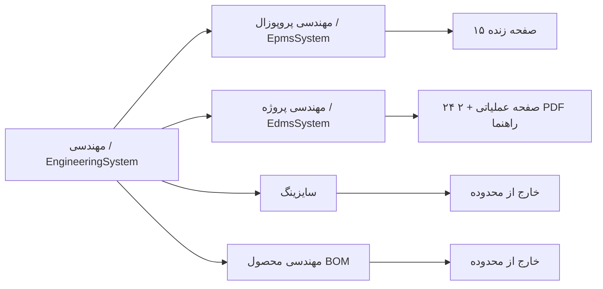
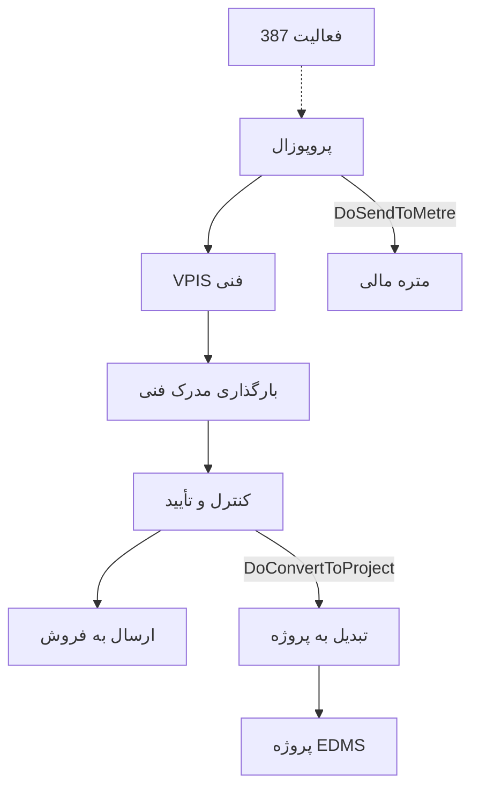

# 00 — مهندسی پروپوزال و مهندسی پروژه (HTS ↔ Havayar)

> فقط مستندات. **هیچ تغییری در کد، منو، مایگریشن یا دیتابیس در این مرحله انجام نشده و نمی‌شود.**  
> تأیید شده روی سورس HTS و Havayar در **2026-09-15**.  
> MCPهای MSSQL (`user-mssql-havayar` / `user-mssql-totalsystem`) در همین تاریخ **وصل نشدند** — لیبل زنده `Gnr_Lookup`، شمارش TotalSystem، منوی Panel و `RoleAccess` اینجا **بررسی نشده** است. منبع حقیقت: کد HTS + کد Havayar + فایل‌های `01`–`06`.

خواندن پیشنهادی: این فایل → `01`/`03` (HTS زنده) → `05`/`06` (Havayar as-is) → `07`/`08` (مغایرت برای تیک شما) → `09` (ماتریس صفحه).

---

## 1. محدوده

منوی زنده HTS از **یک فایل** خوانده می‌شود: `_EpmsMenu.cshtml`. همین فایل هر دو زیرمنوی «مهندسی پروپوزال» و «مهندسی پروژه» را دارد. `_EdmsMenu.cshtml` **رندر نمی‌شود**.

| داخل محدوده | خارج از محدوده (فقط برای قاطی نشدن اینجا ذکر می‌شود) |
|---|---|
| مهندسی → **مهندسی پروپوزال** (`EpmsSystem`) — ۱۵ برگ زنده | سایزینگ و انتخاب تجهیز، `CompressorSizing` |
| مهندسی → **مهندسی پروژه** (`EdmsSystem`) — ۲۴ برگ عملیاتی + ۲ راهنمای PDF | BOM / مهندسی محصول، `Eng.PartList` |
| فیلدها، اکشن‌ها، `SystemPage` / `PermissionType`، ایمیل/نوتیف، enum وضعیت | `_EdmsMenu.cshtml` (فایل کهنه؛ در `_ModulesMenu` کامنت است) |
| پیاده‌سازی واقعی `Entities.App.Epms` / `Edms` + کنترلر/ویو/Action/جاب | آیتم‌های **کامنت‌شده در منو** (مناقصه EPMS، سه آرشیو مالی/مناقصه، ExtraInfo مدرک، TimeSchedule) — در `09` جدول جدا؛ **کمبود Havayar نیستند** مگر هنوز در فرآیند زنده به‌کار روند (مثلاً `Epms_Tender` به‌عنوان FK پروپوزال) |

تبدیل پروپوزال به پروژه (`DoConvertToProject` → `Edms_Project`) مرز دو ماژول است؛ در `07` و `08` هر دو طرف آمده است.

---

## 2. درخت منوی زنده HTS

Parent: `CaptionsLibrary.EngineeringSystem` = **سیستم مهندسی** (فقط اگر `HasAccess(SystemType.Engineering)`).  
شِل: `Views\Shared\Layouts\Partials\_ModulesMenu.cshtml` → `Html.RenderPartial(..._EpmsMenu)`.

Href همان توکن `load-partial` است (`partialType` → `Home.LoadPartial` → کنترلر Area).

### 2.1 مهندسی پروپوزال — ۱۵ برگ زنده

جزئیات: [`01-HTS-Epms-Process-Pages-Access.md`](01-HTS-Epms-Process-Pages-Access.md).

| گروه | Caption (fa-IR) | Href | `SystemPage` | Id |
|---|---|---|---|---|
| — | ثبت فعالیت ها - پروپوزال | `epms-projectActivity` | `Epms_Project_Activity` | 294 |
| — | کارتابل شخصی - پروپوزال | `epms-personalReferralDocuments` | `Epms_PersonalReferralDocuments` | 350 |
| — | مدیریت مناقصه \| پروپوزال | `epms-proposalManagement` | `Epms_Proposal` | 252 |
| — | استعلام قیمت تجهیزات پروپوزال | `epms-proposalInquiryPartPrice` | `Epms_ProposalInquiryPartPrice` | 265 |
| فنی | مدیریت Vpis - پروپوزال | `epms-proposalVpisManagement` | `Epms_Proposal_Vpis` | 254 |
| فنی | بارگذاری مدارک فنی | `epms-documentUpload` | `Epms_Document` | 255 |
| فنی | بررسی/تایید/رد اسناد - پروپوزال | `epms-controlDocuments` | `Epms_ControlDocuments` | 257 |
| فنی | مدارک ارسال شده به فروش | `epms-commitedDocuments` | `Epms_CommitedDocuments` | 260 |
| مالی / برآورد | مدیریت برآورد هزینه | `epms-financialVpisManagement` | `Epms_FinancialVpisManagement` | 272 |
| مالی / برآورد | بارگذاری مدارک مالی | `epms-financialDocument` | `Epms_FinancialDocument` | 273 |
| مالی / برآورد | برآورد هزینه تجهیزات | `epms-metreEquipmentFinancial` | `Epms_MetreEquipmentFinancial` | 261 |
| مالی / برآورد | برآورد هزینه ارسال شده به فروش | `epms-commitedMetreEquipmentFinancial` | `Epms_CommitedMetreEquipmentFinancial` | 267 |
| آرشیو | آرشیو شخصی - پروپوزال | `epms-personalDocumentArchive` | `Epms_Personal_Document_Archive` | 289 |
| آرشیو | آرشیو کلی - پروپوزال | `epms-allDocumentArchive` | `Epms_All_Document_Archive` | 264 |
| گزارشات | گزارش عملکرد پرسنل | `epms-epmsPersonnelPerformanceReport` | `EpmsPersonnelPerformanceReport` | 351 |

منوی مرده (کامنت در `_EpmsMenu`؛ کنترلر ممکن است هنوز با URL قدیمی باز شود) — **در `09` جدول جدا**: مناقصه `249`، آرشیو متره `268`، آرشیو مدرک مالی `274`، آرشیو پیوست مناقصه `325`، و آیتم گزارش تجمعی با href **EDMS**.

### 2.2 مهندسی پروژه — ۲۴ برگ عملیاتی + ۲ PDF

جزئیات: [`03-HTS-Edms-Process-Pages-Access.md`](03-HTS-Edms-Process-Pages-Access.md).  
`ul[moduletype=edmsModuleType]`.

| # | Caption (fa-IR) | Href | `SystemPage` | Id |
|---|---|---|---|---|
| 1 | ثبت فعالیت ها | `edms-projectActivity` | `Edms_Project_Activity` | 288 |
| 2 | کارتابل شخصی | `edms-personalReferralDocuments` | `Edms_PersonalReferralDocuments` | 275 |
| 3 | شناسنامه پروژه ها | `edms-projectManagement` | `Edms_Project` | 163 |
| 4 | اقلام پروژه | `edms-ProjectParts` | `Edms_ProjectParts` | 558 |
| 5 | مدیریت Vpis | `edms-projectVpisManagement` | `Edms_Project_Vpis` | 165 |
| 6 | بارگذاری اسناد | `edms-documentUpload` | `Edms_Document` | 166 |
| 7 | بررسی/تایید/رد اسناد | `edms-controlDocuments` | `Edms_ControlDocuments` | 223 |
| 8 | کنترل اسناد (DCC) | `edms-documentControlCenter` | `Edms_Document_Control_Center` | **221** |
| 9 | ترانسمیتال | `edms-transmitalManage` | `Edms_Transmital_Manage` | 169 |
| 10 | دریافت و ارسال اسناد | `edms-finalDocumentControlCenter` | `Edms_Document_Control_Center` | **221** (همان ۸) |
| 11 | گزارش MDR | `edms-mdrReport` | `Edms_Mdr_Report` | 235 |
| 12 | گزارش تجمعی عملکرد/فعالیت | `edms-cumulativePerformanceReport` | `Edms_CumulativePerformanceReport` | 291 |
| 13 | گزارش حجم کاری پرسنل | `edms-personnelWorkLoadReport` | `Edms_PersonnelWorkLoadReport` | **361** |
| 14 | گزارش تجمعی حجم کاری پرسنل | `edms-personnelCumulativeWorkLoadReport` | `Edms_PersonnelWorkLoadReport` | **361** (همان ۱۳) |
| 15 | گزارش عملکرد پرسنل | `edms-personnelPerformanceReport` | `Edms_PersonnelPerformance_Report` | 245 |
| 16 | گزارش تاخیرات مدارک | `edms-documentDelayReport` | `Edms_DocumentDelayReport` | 238 |
| 17 | گزارش توقفات مدارک | `edms-documentHoldReport` | `Edms_DocumentHoldReport` | 248 |
| 18 | گزارش پیشرفت پروژه | `edms-projectProgressReport` | `Edms_ProjectProgress_Report` | 246 |
| 19 | گزارش تجمعی پروژه | `edms-projectSummerizedReport` | `Edms_ProjectSummerized_Report` | 282 |
| 20 | گزارش شاخص ارزیابی | `edms-indexEvaluationReport` | `Edms_IndexEvaluationReport` | 380 |
| 21 | گزارش اسناد کارفرما / وندور | `edms-clientAndVendorDocumentReport` | `EdmsClientAndVendorDocumentReport` | 532 |
| 22 | آرشیو شخصی | `edms-personalDocumentArchive` | `Edms_Personal_Document_Archive` | 233 |
| 23 | آرشیو کلی | `edms-allDocumentArchive` | `Edms_All_Document_Archive` | 232 |
| 24 | آرشیو اسناد ورودی پروژه | `edms-projectAttachmentsArchive` | `Edms_Project_Attachment_Archive` | 279 |
| 25 | نسخه فارسی - Fa | `Home.LoadFile` | — | PDF |
| 26 | نسخه لاتین - En | `Home.LoadFile` | — | PDF |

منوی مرده EDMS: `edms-documentExtraInfo` (543)، `edms-timeScheduleReport` (306) — دومی هنوز `ShowAll` گزارش حجم کاری HTS را روی همین صفحه چک می‌کند.

---

## 3. قرارداد نام‌گذاری

| موضوع | HTS | HavayarApp |
|---|---|---|
| اسکیما / پیشوند جدول | `Epms_*` / `Edms_*` در TotalSystem | اسکیما `Epms` / `Edms` |
| مسیر UI | Area `Epms` / `Edms` + `load-partial` (`epms-*` / `edms-*`) | `[Route("Panel/Epms/[controller]")]` / `Panel/Edms/[controller]` — شکل منو در صورت وجود: `/panel/epms/...` و `/panel/edms/...` (حروف کوچک) |
| دسترسی صفحه | `SystemPage` + `PermissionType` روی `Gnr_Page` | `[ControllerInfo]` + `[ActionDisplayName]` → کاتالوگ Role؛ سید `SystemMenu`/`RoleAccess` برای این دو ماژول در ریپو **نیست** |
| PK / کاربر | `short`/`int` + `Gnr_User` / `HRM_Personel` | `BaseEntity<long>` + `User` |
| تاریخ | ستون شمسی متنی + گاهی میلادی جدا | جفت Shamsi/Miladi (+ فیلدهای `BaseEntity`) |
| فایل | مسیر دیسک (`EpmsDocumentStoragePath`) یا `varbinary` | `FileEntity` |
| همگام HTS | — (منبع) | `HtsId` روی بخشی از موجودیت‌های **Edms**؛ **هیچ** `HtsId` روی Epms |
| لاجیک «همیشه با ذخیره» | سرویس Area + گاهی تریگر SQL (LastStatus) | Edms: `WebApp/Actions/Edms/*`؛ **Epms: هیچ EntityAction** |
| وضعیت مدرک | `EdmsDocumentStatus` با `Issue = 5` | `DocumentStatusEnums` با `Issue = 2` — جاب `DocumentJob.MapDocumentStatus` اعداد را عوض می‌کند (**ریسک بالا**؛ `08`) |

نام‌های رایج که **یکی نیستند**:

| HTS | Havayar |
|---|---|
| `Epms_Proposal` | `Epms.Proposal` |
| `Epms_Proposal_Vpis` | `Epms.ProposalVpis` |
| `Epms_Document` | `Epms.ProposalDocument` (FK به **پروپوزال** نه VPIS) |
| `Epms_Financial_Vpis` + `Epms_Financial_Document` + `Epms_Metre_Equipment_Financial` (+ Comment/Price) | **یک** `Epms.EquipmentPriceEstimate` |
| `Edms_Project_Activity` با `ModuleType_FK` 387/386 | دو جدول جدا: `Epms.ProjectActivity` و `Edms.ProjectActivity` |
| `Edms_Project_Part` | **موجودیت نیست** |
| `Edms_Transmital` + `Edms_Transmital_Document` (چند مدرک) | `Edms.Transmital` با **یک** `DocumentId` اجباری |

---

## 4. فرآیند زنده (خلاصه؛ جزئیات در `01` و `03`)

EPMS صفحه‌محور است نه یک state machine واحد:

EDMS: فعالیت ۳۸۶ → شناسنامه پروژه (+ اقلام/پیوست) → VPIS → بارگذاری/ریویژن → بررسی/تأیید → DCC → ترانسمیتال (کامنت `NotReview`) → Final DCC (کارفرما) → آرشیوها. کارتابل صف کار است نه موجودیت جدا.

---

## 5. Havayar امروز (یک پاراگراف)

**EPMS:** CRUD برای `Proposal` (با تب پیوست/مدرک؛ تب تجهیز در Edit نیست)، `ProposalVpis`، `ProposalActivity`، `VpisType`، `EquipmentPriceEstimate`. اکشن `SendToMetre` / `ConvertToProject` / Commit / کارتابل / آرشیو / استعلام / گزارش عملکرد **نیست**. فیلد `IsSendToMetre` روی موجودیت هست و روی فرم bind نشده.

**EDMS:** CRUD برای `Project`، `ProjectVpis`، `Document` (+ ریویژن/کامنت)، `Transmital`، `ProjectActivity`. گزارش‌های **MDR** و **حجم کاری پرسنل** صفحه دارند. کارتابل / کنترل جدا / DCC / Final DCC / اقلام پروژه / سه آرشیو / بقیه گزارش‌ها صفحه جدا ندارند. نقش `Edms.Documents.DccUsers` فقط فیلتر وضعیت کامنت است. جاب همگام `Project` / `ProjectVpis` / `Document` (+ فایل و کامنت) هست؛ ترانسمیتال و فعالیت جاب ندارند.

ماتریس صفحه: [`09-Page-Matrix.md`](09-Page-Matrix.md). مغایرت‌ها: [`07-Gap-Epms.md`](07-Gap-Epms.md) و [`08-Gap-Edms.md`](08-Gap-Edms.md).

---

## 6. ایندکس فایل‌ها

| فایل | محتوا |
|---|---|
| این فایل | محدوده، درخت منو، نام‌گذاری، خارج از محدوده، منابع، موارد تأییدنشده |
| [`01-HTS-Epms-Process-Pages-Access.md`](01-HTS-Epms-Process-Pages-Access.md) | فرآیند پروپوزال، ۱۵ صفحه، اکشن، دسترسی، ایمیل/نوتیف/لاگ |
| [`02-HTS-Epms-Entities-Fields.md`](02-HTS-Epms-Entities-Fields.md) | کاتالوگ فیلد `Epms_*` و enum |
| [`03-HTS-Edms-Process-Pages-Access.md`](03-HTS-Edms-Process-Pages-Access.md) | فرآیند پروژه/مدرک/DCC، صفحات، دسترسی، گزارش‌ها |
| [`04-HTS-Edms-Entities-Fields.md`](04-HTS-Edms-Entities-Fields.md) | کاتالوگ فیلد `Edms_*` و ماشین وضعیت مدرک |
| [`05-Havayar-Epms-Implemented.md`](05-Havayar-Epms-Implemented.md) | موجودیت/کنترلر/ویو واقعی Epms (بدون Action/جاب) |
| [`06-Havayar-Edms-Implemented.md`](06-Havayar-Edms-Implemented.md) | موجودیت/کنترلر/ویو/Action/جاب Edms |
| [`07-Gap-Epms.md`](07-Gap-Epms.md) | چک‌لیست مغایرت پروپوزال (فارسی) |
| [`08-Gap-Edms.md`](08-Gap-Edms.md) | چک‌لیست مغایرت پروژه (فارسی) |
| [`09-Page-Matrix.md`](09-Page-Matrix.md) | HTS href / SystemPage → مسیر Havayar → وضعیت |

---

## 7. منابع

| نقش | مسیر |
|---|---|
| منوی زنده HTS | `Presentation\WebApplication\HtsWebApplication\Areas\Epms\Views\Shared\Menu\_EpmsMenu.cshtml` |
| منوی استفاده‌نشده EDMS | `Areas\Edms\Views\Shared\Menu\_EdmsMenu.cshtml` |
| Href → عنوان | `Infrastructure\Hts.Web.Core\General\Helpers\ApplicationHelpers\MessageTranslator.cs` |
| Redirect | `HtsWebApplication\Controllers\HomeController.cs` |
| `SystemPage` / `PermissionType` | `Infrastructure\Hts.Core\Enums\Pages.cs`, `PermissionType.cs` |
| Caption فارسی | `Infrastructure\Hts.Core\Resources\CaptionsLibrary.fa-IR.resx` |
| Entity HTS | `Data Persistence\Hts.Data.Model\MainEntities\Epms_*.cs` / `Edms_*.cs` |
| کنترلر HTS | `Areas\Epms\Controllers\*.cs` / `Areas\Edms\Controllers\*.cs` |
| Havayar Epms | `Entities/App/Epms/`, `WebApp/Controllers/Dynamic/Epms/`, `WebApp/Views/Panel/Epms/` |
| Havayar Edms | `Entities/App/Edms/`, `WebApp/Controllers/Dynamic/Edms/`, `WebApp/Views/Panel/Edms/`, `WebApp/Actions/Edms/`, `App.BackgroundJob/Jobs/Edms/` |

---

## 8. موارد تأییدنشده (این موج)

| مورد | چرا |
|---|---|
| MCP MSSQL (Havayar / TotalSystem / ERPS) | tool discovery/auth کامل نشد — منوی زنده Panel، `RoleAccess`، `JobSchedule`، لیبل `Gnr_Lookup`، `Edms_Document_Status.Document_Status_Title`، شمارش ردیف |
| کلیدهای `CaptionsLibrary.fa-IR` بدون مقدار | از جمله `NotStarted`, `Canceled`, `Hold`, `Archived`, `NotReview`, `Due_Date`, `PreparedDate`, `Project_Title`, `Rev0_ManHour` و بقیه فهرست‌شده در `02` §13 و `04` §18 |
| `EpmsPersonnelPerformanceReport` (351) در برابر authorize کنترلر با `245` | ناسازگاری داخلی HTS؛ در Havayar صفحه معادل نیست |
| مقدار runtime `EpmsDocumentStoragePath` | کانفیگ/BaseController |
| تریگر SQL که `Edms_Document.LastStatusId` را دنرمال می‌کند | در ریپوی HTS پیدا نشد |
| باینری PDF راهنمای EDMS | فقط مسیر T4MVC |
| اینکه کنترلرهای منوی مرده هنوز از URL مستقیم استفاده می‌شوند | در کد هستند؛ ترافیک زنده بدون DB معلوم نیست |

---

## 9. بعد از این مرحله

شما `07` / `08` / `09` را خط‌به‌خط بررسی می‌کنید و می‌گویید کدام مغایرت باید در سیستم جدید اصلاح شود. **تا آن دستور، کد دست نمی‌خورد.**
