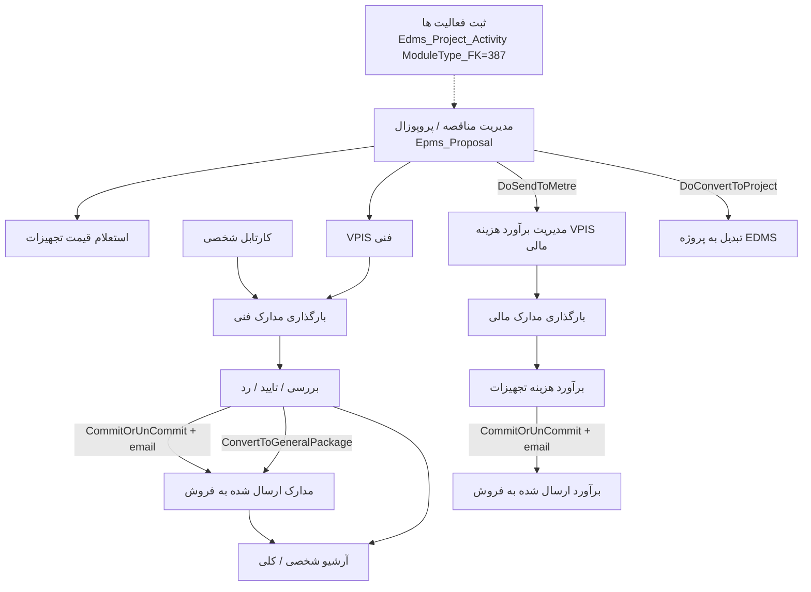

# HTS EPMS — Process, live pages, access, emails / notifications / logs

> As-is documentation of the live HTS menu **Engineering → EpmsSystem (مهندسی پروپوزال)**. No Havayar mapping, no implementation advice.
>
> Confirmed against HTS source on **2026-09-15**. Persian captions are from `CaptionsLibrary.fa-IR.resx`. `SystemPage` IDs are from `Pages.cs`. Every live `epms-*` href was traced through `MessageTranslator` → `HomeController.RedirectToPartial` → the Area `Epms` controller.

## 1. Purpose and sources

HTS module for engineering **proposals** (not EDMS projects, not sizing, not BOM). Menu host is a single file that also contains EDMS / sizing / BOM blocks — **only the EpmsSystem block (≈ lines 23–317)** is in scope.

| Role | Path |
|---|---|
| Live menu | `Presentation\WebApplication\HtsWebApplication\Areas\Epms\Views\Shared\Menu\_EpmsMenu.cshtml` |
| `load-partial` → title | `Infrastructure\Hts.Web.Core\General\Helpers\ApplicationHelpers\MessageTranslator.cs` (`#region EPMS`) |
| Title enum | `Infrastructure\Hts.Web.Core\General\Enums\PartialTitle.cs` (`EpmsTenderManagement` … `EpmsPersonnelPerformanceReport`) |
| Redirect to controller | `Presentation\WebApplication\HtsWebApplication\Controllers\HomeController.cs` (`#region EPMS`, `RedirectToPartial`) |
| MVC area | `Areas\Epms\EpmsAreaRegistration.cs` — route `Epms/{controller}/{action}/{id}` |
| Controllers | `Areas\Epms\Controllers\*.cs` |
| Views | `Areas\Epms\Views\EpmsSystem\_*.cshtml` |
| `SystemPage` | `Infrastructure\Hts.Core\Enums\Pages.cs` |
| `PermissionType` | `Infrastructure\Hts.Core\Enums\PermissionType.cs` |
| `SystemType` | `Infrastructure\Hts.Core\Enums\SystemType.cs` — `Engineering = 26` |
| Captions | `Infrastructure\Hts.Core\Resources\CaptionsLibrary.fa-IR.resx` |
| Status enums | `Infrastructure\Hts.Core\Enums\EpmsProposalStatus.cs`, `EdmsDocumentStatus.cs` |
| Services | `Services\EntityServices\Hts.EntityServices\Common\Epms\` |

Parent menu caption: `EngineeringSystem` = **سیستم مهندسی**. Submenu caption: `EpmsSystem` = **مهندسی پروپوزال**.

The whole EpmsSystem subtree is shown only if the user has `HasAccess(SystemType.Engineering)` **and** (`UserType.Admin` **or** any permission on the `pageIds` list in `_EpmsMenu.cshtml` lines 27–48). Each leaf still has its own `HasAccess(systemType, SystemPage.…)` check.

## 2. Process (live)

EPMS is **page-based**, not a single workflow engine. Status lives on `Epms_Proposal.Proposal_Status_FK` (lookup type 2), on `Epms_Document` / `Epms_Metre_Equipment_Financial` comment rows (`EdmsDocumentStatus` / table `Edms_Document_Status`), and on `Epms_Proposal_log`.

Typical order in code (not enforced as one state machine):

1. Optional **activity** rows (`ModuleType_FK == 387`).
2. **Proposal** CRUD (`HY-PRO-{alias}-{nnn}`), equipment lines, attachments, log.
3. **Send to metre** (`DoSendToMetreOperation`) sets `IsSendToMetre` and emails metre groups; technical VPIS dropdown is limited to proposals already sent to metre (`GetSendTometreProposalsModel`).
4. **Technical VPIS** assigns Main / Control / Approve users; membership is written into user groups 94 and 123.
5. **Upload** creates `Epms_Document` + comment `Issue`; files go to disk under `EpmsDocumentStoragePath`.
6. **Control** checker/approver set `Checked*` / `Approved*`; **Commit** flips `IsCommited`, writes `Commited`/`UnCommit` comments, emails sale, logs `SendToSale`.
7. Sale works **committed documents** and **committed metre** (`CommentedBySale` / `ApprovedBySale` / `RejectedBySale`).
8. **Convert to project** creates `Edms_Project` (`IsCreatedFromProposal`, `ProposalId`) and copies selected attachments.
9. **Archives** are filtered lists of the same documents / metre rows, not a separate entity.

Parallel: **inquiry part price** (no status machine). Personal **cartable** lists VPIS with no document yet (proposal status InProgress = 4) plus last-revision documents in reject/comment/sale-comment/sale-reject.

## 3. Live menu tree (EpmsSystem block)

Captions: English key → Persian `CaptionsLibrary.fa-IR.resx`. Href is the `load-partial` token.

| Menu level | Caption key | Persian | Href | `SystemPage` | Id | Live? |
|---|---|---|---|---|---|---|
| Parent | `EpmsSystem` | مهندسی پروپوزال | — | *(any of pageIds)* | — | yes |
| Leaf | `Edms_Project_Activity` − `Proposal` | ثبت فعالیت ها - پروپوزال | `epms-projectActivity` | `Epms_Project_Activity` | **294** | yes |
| Leaf | `PersonalCartable` − `Proposal` | کارتابل شخصی - پروپوزال | `epms-personalReferralDocuments` | `Epms_PersonalReferralDocuments` | **350** | yes |
| Leaf | `TendersManagement` | مدیریت مناقصات | `epms-tenderManagement` | `Epms_Tender` | 249 | **dead-menu** (`@*حذف شود*@`) |
| Leaf | `TenderProposalManagement` | مدیریت مناقصه \| پروپوزال | `epms-proposalManagement` | `Epms_Proposal` | **252** | yes |
| Leaf | `ProposalInquiryPartPrice` | استعلام قیمت تجهیزات پروپوزال | `epms-proposalInquiryPartPrice` | `Epms_ProposalInquiryPartPrice` | **265** | yes |
| Group | `Technical` | فنی | — | — | — | yes |
| Leaf | `ProjectVpisManagement` − `Proposal` | مدیریت Vpis - پروپوزال | `epms-proposalVpisManagement` | `Epms_Proposal_Vpis` | **254** | yes |
| Leaf | `UploadTechnicalDocumetns` | بارگذاری مدارک فنی | `epms-documentUpload` | `Epms_Document` | **255** | yes |
| Leaf | `CheckAndApproveDocuments` − `Proposal` | بررسی/تایید/رد اسناد - پروپوزال | `epms-controlDocuments` | `Epms_ControlDocuments` | **257** | yes |
| Leaf | `SubmittedDocumentsForSale` | مدارک ارسال شده به فروش | `epms-commitedDocuments` | `Epms_CommitedDocuments` | **260** | yes |
| Group | `Financial` / `Estimate` | مالی / برآورد | — | — | — | yes |
| Leaf | `CostEstimationManagement` | مدیریت برآورد هزینه | `epms-financialVpisManagement` | `Epms_FinancialVpisManagement` | **272** | yes |
| Leaf | `FinancialDocumentUpload` | بارگذاری مدارک مالی | `epms-financialDocument` | `Epms_FinancialDocument` | **273** | yes |
| Leaf | `EstimatedEquipmentPrices` | برآورد هزینه تجهیزات | `epms-metreEquipmentFinancial` | `Epms_MetreEquipmentFinancial` | **261** | yes |
| Leaf | `CommitedMetreEquipmentFinancial` | برآورد هزینه ارسال شده به فروش | `epms-commitedMetreEquipmentFinancial` | `Epms_CommitedMetreEquipmentFinancial` | **267** | yes |
| Group | `Archive` | آرشیو | — | — | — | yes |
| Leaf | `PersonalArchive` − `Proposal` | آرشیو شخصی - پروپوزال | `epms-personalDocumentArchive` | `Epms_Personal_Document_Archive` | **289** | yes |
| Leaf | `PublicArchive` − `Proposal` | آرشیو کلی - پروپوزال | `epms-allDocumentArchive` | `Epms_All_Document_Archive` | **264** | yes |
| Leaf | `Epms_All_MetreEquipmentFinancial_Archive` | آرشیو کلی برآورد هزینه تجهیزات | `epms-allMetreEquipmentFinancialArchive` | `Epms_All_MetreEquipmentFinancial_Archive` | 268 | **dead-menu** |
| Leaf | `Epms_All_FinancialDocument_Archive` | آرشیو کلی مدارک مالی | `epms-allFinancialDocumentArchive` | `Epms_All_FinancialDocument_Archive` | 274 | **dead-menu** |
| Leaf | `ArchiveOfBiddingDocuments` | آرشیو اسناد مناقصات | `epms-allTenderAttachmentsArchive` | `Epms_AllTenderAttachmentsArchive` | 325 | **dead-menu** |
| Group | `Reports` | گزارشات | — | — | — | yes |
| Leaf | `CumulativePerformanceReport` | *(EDMS href)* | `edms-cumulativePerformanceReport` | `Edms_CumulativePerformanceReport` | 291 | **dead-menu** (commented; not an EPMS controller) |
| Leaf | `Edms_PersonnelPerformance_Report` | گزارش عملکرد پرسنل | `epms-epmsPersonnelPerformanceReport` | `EpmsPersonnelPerformanceReport` | **351** | yes |

**15 live leaves.** Dead-menu rows still have controllers and `SystemPage` values; they are **not** Havayar gaps.

`pageIds` also includes those dead pages so an admin who only has tender/archive permission still sees the EpmsSystem parent.

## 4. `SystemPage` IDs used by EPMS (including non-menu)

From `Pages.cs`. Menu visibility uses the first column; child pages are permission targets on attachment / comment actions.

| Enum | Id | Used as |
|---|---|---|
| `Epms_Tender` | 249 | Dead menu; `TenderManagementController` |
| `Epms_Tender_Attachment` | 250 | Tender attachment partial / `ViewAttachment` |
| `Epms_Proposal` | 252 | Live proposal page |
| `Epms_Proposal_Attachment` | 253 | Proposal attachment partial / `ViewAttachment` |
| `Epms_Proposal_Vpis` | 254 | Live technical VPIS |
| `Epms_Document` | 255 | Live upload; also **grid filter** on personal archive (`FullAccess`/`ShowAll`) |
| `Epms_Document_Comment` | 256 | In `Pages.cs`; **no EPMS controller `[PermissionAuthorize]` on this id** (comments use parent page) |
| `Epms_ControlDocuments` | 257 | Live control; also **grid filter** on committed-documents (`FullAccess`/`ShowAll`) |
| `Epms_CommitedDocuments` | 260 | Live committed documents (page open) |
| `Epms_MetreEquipmentFinancial` | 261 | Live metre |
| `Epms_All_Document_Archive` | 264 | Live public archive |
| `Epms_ProposalInquiryPartPrice` | 265 | Live inquiry |
| `Epms_CommitedMetreEquipmentFinancial` | 267 | Live committed metre |
| `Epms_All_MetreEquipmentFinancial_Archive` | 268 | Dead menu; controller still live if URL known |
| `Epms_FinancialVpisManagement` | 272 | Live financial VPIS |
| `Epms_FinancialDocument` | 273 | Live financial upload |
| `Epms_All_FinancialDocument_Archive` | 274 | Dead menu; controller still live |
| `Epms_Personal_Document_Archive` | 289 | Live personal archive |
| `Epms_Project_Activity` | 294 | Live activity |
| `Epms_AllTenderAttachmentsArchive` | 325 | Dead menu; controller still live |
| `Epms_PersonalReferralDocuments` | 350 | Live cartable |
| `EpmsPersonnelPerformanceReport` | 351 | **Menu** visibility for personnel report |
| `Edms_PersonnelPerformance_Report` | 245 | **Controller** `[PermissionAuthorize]` on the same personnel-report page (mismatch vs 351) |

## 5. `PermissionType` values the EPMS controllers actually test

Class-level on every EPMS controller: `[PermissionAuthorize(SystemType.Engineering)]` (`Engineering = 26`).

| Enum | Id | Where EPMS uses it |
|---|---|---|
| `FullAccess` | 2 | Document upload grid; control grid; metre grid; financial document grid; personal archive grid; metre-all-archive grid |
| `New` / `Edit` / `Delete` | 4 / 5 / 6 | Proposal `HasCrudPermissions`; metre `HasCrudPermissions` |
| `ShowAll` | 7 | Activity, proposal, cartable, control, committed docs, committed metre, public archive, tender archive, metre archive |
| `ViewAttachment` | 20 | Proposal attachment view; inquiry attachment view; tender attachment view |
| `CommitOrUnCommit` | 67 | Control `CommitOrUnCommit` + `ConvertToGeneralPackage`; metre `CommitOrUnCommit` |
| `RemoveComment` | 72 | Dead-menu metre-all-archive `DoCommentOperation` |
| `Checker` | 88 | Metre grid (non-admin, not FullAccess) |
| `SuperVisorOfDepartment` | 155 | Proposal grid org-unit / `SalesSupervisorId` filter |
| `ProductEngineering` | 194 | Proposal grid (`IsForProductEngineeringDepartment`); **blocks** proposal CRUD, send-to-metre, convert-to-project |

`PermissionAuthorize(SystemType, SystemPage)` without a `PermissionType` means “any permission on that page”. Several POST grids (`Get*GridData`) have **no** `[PermissionAuthorize]` of their own — they rely on the class-level Engineering check plus in-action `HasAccess`.

## 6. User groups and hardcoded org units

| Id | Source comment / enum | Effect |
|---|---|---|
| `UserGroup.EpmsFileUploaders = 94` | کارشناسان بارگذاری اسناد EPMS | VPIS `DoOperation` calls `UpdatePermissions` with `MainResponsible_FK` |
| `UserGroup.EpmsDocumentUpload = 123` | کارشناسان مدارک ارسال شده به فروش | same |
| **200** | comment: کارشناسان آرشیو کلی (واحد فروش) | Public archive: committed docs for that user’s sale ids |
| **535** | comment: دریافت کنندگان ایمیل ارسال به متره (مهندسی پروپوزال) | `SendToMetreEmail` when `!IsForProductEngineeringDepartment` |
| **557** | comment: کارشناسان مدیریت VPIS - پروپوزال دسترسی مهندسی محصول | VPIS grid split; control ShowAll split; send-to-metre / new-revision email for product-engineering proposals |

Org units in proposal grid / coding (hardcoded in `ProposalManagementController`):

| Id | Comment in code | `GetSaleDepartmentAlias` |
|---|---|---|
| 140 | فروش کمپرسورهای مهندسی | `EC` → code `HY-PRO-EC-nnn` |
| 745 | فروش تجهیزات فشرده سازی و جداسازی هوا و گاز | `IG` |
| 30 | فروش گازهای صنعتی | *(supervisor filter group with 140, 745; no alias)* |
| 142 | فروش توربو ماشین | `TC` |
| 278 | فروش صنعتی | `IC`; also `industrialSaleUnit` with 225 |
| 225 | فروش صنعتی | grid filter only |
| 249 | مهندسی محصول | VPIS proposal combo uses product-engineering proposals |
| 149 | excluded from sale org/personnel combos | |

`IsForProductEngineeringDepartment` is set on add/update when the **current user’s** org title contains `فروش صنعتی`.

## 7. Live pages (verified)

Convention for each page: href → `PartialTitle` → `RedirectToAction` → controller action → view. Services are constructor injections.

### 7.1 Activity — `epms-projectActivity`

| | |
|---|---|
| Caption | ثبت فعالیت ها - پروپوزال |
| Controller | `EpmsProjectActivityController` |
| Load | `LoadPage` → `_EpmsProjectActivity.cshtml` |
| Entity | `Edms_Project_Activity` + `Edms_Project_Activity_Comment` |
| Services | `IProjectActivityService`, `IProposalService`, `IProjectActivityCommentService`, `IOrganizationUnitService`, `ILookupService`, `IEntityService<Edms_Document_Status>`, `IProjectService` (injected, unused in the methods read) |

| Action | HTTP | `[PermissionAuthorize]` |
|---|---|---|
| `LoadPage` | GET (ajax) | `Epms_Project_Activity` |
| `GetGridData` | POST | class only |
| `GetCommentsGridData` | POST | class only |
| `DoOperation` | POST | `Epms_Project_Activity` |
| `DoCommentOperation` | POST | `Epms_Project_Activity` |

**Grid filter:** `ModuleType_FK == 387`. Admin or `ShowAll` → all 387 rows; else `CreatedUser_FK == UserId`. The view posts `ModuleType_FK: 387` on save. EDMS activity uses **386** in the sibling controller — 387 is the EPMS discriminator, **not** `ModuleType.Epms = 616` in `ModuleType.cs`.

**Lookups:** proposals (`CodeTitle`); beneficiary units `GetForRegisterActivities()`; activity types `LookupType_FK == 84`; comment statuses `Document_Status_ID` in `{2, 4}` = Approve / Commented.

Add writes a comment with `Status_FK = Issue (5)`.

### 7.2 Personal cartable — `epms-personalReferralDocuments`

| | |
|---|---|
| Caption | کارتابل شخصی - پروپوزال |
| Controller | `EpmsPersonalReferralDocumentsController` |
| Load | `LoadPage` → `_EpmsPersonalReferralDocuments.cshtml` |
| Service | `IEpmsDocumentUploadService.GetPersonalReferralDocuments` |

| Action | `[PermissionAuthorize]` |
|---|---|
| `LoadPage` | `Epms_PersonalReferralDocuments` |
| `GetGridData` | class only; `ShowAll` or Admin bypasses user filter |

**Query (service):** proposal status InProgress **4**. Two unions:

1. VPIS with **no** `Epms_Document` (optionally `MainResponsible_FK == current user`).
2. Last `Document_ID` per VPIS whose last comment is `Reject`, `Commented`, `CommentedBySale`, or `RejectedBySale`, and (if not ShowAll) main responsible or preparer is current user.

Deduped by `Proposal_Vpis_FK`. No CRUD on this page.

### 7.3 Proposal management — `epms-proposalManagement`

| | |
|---|---|
| Caption | مدیریت مناقصه \| پروپوزال |
| Controller | `ProposalManagementController` |
| Load | `LoadProposalPage` → `_ProposalManagement.cshtml` |
| Attachment | `LoadProposalAttachmentPage` → `ProposalManagementPartials\_ProposalAttachment.cshtml` (`Epms_Proposal_Attachment`) |
| Entity | `Epms_Proposal`, `Epms_Proposal_Equipment`, `Epms_Proposal_Attachment`, `Epms_Proposal_log` |
| Services | `IProposalService`, `IProposalLogService`, `ITenderService`, `IProposalAttachmentService`, `IOrganizationUnitService`, `IPersonnelService`, `ILookupService`, `IProposalEquipmentService`, `IProjectService`, `IProjectAttachmentService`, `IEntityService<Crm_IndustryHdr>`, `IUserService`, `IUserGroupMemberService`, `IEdmsDocumentUploadService`, `IEpmsDocumentUploadService`, `IEntityService<Epms_VpisType>` |

| Action | `[PermissionAuthorize]` | Notes |
|---|---|---|
| `LoadProposalPage` | `Epms_Proposal` | |
| `LoadProposalAttachmentPage` | `Epms_Proposal_Attachment` | |
| `GetProposalGridData` | class | row ACL below |
| `GetProposalItemsGridData` | class | equipment by `proposalId` |
| `GetProposalLogGridData` | class | log by `proposalId` |
| `DoOperation` | `Epms_Proposal` | CRUD; `HasCrudPermissions`; ProductEngineering → denied |
| `DoConvertToProjectOperation` | `Epms_Proposal` | ProductEngineering denied |
| `DoSendToMetreOperation` | `Epms_Proposal` | ProductEngineering denied |
| `DoNewRevisionOperation` | `Epms_Proposal` | clones row, `Revision++`, status `CreateProposal` (2749) |
| `GetAttachmentGridData` | class | |
| `DoAttachmentOperation` | class | add/delete files; log `AttachmentOperation` |
| `ViewAttachedFile` / `ViewAttachedFileOld` | `Epms_Proposal_Attachment` + `ViewAttachment` | |

**Grid ACL:** Admin/`ShowAll` → all. Supervisor + industrial-gas units `{140,30,745}` → those units **or** `SalesSupervisorId == Personel`. Other supervisor → own org **or** supervisor id. Industrial sale `{225,278}` → own org. `ProductEngineering` → `IsForProductEngineeringDepartment`. Else `SalesExpertIds` contains personel **or** creator.

**Combos:** tenders; sale org units except 149; sale personnels except org 149; all active personnels; `Crm_IndustryHdr`; lookup type **63** (proposal request); lookup type **2** excluding **2432** (proposal status); `Epms_VpisType`.

**Code:** `HY-PRO-{EC\|IG\|TC\|IC}-{nnn}` from org alias + count of codes containing that alias.

**Send to metre:** email (groups 535 or 557 + actor + supervisor), log `SendToMetre`, `SetIsSendToMetre(id, true)`. Does not change `Proposal_Status_FK`.

**Convert to project:** requires at least one proposal attachment; fails if an `Edms_Project` already has same `Project_Code == Proposal_Code` **or** `Project_Name == TenderName`. New project: `GetProjectCode(...)`, name = `TenderName`, `BeneficiaryUnit_FK = RequestedOrgUnit_FK`, `Main_Client_FK = 1247`, `Project_Status_FK = 3`, `IsCreatedFromProposal`, `ProposalId`. Copies attachments with `IsSendToProjectAttachments` as type **258** (متره) and approved technical docs as type **257** (پروپزال). Log `ConvertToProject`.

**Revision:** new `Epms_Proposal` row (not in-place); `TenderName` suffix ` Rev N`; email like send-to-metre.

**Log on CRUD:** add → `CreateProposal` + «ثبت پروپوزال جدیدانجام شد»; update → `UpdateProposal` + status-name text if `Proposal_Status_FK` changed. `ProposalService` also inserts `Gnr_Notification` to users in config `Tender_NotificationReciversUserIds` when status lookup changes.

### 7.4 Inquiry part price — `epms-proposalInquiryPartPrice`

| | |
|---|---|
| Caption | استعلام قیمت تجهیزات پروپوزال |
| Controller | `EpmsProposalInquiryPartPriceController` |
| Load | `LoadPage` → `_EpmsProposalInquiryPartPrice.cshtml` |
| Attachment | `LoadAttachmentPage` → `InquiryPartPricePartials\_Attachment.cshtml` (**no page PermissionAuthorize**) |
| Services | `IEmpsProposalInquiryPartPriceService`, `IProposalInquiryPartPriceAttachmentService`, `IEntityService<Acc_PriceUnit>`, `IProposalService` |

| Action | `[PermissionAuthorize]` |
|---|---|
| `LoadPage` / `DoOperation` | `Epms_ProposalInquiryPartPrice` |
| `DoAttachmentOperation` | same |
| `ViewAttachedFile` | same + `ViewAttachment` |
| `GetGridData` / `GetAttachmentGridData` / `LoadAttachmentPage` | class only |

Grid is **unfiltered** (`GetProposalInquiryPartPriceModel()`). Combos: all proposals; `Acc_PriceUnit`.

### 7.5 Technical VPIS — `epms-proposalVpisManagement`

| | |
|---|---|
| Caption | مدیریت Vpis - پروپوزال |
| Controller | `ProposalVpisManagementController` |
| Load | `LoadProposalVpisManagementPage` → `_ProposalVpisManagement.cshtml` |
| Service | `IProposalVpisService`, `IProposalService`, `IEntityService<Epms_VpisType>`, `IUserService`, `IPersonnelService`, `IUserGroupMemberService` |

| Action | `[PermissionAuthorize]` |
|---|---|
| `LoadProposalVpisManagementPage` / `DoOperation` | `Epms_Proposal_Vpis` |
| `GetProposalVpisGridData` | class only |

**Grid:** user in group **557** → `IsForProductEngineeringDepartment == true`, else `false`.

**Proposal combo:** org 249 → send-to-metre proposals with product-engineering flag; else the inverse. Flag copied from parent proposal on save.

**Title:** appends ` - REV 0{count}` of existing VPIS of same type on that proposal.

On success: `UpdatePermissions(EpmsFileUploaders=94)` and `EpmsDocumentUpload=123)` with `MainResponsible_FK`.

### 7.6 Technical document upload — `epms-documentUpload`

| | |
|---|---|
| Caption | بارگذاری مدارک فنی |
| Controller | `EpmsDocumentUploadController` |
| Load | `LoadDocumentUploadPage` → `_EpmsDocumentUpload.cshtml` |
| Entity | `Epms_Document`, `Epms_Document_Comment` |
| Files | disk under `EpmsDocumentStoragePath\{code}({title})\{documentNumber}\{rev}\` plus comment subfolder |
| File kinds | session lists: Main / Native / Secondary / DeviationList / Comment; download uses `DocumentFileType` (`EdmsFileType.cs`) |

| Action | `[PermissionAuthorize]` |
|---|---|
| `LoadDocumentUploadPage` / `DoOperation` | `Epms_Document` |
| `GetDocumentUploadGridData`, comment grids, downloads, Kendo upload add/remove | class / none |

**Grid:** Admin/`FullAccess` → all (including older revisions). Else preparer = current user, **hide superseded revisions**, and last status in `{Reject, Commented, CommentedBySale}`.

**DoOperation:** add blocked if same VPIS already has a document (`IsExistAlready`) unless `isNewRevision`. Sets preparer = current user. If checker or approver is the current user on add, also inserts an `Approve` comment. Notifications: add → `SendNotification(..., Issue)`; update → new Issue comment.

### 7.7 Control / approve — `epms-controlDocuments`

| | |
|---|---|
| Caption | بررسی/تایید/رد اسناد - پروپوزال |
| Controller | `EpmsControlDocumentsController` |
| Load | `LoadControlDocumentsPage` → `_EpmsControlDocuments.cshtml` |
| Services | `IEpmsDocumentUploadService`, `IProposalService`, `IProposalVpisService`, `IEntityService<Edms_Document_Status>`, `IEpmsDocumentUploadCommentService`, `IProposalLogService`, `IUserGroupMemberService` |

| Action | `[PermissionAuthorize]` |
|---|---|
| `LoadControlDocumentsPage` / `DoOperation` / `DoSecondConfirmOperation` | `Epms_ControlDocuments` |
| `CommitOrUnCommit` / `ConvertToGeneralPackage` | `Epms_ControlDocuments` + `CommitOrUnCommit` |
| grids / comment file upload | class / none |

**Grid:** Admin/`FullAccess` → all. `ShowAll` → Issue or Approve (or null last status), split by group **557** vs not. Else: checker with last `Issue`; approver with `Issue` or `Approve` and last commenter ≠ self; or committed + last `ApprovedBySale`.

**DoOperation:** comment statuses offered in FillData: `Approve`, `Reject`, `Commented` (visible only). Checker/approver stamps dates; reject/comment clears dates.

**Commit:** only rows with `ApprovedDate`; toggle `IsCommited`; comments `Commited`/`UnCommit`; if newly committed → email «بررسی کارتابل فنی_مهندسی پروپوزال» + log `SendToSale`.

**General package:** one proposal only; all approved; second-approver must have `SecondApprovedDate` if `SecondApprovedUser_FK` set; `DoGeneralPackageOperation` + `ConfirmDocument`; comments written as `Commented` (status 4). Email path «ارسال مدارک متره به فروش» exists on the **same service** for the general-package branch.

**Second confirm:** sets `IsSecondApproved` / `SecondApprovedDate`.

### 7.8 Documents sent to sale — `epms-commitedDocuments`

| | |
|---|---|
| Caption | مدارک ارسال شده به فروش |
| Controller | `EpmsCommitedDocumetsController` (typo in type name) |
| Load | `LoadCommitedDocumentsPage(int? proposalId)` → `_EpmsCommitedDocumets.cshtml` |

| Action | `[PermissionAuthorize]` |
|---|---|
| `LoadCommitedDocumentsPage` / `DoOperation` | `Epms_CommitedDocuments` |
| `GetCommitedDocumentsGridData` | class; **filters using `Epms_ControlDocuments` FullAccess/ShowAll** |

**Grid:** Admin/control-FullAccess → all (optional `proposalId`). Control-ShowAll → last status `Commited` or `HasCommitedStatus`. Else sale expert/manager/supervisor ids **and** (`Commited` / `HasCommitedStatus` / `IsCommited`).

**DoOperation:** sale comment; `CommentedBySale` treated as reject-mode (clears check/approve dates). Notifications via comment service + hub.

### 7.9 Financial VPIS — `epms-financialVpisManagement`

| | |
|---|---|
| Caption | مدیریت برآورد هزینه |
| Controller | `EpmsFinancialVpisManagementController` |
| Load | `LoadPage` → `_EpmsFinancialVpisManagement.cshtml` |
| Entity | `Epms_Financial_Vpis` |
| Lookup | `LookupType_FK == 70` (financial document type) |

Grid **unfiltered**. Combos: all proposals; type 70; active users. CRUD timestamps on add/update. `DeliveryDate` from Shamsi.

### 7.10 Financial document upload — `epms-financialDocument`

| | |
|---|---|
| Caption | بارگذاری مدارک مالی |
| Controller | `EpmsFinancialDocumentController` |
| Load | `LoadPage` → `_EpmsFinancialDocument.cshtml` |
| Entity | `Epms_Financial_Document` (file in **varbinary**, not EPMS disk tree) |

| Action | `[PermissionAuthorize]` |
|---|---|
| `LoadPage` / `DoOperation` | `Epms_FinancialDocument` |
| `GetGridData` | class; Admin/`FullAccess` all, else VPIS `MainResponsible_FK == UserId` |
| `DownloadAttachment` | **none** (`PermissionAuthorize` commented out) |

Add sets `Revision = existing count` on that VPIS. Metre page proposal combo requires a financial document that already has a file name.

### 7.11 Metre / equipment price — `epms-metreEquipmentFinancial`

| | |
|---|---|
| Caption | برآورد هزینه تجهیزات |
| Controller | `EpmsMetreEquipmentFinancialController` |
| Load | `LoadPage` → `_EpmsMetreEquipmentFinancial.cshtml` |
| Entity | `Epms_Metre_Equipment_Financial` + `_Comment` + `_Price` |
| Read model | `GetMetreEquipmentFinancialModelFromView` → `Vw_Epms_Metre_Equipment_Financial` |

| Action | `[PermissionAuthorize]` |
|---|---|
| `LoadPage` / `DoOperation` / `DoChangeGeneralCommentOperation` / `DoOperationByExcel` | `Epms_MetreEquipmentFinancial` |
| `CommitOrUnCommit` | same + `CommitOrUnCommit` |
| grids / downloads | class / GET download |

**Grid:** Admin/`FullAccess` → view. `Checker` → last status not in `{Commited, Approve, ApprovedBySale}`. Else creator, not committed, same status exclusion.

Add writes comment `Issue`. Update writes comment text `Edited` (ویرایش شده). Commit emails sale (`SendCommitedDocumentsNotificationEmail` on metre service). Excel import `DoOperationByExcel(proposalFk)` with `ImportByExcel` permission **not** checked in the authorize attribute (only page permission).

CRUD New/Edit/Delete via `HasCrudPermissions` exist but `DoOperation` **does not call** `HasCrudPermissions` (unlike proposal).

### 7.12 Metre sent to sale — `epms-commitedMetreEquipmentFinancial`

| | |
|---|---|
| Caption | برآورد هزینه ارسال شده به فروش |
| Controller | `EpmsCommitedMetreEquipmentFinancialController` |
| Load | `LoadPage(int? proposalId)` → `_EpmsCommitedMetreEquipmentFinancial.cshtml` |

**Grid:** Admin → all (optional proposal). `ShowAll` → last status `Commited`. Else sale ids + `Commited`.

**DoOperation:** always inserts comment `CommentedBySale`; optional file in varbinary; `SendChangedCommitedDocumetsNotification` + hub.

FillData sale statuses: `ApprovedBySale`, `CommentedBySale`, `RejectedBySale` from enum display strings. Also lookup type 63 (unused for filter).

### 7.13 Personal archive — `epms-personalDocumentArchive`

| | |
|---|---|
| Caption | آرشیو شخصی - پروپوزال |
| Controller | `EpmsPersonalDocumentArchiveController` |
| Load | `LoadPage` → `_EpmsPersonalDocumentArchive.cshtml` |

**Grid uses `Epms_Document` FullAccess/ShowAll**, not the archive page id: those users see all documents; others see rows where they are preparer/checker/approver **and** last status is non-null.

Comment combo: visible `Commented` only. `DoCommentOperation` → notifications.

### 7.14 Public archive — `epms-allDocumentArchive`

| | |
|---|---|
| Caption | آرشیو کلی - پروپوزال |
| Controller | `EpmsAllDocumentArchiveController` |
| Load | `LoadAllDocumentArchivePage` → `_EpmsAllDocumentArchive.cshtml` |

**Grid:** `ShowAll` on **this** page → all documents. User group **200** → committed + sale ids. Else sale ids without requiring commit.

Comment combo: visible `Reject` or `Commented`. Delete comment allowed in `DoCommentOperation`.

### 7.15 Personnel performance report — `epms-epmsPersonnelPerformanceReport`

| | |
|---|---|
| Caption | گزارش عملکرد پرسنل |
| Controller | `EpmsPersonnelPerformanceReportController` |
| Load | `LoadPersonnelPerformanceReportPage` → `_EpmsPersonnelPerformanceReport.cshtml` |
| Data | `ReadData.GetEpmsPersonelPerformance()` — inline SQL on TotalSystem (`Epms_Document` ⋈ VPIS ⋈ Proposal ⋈ users); checker hours = `ConsumedManHours * 0.2` |

| Action | `[PermissionAuthorize]` |
|---|---|
| `LoadPersonnelPerformanceReportPage` | **`Edms_PersonnelPerformance_Report` (245)** — not 351 |
| `GetPersonnelPerformanceReportGridData` | class; optional Shamsi `fromDate`/`toDate` on `IssueDate` (`Due_Date_Shamsi` converted) |

**Menu vs controller mismatch:** menu `HasAccess(..., EpmsPersonnelPerformanceReport=351)`; opening the page requires **245**. A role with only 351 can see the menu item and still be rejected by the action filter (unless they also have 245 or Admin).

No injected service; empty constructor.

## 8. Dead-menu pages (controllers still in tree)

Not Havayar gaps. They remain reachable via `HomeController` if someone posts the old `partialType`.

### 8.1 Tender management — `epms-tenderManagement` (`Epms_Tender = 249`)

`TenderManagementController`: `LoadTenderPage` → `_TenderManagement.cshtml`; attachments `Epms_Tender_Attachment = 250`. Grid: Admin/`ShowAll` or sales expert/manager/creator. Add notifies via `ITenderService.DoOperation(..., out userIds)` + hub. **Still the FK** of `Epms_Proposal.Tender_FK` and convert-to-project employer fields on the proposal UI.

### 8.2 All metre archive — `epms-allMetreEquipmentFinancialArchive` (268)

`EpmsAllMetreEquipmentFinancialArchiveController`. Admin/FullAccess/ShowAll → all view rows; else sale ids + last `ApprovedBySale`. `DoCommentOperation` delete only, `RemoveComment`.

### 8.3 All financial-document archive — `epms-allFinancialDocumentArchive` (274)

`EpmsAllFinancialDocumentArchiveController`. Grid = all `GetFinancialDocumentModel()` (no extra ACL in the action).

### 8.4 All tender-attachment archive — `epms-allTenderAttachmentsArchive` (325)

`EpmsAllTenderAttachmentsArchiveController`. Admin/`ShowAll` or tender sales manager/expert/creator.

### 8.5 Commented EPMS-report item pointing at EDMS

`edms-cumulativePerformanceReport` inside the EPMS Reports group is commented; it is an **EDMS** page, not an EPMS controller.

## 9. Emails

All via `UtilityHelper.SendEmail`. Addresses are `{ActiveDirectoryUsername}@havayar.com` or `HRM_Personel.PrsEmail`.

| Trigger | Subject / title | Recipients | Code |
|---|---|---|---|
| Send to metre | `TenderName` | Group **535** or **557** + current user + sales supervisor | `ProposalManagementController.SendToMetreEmail` |
| New proposal revision | `TenderName` | same pattern | `SendCreateNewRevisionEmail` |
| Commit technical docs | `بررسی کارتابل فنی_مهندسی پروپوزال` | proposal+tender sales expert ids + supervisor (`PrsEmail`); CC via `GetHavayarEmailSuffix()` | `EpmsDocumentUploadService.SendCommitedDocumentsNotificationEmail` |
| General package / metre pack to sale | `ارسال مدارک متره به فروش` | same style | same service, `GetGeneralPackageEmailContent` |
| Commit metre rows | (metre service email) | sale experts on the proposal | `IMetreEquipmentFinancialService.SendCommitedDocumentsNotificationEmail` |

Body of send-to-metre: HTML table, RTL, lists tender name, revision, requesting unit, sales expert, sales manager, proposal request type, industry, start date, tender date, comment.

## 10. In-app notifications (`Gnr_Notification`) + SignalR

Hub: `OnlineUsersHub.UpdateUsersNotifications(userIds)` after inserts.

| Trigger | Title | Recipients | Type |
|---|---|---|---|
| Document comment / Issue / control / archive / committed-docs comment | `ChangeStatus` = تغییر وضعیت | preparer, checker, approver except ignored user | Error / Warning / Success by `EdmsDocumentStatus` |
| Proposal status lookup change | ثابت «تغییر در پروپوزال» | CSV user ids in `Gnr_MainConfiguration.Tender_NotificationReciversUserIds` | Info |
| New tender | (tender service) | `out userIds` from `TenderService.DoOperation` | |
| Sale comments on committed metre | `SendChangedCommitedDocumetsNotification` | proposal users | |

`EpmsDocumentUploadCommentService.SendNotification` message template: `MessagesLibrary.TheDocumentNumberIsChangedByUser`.

## 11. Logs (`Epms_Proposal_log`)

Table is the proposal audit trail. `StatusId` is `EpmsProposalStatus` (mix of lookup 3–7 **and** operation ids 2749+ — see spec 02).

| Event | `StatusId` | Comment (as written) |
|---|---|---|
| Add proposal | `CreateProposal` 2749 | ثبت پروپوزال جدیدانجام شد |
| Update proposal | `UpdateProposal` 2750 | ویرایش اطلاعات پروپوزال **or** ویرایش پروپوزال شامل تغییر وضعیت به وضعیت : {lookup title} |
| Send to metre | `SendToMetre` 2751 | ارسال به متره انجام شد. REV0{Revision} |
| Convert to project | `ConvertToProject` 2752 | تبدیل پروپوزال به پروژه انجام شد کد پروژه:{code} |
| Attachment add/delete | `AttachmentOperation` 2753 | includes file name on delete |
| Commit docs to sale | `SendToSale` 2779 | ارسال به فروش انجام شد |
| New revision row | `CreateProposal` 2749 | ایجاد شده توسط ریویژن جدید، توضیحات رویژن جدید : … |

Document/metre **status history** is `Epms_Document_Comment` / `Epms_Metre_Equipment_Financial_Comment`, not this log.

## 12. Lookups used by EPMS pages (ids only; labels not queried)

TotalSystem `Gnr_Lookup` was **not** read (MSSQL MCP unavailable). Code uses:

| `LookupType_FK` | Used for |
|---|---|
| **2** | `Proposal_Status_FK` (exclude id 2432); same type as EDMS `Project_Status_FK` |
| **63** | `ProposalRequest_FK` / «نوع پروپوزال درخواستی» |
| **70** | `FinancialDocumentType_FK` |
| **84** | activity `ActivityType_FK` |

`Epms_VpisType` is its own table, not a lookup. `Action_Priority` is `byte?` on the proposal (caption الویت اقدام) — combo source not in `FillData` (may be client-side / unused).

`Edms_Document_Status` is a **table** keyed by `EdmsDocumentStatus` byte values; `IsVisible` filters combos.

## 13. Could not verify from these sources

- Live `Gnr_Lookup` / `Edms_Document_Status` **Persian titles** in TotalSystem (no DB session).
- Meaning of lookup **387** vs enum `ModuleType.Epms = 616` (only the hardcoded 387/386 split is in source).
- Display name of user groups **200 / 535 / 557** beyond in-code comments.
- `CaptionsLibrary` keys **NotStarted, Canceled, Hold, Archived, NotReview, Due_Date, PreparedDate, PreparedDate_Shamsi** — **no** `fa-IR.resx` entries; `LocalizedDescription`/`LocalizedDisplayName` would fall back to the key or another culture.
- Whether `Epms_Document_Comment` SystemPage **256** is assigned in the HTS permission UI (not referenced by `[PermissionAuthorize]`).
- Runtime `EpmsDocumentStoragePath` value (BaseController / config).
- `_EdmsMenu.cshtml` (not rendered; out of scope).
