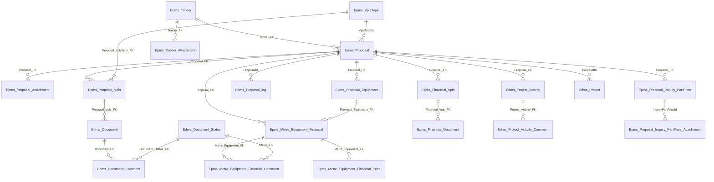

# HTS EPMS — Entity and field catalog

> Physical columns from `Data Persistence\Hts.Data.Model\MainEntities\Epms_*.cs` plus `Edms_Project_Activity` / `Edms_Project_Activity_Comment` (EPMS activity page, `ModuleType_FK = 387`). Persian captions are `CaptionsLibrary.fa-IR.resx` keys used by EPMS view-models (`[LocalizedDisplayName]`) or menu/status enums (`[LocalizedDescription]`). **No field is invented.** If a caption key has no `fa-IR` value, that is stated.
>
> Duplicate/partial classes under `Entities\Common\EngineeringProposalManagementSystem\` and `...\EngineeringProjectManagementSystem\` are EF `partial` companions (e.g. `Epms_Proposal.CodeTitle`) — they do **not** add columns.

## 1. Relationship sketch

SQL views used by grids (not extra tables): `Vw_Epms_Document`, `Vw_Epms_Metre_Equipment_Financial`.

## 2. Enums as used by EPMS

### 2.1 `EpmsProposalStatus` (`Infrastructure\Hts.Core\Enums\EpmsProposalStatus.cs`)

Two overlapping uses:

- **`Epms_Proposal.Proposal_Status_FK`** is filled from `Gnr_Lookup` **type 2** (same dropdown as EDMS project status), **not** from this enum’s 2749+ members. Comments in the enum file map 3–7 to شروع نشده / در جریان / خاتمه یافته / لغو شده / متوقف شده (lookup titles were not re-read from DB).
- **`Epms_Proposal_log.StatusId`** is written from this enum, including 2749–2779.

`[LocalizedDescription]` → resx:

| Member | Value | Resx key | Persian in `fa-IR.resx` |
|---|---|---|---|
| `NotStarted` | 3 | `NotStarted` | **missing** |
| `InProgress` | 4 | `InProgress` | در حال بررسی |
| `Finished` | 5 | `Finished` | تکمیل شده |
| `Canceled` | 6 | `Canceled` | **missing** |
| `Hold` | 7 | `Hold` | **missing** (there is `IsHold` = معلق, used by document status) |
| `CreateProposal` | 2749 | `CreateProposal` | ایجاد پروپوزال |
| `UpdateProposal` | 2750 | `UpdateProposal` | ویرایش پروپوزال |
| `SendToMetre` | 2751 | `SendToMetre` | ارسال به متره |
| `ConvertToProject` | 2752 | `ConvertToProject` | تبدیل به پروژه |
| `AttachmentOperation` | 2753 | `AttachmentOperation` | انجام عملیات پیوست |
| `SendToSale` | 2779 | `SendToSale` | ارسال به فروش |

Cartable / activity filters treat **4** as «در جریان» (`inWayProjectStatus`). Convert-to-project sets EDMS `Project_Status_FK = 3` (شروع نشده).

### 2.2 `EdmsDocumentStatus` (`Infrastructure\Hts.Core\Enums\EdmsDocumentStatus.cs`)

Stored on `Epms_Document_Comment.Document_Status_FK`, `Epms_Metre_Equipment_Financial_Comment.Status_FK`, `Edms_Project_Activity_Comment.Status_FK`. FK target: table `Edms_Document_Status` (`Document_Status_ID`, `Document_Status_Title`, `IsVisible`, `IsForDocumentUpload`, `IsForDcc`, `IsForEmployer`). Combo boxes use **table titles**, not necessarily the resx strings below.

| Member | Value | `[LocalizedDescription]` key | Persian `fa-IR` (enum display; UI combo may differ) | EPMS usage seen in code |
|---|---|---|---|---|
| `Reject` | 1 | `Rejected` | رد شد | control combo; cartable |
| `Approve` | 2 | `Approved` | تایید شد | control combo; activity combo; metre checker exclude |
| `ApprovedAsNote` | 3 | `ApprovedAsNote` | تایید مشروط | notification warning |
| `Commented` | 4 | `Commented` | کامنت شده | control/archive combos; activity combo; general-package comment write |
| `Issue` | 5 | `Issued` | صادر شده | upload/metre/activity first comment; control inbox |
| `ApprovedByDcc` | 6 | `ApprovedByDcc` | تایید کنترل کننده | notification success (EDMS-oriented) |
| `RejectByEmployer` | 7 | `RejectByEmployer` | توسط کارفرما رد شد | notification |
| `ApproveByEmployer` | 8 | `ApproveByEmployer` | توسط کارفرما تایید شد | notification |
| `ApprovedAsNoteByEmployer` | 9 | `ApprovedAsNoteByEmployer` | توسط کارفرما تایید مشروط شد | notification |
| `CommentedByEmployer` | 10 | `CommentedByEmployer` | اصلاحی کارفرما شد | notification |
| `Hold` | 11 | `IsHold` | معلق | notification |
| `UnHold` | 12 | `UnHold` | UnHold | *(enum only)* |
| `NotReview` | 13 | `NotReview` | **missing in fa-IR** | *(enum only)* |
| `UnHoldByEmployer` | 14 | `UnHold` | UnHold | *(enum only)* |
| `SendEmailToClient` | 15 | `SendEmailToClient` | ارسال ایمیل به کارفرما | *(enum only)* |
| `ReIssued` | 16 | `ReIssued` | ارسال مجدد | *(enum only)* |
| `Commited` | 17 | `Commited` | تایید/ارسال شده | commit docs/metre |
| `UnCommit` | 18 | `UnCommit` | لغو ارسال | uncommit |
| `ApprovedBySale` | 19 | `ApprovedBySale` | Approve | committed-metre combo; control inbox |
| `CommentedBySale` | 20 | `CommentedBySale` | Commented | sale reject-mode; cartable |
| `AsBuild` | 21 | `AsBuiled` | طبق ساخت | *(enum only)* |
| `ReplaySheet` | 22 | `ReplaySheet` | Reply Sheet | *(enum only)* |
| `ReplaySheetFromClient` | 23 | `ReplaySheetFromClient` | Client Reply Sheet | *(enum only)* |
| `IssueForClient` | 24 | `IssueForClient` | Issue For Client | *(enum only)* |
| `RejectedBySale` | 25 | `RejectedBySale` | Reject | cartable; committed-metre combo |
| `Archived` | 26 | `Archived` | **missing in fa-IR** | *(enum only; EPMS archives do not set this)* |
| `HoldByProject` | 27 | `HoldByProject` | Hold By Project | *(enum only)* |
| *(gap 28)* | | | | |
| `ConvertToGeneralPackage` | 29 | `ConvertToGeneralPackage` | تبدیل به جنرال پکیج | *(enum member; control action does **not** write 29 — it writes `Commented`)* |

### 2.3 Other enums touched by EPMS pages

| Enum | Path | EPMS note |
|---|---|---|
| `ModuleType` | `Hts.Core\Enums\ModuleType.cs` | `Epms = 616` — **not** used by the activity page (hardcoded **387**) |
| `DocumentFileType` | `Hts.Core\Enums\EdmsFileType.cs` | download: Main=0, Native=1, Secondary=2, DeviationList=6 (same value as ReplySheetFile), Comment=5 |
| `UserGroup` | `Hts.Core\Enums\UserGroup.cs` | 94, 123 (see spec 01) |
| `SystemType` | `SystemType.cs` | `Engineering = 26` |

## 3. Caption key index (resx → Persian)

Used below as the “UI caption” column when the EPMS model has `[LocalizedDisplayName("…")]`. Keys with no `fa-IR` value are marked —.

| Key | Persian |
|---|---|
| `Action_Priority` | الویت اقدام |
| `ActivityComment` | شرح فعالیت |
| `ActivityType` | نوع فعالیت |
| `Amount` | تعداد/مقدار |
| `ApprovedDate` | تاریخ تصویب |
| `ApprovedUser` | کاربر تاییدکننده |
| `Attachment_FileName` | عنوان فایل پیوست |
| `AttachmentType` | نوع پیوست |
| `BeneficiaryUnit` | واحد ذینفع |
| `CentralOfficeAddress` | آدرس دفتر مرکزی |
| `CheckedDate` | تاریخ بررسی |
| `CheckedUser` | کاربر بررسی کننده |
| `CheckedUserConsumedManHours` | نفر ساعت بررسی کننده |
| `Comment` | کامنت |
| `ConsumedManHours` | نفر ساعت |
| `ControlResponsible` | مسئول کنترل |
| `CreatedDate` | تاریخ ایجاد |
| `CreatedTime` | زمان ایجاد |
| `CreatedUser` | کاربر ایجادکننده |
| `Date` | تاریخ |
| `DeliveryDate` | تاریخ تحویل |
| `DeliveryTimeInMonth` | زمان تحویل (به ماه) |
| `Description` | توضیحات |
| `Document_DeviationListFileSize` | **missing** |
| `Document_FileName` | عنوان فایل |
| `Document_FileSize` | سایز فایل اصلی |
| `Document_NativeFileName` | فایل اصلی مدرک |
| `Document_NativeFileSize` | سایز فایل مادر |
| `Document_Number` | کد مدرک |
| `Document_SecondaryFileName` | فایل ثانوی |
| `Document_SecondaryFileSize` | سایز فایل ثانوی |
| `Document_Title` | عنوان مدرک |
| `DocumentNumber` | کد سند |
| `DocumentTitle` | عنوان سند |
| `Duration` | طول / مدت |
| `Due_Date` | **missing** |
| `EmployeerName` | نام کارفرما |
| `Employer_Email` | ایمیل کارفرما |
| `Employer_Name` | کارفرما |
| `Employer_Phone` | تلفن کارفرما |
| `Employer_RelatedPerson` | شخص رابط کارفرما |
| `Equipment_Model` | مدل تجهیز |
| `Equipment_Name` | نام تجهیز |
| `FileSize` | سایز فایل |
| `FinancialDocumentType` | مدرک |
| `FinancialVpis` | پروپوزال / مدرک مالی |
| `GeneralComment` | کامنت کلی |
| `HasAttachment` | حاوی پیوست |
| `HasGeneralPackage` | جنرال پکیج دارد؟ |
| `Id` | شناسه |
| `IndustryType` | نوع صنعت |
| `InquiryDate` | تاریخ استعلام |
| `IsApproved` | تایید شده |
| `IsChecked` | بررسی شده |
| `IsCommited` | ارسال شده |
| `IsRejected` | رد شده |
| `IsSendToMetre` | ارسال به متره؟ |
| `IssueDate` | تاریخ انتشار/ارسال |
| `LastComment` | کامنت آخر |
| `MainResponsible` | مسئول اصلی |
| `MaxSendingDate` | حداکثر زمان ارسال |
| `MaxTenderAttachmentRevision` | آخرین نسخه سند مناقصه |
| `Operation` | عملیات |
| `OrganizationUnit` | واحد سازمانی |
| `PreparedUser` | کاربر آماده کننده |
| `Price_Dollar` / `Price_Euro` / `Price_Rial` | قیمت (دلار/یورو/ریال) |
| `PriceUnit` | واحد فروش |
| `Project_Address` | آدرس پروژه |
| `Project_Name` | نام پروژه |
| `Proposal` | پروپوزال |
| `Proposal_Code` | کد پروپوزال |
| `Proposal_Title` | عنوان پروپوزال |
| `Proposal_VpisType` | نوع Vpis |
| `ProposalManHours` | نفر ساعت پروپوزال |
| `ProposalRequestType` | نوع پروپوزال درخواستی |
| `Receivers` / `CCReceivers` | گیرندگان / گیرندگان کپی |
| `RequestedDocumentType` | نوع مدرک درخواستی |
| `RequestedOrgUnit` | واحد درخواست کننده |
| `RevNo` | رویژن |
| `RevisionDescription` | توضیحات ریویژن |
| `SalesExperts` | کارشناسان فروش |
| `SalesManager` | مدیر فروش |
| `SalesSupervisor` | سرپرست فروش |
| `SecondApprove` | تایید دوم |
| `SecondApprovedUser` | کاربر تایید کننده دوم |
| `SendToMetreCount` | تعداد ارسال به متره |
| `SendToSaleUnit` | ارسال به فروش |
| `Standard` | استاندارد |
| `StartDate_Shamsi` | تاریخ شروع |
| `Status` | وضعیت |
| `SuggestedPrice` | قیمت پیشنهادی |
| `Supplier_Name` | نام تامین کننده |
| `Supplayer` | تامین کننده |
| `TechnicalSpecifications` | مشخصات فنی |
| `Tender_Date_Shamsi` | تاریخ مناقصه |
| `Tender_Title` | عنوان مناقصه |
| `TenderDocumentVersion` | نسخه سند مناقصه |
| `TenderName` | عنوان مناقصه |
| `Title` | عنوان |
| `Total_Price_*` | مجموع قیمت (ریال/یورو/دلار) |
| `TotalPrice` | مجموع قیمت |
| `TotalSizeOfFile` | سایز کلی فایل (ها) |
| `UnitPrice` | قیمت واحد |
| `UpdatedDate` | زمان ویرایش |
| `UpdatedUser` | کاربر ویرایشگر |
| `User` | کاربر |

## 4. `Epms_Proposal`

Source: `MainEntities\Epms_Proposal.cs`. PK `Proposal_ID` `short`.

| Column | CLR | Len / notes | UI caption (resx) |
|---|---|---|---|
| `Proposal_ID` | `short` | PK | شناسه (`Id`) |
| `Tender_FK` | `short?` | → `Epms_Tender` | — |
| `Proposal_Code` | `string` | 160; generated `HY-PRO-…` | کد پروپوزال |
| `Proposal_Title` | `string` | 1600 | عنوان پروپوزال |
| `RequestedOrgUnit_FK` | `short` | → `HRM_OrgUnit` | واحد درخواست کننده |
| `SalesExpertIds` | `string` | 1024 CSV personel ids | — (display `SalesExperts`) |
| `SalesExperts` | `string` | 4000 names | کارشناسان فروش |
| `Action_Priority` | `byte?` | | الویت اقدام |
| `IndustryHdr_FK` | `byte?` | → `Crm_IndustryHdr` | نوع صنعت |
| `ProposalRequest_FK` | `short?` | lookup type 63 → `Gnr_Lookup` | نوع پروپوزال درخواستی |
| `ProposalDate` | `DateTime?` | `date` | |
| `ProposalDate_Shamsi` | `string` | 10, **computed** | |
| `Proposal_Status_FK` | `short?` | lookup type 2 → `Gnr_Lookup` | وضعیت |
| `CreatedUser_FK` | `short` | → `Gnr_User` | کاربر ایجادکننده |
| `CreatedDate` | `DateTime` | `date` | تاریخ ایجاد |
| `CreatedDate_Shamsi` | `string` | 10 | تاریخ ایجاد |
| `CreatedTime` | `string` | 5 | زمان ایجاد |
| `Comment` | `string` | 4000 | کامنت |
| `TenderName` | `string` | 128 | عنوان مناقصه |
| `SalesManagerId` | `short?` | → `HRM_Personel` | مدیر فروش |
| `StartDate` | `DateTime?` | | |
| `StartDateInText` | `string` | 20 | تاریخ شروع |
| `TenderDate` | `DateTime?` | | |
| `TenderDateInText` | `string` | 20 | تاریخ مناقصه |
| `UpdatedUserId` | `short?` | → `Gnr_User` | کاربر ویرایشگر |
| `UpdatedDateTime` | `DateTime?` | | زمان ویرایش |
| `UpdatedDateInText` | `string` | 20 | زمان ویرایش |
| `ProposalSecondStatus` | `short?` | → `Gnr_Lookup` | عملیات (model) |
| `IsSendToMetre` | `bool?` | set by `SetIsSendToMetre` | ارسال به متره؟ |
| `SalesSupervisorId` | `short?` | → `HRM_Personel` | سرپرست فروش |
| `VpisTypeId` | `byte?` | → `Epms_VpisType` | نوع مدرک درخواستی |
| `IsForProductEngineeringDepartment` | `bool` | | — |
| `HasGeneralPackage` | `bool?` | | جنرال پکیج دارد؟ |
| `Revision` | `int` | UI caption SendToMetreCount | تعداد ارسال به متره |
| `RevisionDescription` | `string` | 1024 | توضیحات ریویژن |

Navigations (no extra columns): `Edms_Project`, `Edms_Project_Activity`, `Epms_Financial_Vpis`, `Epms_Metre_Equipment_Financial`, `Epms_Proposal_Attachment`, `Epms_Proposal_Equipment`, `Epms_Proposal_Inquiry_PartPrice`, `Epms_Proposal_log`, `Epms_Proposal_Vpis`, `Epms_Tender`, `Epms_VpisType`, `Crm_IndustryHdr`, `HRM_OrgUnit`, `Gnr_User` / `Gnr_User1`, `HRM_Personel` / `HRM_Personel1`, `Gnr_Lookup` ×3.

Partial computed (not a column): `CodeTitle` => `{Proposal_Code} | {Proposal_Title}` (`Entities\Common\...\Epms_Proposal.cs`).

**Not on the entity:** employer phone/email/address — those live on `Epms_Tender` and are shown on `ProposalModel` via join.

## 5. `Epms_Proposal_Attachment`

`MainEntities\Epms_Proposal_Attachment.cs`. PK `Proposal_Attachment_ID` `short`.

| Column | CLR | Len / notes | UI caption |
|---|---|---|---|
| `Proposal_Attachment_ID` | `short` | PK | |
| `Proposal_FK` | `short` | | |
| `RevNo` | `short` | | رویژن |
| `Attachment_FileName` | `string` | 255 | عنوان (`Title` on model) |
| `Attachment_FileContent` | `byte[]` | | |
| `CreatedUser_FK` | `short` | | کاربر |
| `CreatedDate` | `string` | 10 Shamsi | تاریخ ایجاد |
| `CreatedTime` | `string` | 5 | زمان ایجاد |
| `Attachment_Comment` | `string` | 4000 | توضیحات |
| `Attachment_FileSize` | `long?` | | سایز فایل |
| `AttachmentFilePath` | `string` | 1024 disk path | |
| `IsSendToProjectAttachments` | `bool` | copied to EDMS as type 258 if true | ارسال به فروش (`SendToSaleUnit`) |

## 6. `Epms_Proposal_Equipment`

`MainEntities\Epms_Proposal_Equipment.cs`. PK `Proposal_Equipment_ID` `int`. Replaced in full on proposal update (`Delete` then `BulkInsert`).

| Column | CLR | Len | UI caption |
|---|---|---|---|
| `Proposal_Equipment_ID` | `int` | PK | |
| `Proposal_FK` | `short?` | | |
| `Equipment_Name` | `string` | 2048 | نام تجهیز |
| `Equipment_Model` | `string` | 2048 | مدل تجهیز |
| `Supplier_Name` | `string` | 2048 | نام تامین کننده |
| `Standard` | `string` | 2048 | استاندارد |
| `Mount` | `byte` | | تعداد/مقدار (`Amount` on model) |
| `TechnicalSpecifications` | `string` | 2048 | مشخصات فنی |
| `Comment` | `string` | 4000 | کامنت |

## 7. `Epms_Proposal_Vpis`

`MainEntities\Epms_Proposal_Vpis.cs`. PK `Proposal_Vpis_ID` `int`.

| Column | CLR | Len / notes | UI caption |
|---|---|---|---|
| `Proposal_Vpis_ID` | `int` | PK | |
| `Proposal_FK` | `short` | | |
| `Proposal_VpisType_FK` | `byte` | → `Epms_VpisType` | نوع Vpis |
| `DocumentTitle` | `string` | 2040; suffix ` - REV 0n` | عنوان سند |
| `DocumentNumber` | `string` | 800 | کد سند |
| `MainResponsible_FK` | `short` | → `Gnr_User` (nav `Gnr_User3` in cartable include) | مسئول اصلی |
| `ControlResponsible_FK` | `short` | checker user id | مسئول کنترل |
| `ApprovedUser_FK` | `short` | | کاربر تاییدکننده |
| `CreatedUser_FK` | `short` | | |
| `CreatedDate` | `DateTime` | `date` | تاریخ ایجاد |
| `CreatedDate_Shamsi` | `string` | 10 | |
| `CreatedTime` | `string` | 5 | زمان ایجاد |
| `Comment` | `string` | 4000 | کامنت |
| `IsForProductEngineeringDepartment` | `bool` | copied from proposal | — |
| `SecondApprovedUser_FK` | `short?` | | کاربر تایید کننده دوم |

**Not on this entity:** `Due_Date` — `ProposalVpisModel` has `[LocalizedDisplayName("Due_Date")]` properties, but **no matching columns** on `Epms_Proposal_Vpis`. Due dates belong to `Epms_Document`.

Users: `Gnr_User`, `Gnr_User1`, `Gnr_User2`, `Gnr_User3`, `Gnr_User4` (EF multiplicity; do not invent names beyond the FKs above).

## 8. `Epms_VpisType`

`MainEntities\Epms_VpisType.cs`. PK `VpisType_ID` `byte` identity.

| Column | CLR | Len | UI caption |
|---|---|---|---|
| `VpisType_ID` | `byte` | PK | |
| `Vpis_Type_Title` | `string` | 400 | *(no dedicated resx key; combo text)* |

## 9. `Epms_Proposal_log`

`MainEntities\Epms_Proposal_log.cs`. PK `Id` `int`.

| Column | CLR | Len | UI caption |
|---|---|---|---|
| `Id` | `int` | PK | شناسه |
| `ProposalId` | `short?` | | |
| `StatusId` | `short?` | → `Gnr_Lookup` **and/or** `EpmsProposalStatus` | وضعیت / عملیات |
| `Comment` | `string` | 1024 | کامنت |
| `CreatedUserId` | `short?` | → `Gnr_User` | کاربر ایجادکننده |
| `CreatedDate` | `DateTime?` | | |
| `CreatedDateInText` | `string` | 16 | تاریخ ایجاد |

## 10. `Epms_Proposal_Inquiry_PartPrice`

`MainEntities\Epms_Proposal_Inquiry_PartPrice.cs`. PK `Proposal_Inquiry_PartPrice_ID` `int`.

| Column | CLR | Len | UI caption |
|---|---|---|---|
| `Proposal_Inquiry_PartPrice_ID` | `int` | PK | |
| `Proposal_FK` | `short` | | |
| `Equipment_Name` | `string` | 2048 | نام تجهیز |
| `Equipment_Model` | `string` | 2048 | مدل تجهیز |
| `TechnicalSpecifications` | `string` | 2048 | مشخصات فنی |
| `Supplier_Name` | `string` | 2048 | نام تامین کننده |
| `SuggestedPrice` | `long` | | قیمت پیشنهادی |
| `UnitPrice_FK` | `byte` | → `Acc_PriceUnit` | واحد فروش (`UnitPrice` on model) |
| `EmployeerName` | `string` | 2048 | نام کارفرما |
| `InquiryDate` | `string` | 10 | تاریخ استعلام |
| `Comment` | `string` | 2400 | کامنت |

## 11. `Epms_Proposal_Inquiry_PartPrice_Attachment`

`MainEntities\Epms_Proposal_Inquiry_PartPrice_Attachment.cs`. PK `Id` `int`.

| Column | CLR | Len | UI caption |
|---|---|---|---|
| `Id` | `int` | PK | |
| `InquiryPartPriceId` | `int` | | |
| `Attachment_FileName` | `string` | 2048 | عنوان فایل پیوست |
| `Attachment_FileContent` | `byte[]` | required | |
| `Attachment_FileSize` | `long?` | **computed** | سایز فایل |
| `CreatedUser_FK` | `short` | | کاربر |
| `CreatedDate` | `string` | 10 | تاریخ ایجاد |
| `CreatedTime` | `string` | 5 | زمان ایجاد |
| `Attachment_Comment` | `string` | 4000 | توضیحات |

## 12. `Epms_Tender` (dead menu; still FK of proposal)

`MainEntities\Epms_Tender.cs`. PK `Tender_ID` `short`.

| Column | CLR | Len | UI caption |
|---|---|---|---|
| `Tender_ID` | `short` | PK | |
| `Tender_Title` | `string` | 1600 | عنوان مناقصه |
| `Employer_Name` | `string` | 1024 | کارفرما |
| `Employer_Phone` | `string` | 160 | تلفن کارفرما |
| `Employer_Email` | `string` | 400 | ایمیل کارفرما |
| `Employer_RelatedPerson` | `string` | 1024 | شخص رابط کارفرما |
| `SalesExpertIds` | `string` | 400 CSV | |
| `SalesExperts` | `string` | 4000 | کارشناسان فروش |
| `SalesManagerId` | `short?` | → `HRM_Personel` | مدیر فروش |
| `RequestedOrgUnit_FK` | `short?` | → `HRM_OrgUnit` | واحد درخواست کننده |
| `Tender_Status_FK` | `short?` | → `Gnr_Lookup` | وضعیت |
| `Tender_Date` | `DateTime` | `date` | |
| `Tender_Date_Shamsi` | `string` | 10 | تاریخ مناقصه |
| `StartDate` | `DateTime?` | `date` | |
| `StartDate_Shamsi` | `string` | 10 | تاریخ شروع |
| `Project_Address` | `string` | 4000 | آدرس پروژه |
| `CentralOfficeAddress` | `string` | 4000 | آدرس دفتر مرکزی |
| `CreatedUserId` | `short` | → `Gnr_User` | |
| `CreatedDate` | `DateTime` | | تاریخ ایجاد |

Also navigates to `Edms_Project`, `Inv_Specific_Equipment` (out of EPMS menu scope).

## 13. `Epms_Tender_Attachment`

`MainEntities\Epms_Tender_Attachment.cs`. PK `Tender_Attachment_ID` `short`.

| Column | CLR | Len | UI caption |
|---|---|---|---|
| `Tender_Attachment_ID` | `short` | PK | |
| `Tender_FK` | `short` | | |
| `Tender_AttachmentType_FK` | `short?` | → `Gnr_Lookup` | نوع پیوست |
| `Supplayer_FK` | `int?` | → `Gnr_ManCompany` | تامین کننده |
| `RevNo` | `short` | | رویژن |
| `Attachment_FileName` | `string` | 255 | عنوان |
| `Attachment_FileContent` | `byte[]` | | |
| `CreatedUser_FK` | `short` | | کاربر |
| `CreatedDate` | `string` | 10 | تاریخ ایجاد |
| `CreatedTime` | `string` | 5 | زمان ایجاد |
| `Attachment_Comment` | `string` | 4000 | توضیحات |
| `MaxSendingDate` | `DateTime` | `date` | حداکثر زمان ارسال |
| `MaxSendingDateInText` | `string` | 80 | |
| `AttachmentFilePath` | `string` | 1024 | |
| `Attachment_FileSize` | `long?` | | سایز فایل |

## 14. `Epms_Document`

`MainEntities\Epms_Document.cs`. PK `Document_ID` `int`. File **names/sizes** on the row; bytes on disk.

| Column | CLR | Len / notes | UI caption |
|---|---|---|---|
| `Document_ID` | `int` | PK | |
| `Proposal_Vpis_FK` | `int` | | |
| `Document_FileName` | `string` | 2040 | عنوان فایل |
| `Document_NativeFileName` | `string` | 2040 | فایل اصلی مدرک |
| `Document_SecondaryFileName` | `string` | 2040 | فایل ثانوی |
| `Document_DeviationListFileName` | `string` | 2040 | *(resx key missing; model uses same name)* |
| `Document_FileSize` | `long?` | | سایز فایل اصلی |
| `Document_NativeFileSize` | `long?` | | سایز فایل مادر |
| `Document_SecondaryFileSize` | `long?` | | سایز فایل ثانوی |
| `Document_DeviationListFileSize` | `long?` | | *(resx missing)* |
| `Revision` | `byte?` | **computed** | رویژن |
| `TenderDocumentVersion` | `short?` | | نسخه سند مناقصه |
| `Due_Date` | `DateTime` | `date` | *(Due_Date resx missing; Shamsi below)* |
| `Due_Date_Shamsi` | `string` | 10 | report uses as IssueDate = تاریخ انتشار/ارسال |
| `ConsumedManHours` | `short?` | | نفر ساعت |
| `CreatedUser_FK` | `short` | | کاربر ایجادکننده |
| `CreatedDate` | `DateTime?` | `date` | تاریخ ایجاد |
| `CreatedDate_Shamsi` | `string` | 10 | |
| `CreatedTime` | `string` | 5 | زمان ایجاد |
| `PreparedUser_FK` | `short` | | کاربر آماده کننده |
| `PreparedDate` | `DateTime?` | | *(PreparedDate resx missing)* |
| `PreparedDate_Shamsi` | `string` | 10 | |
| `CheckedUser_FK` | `short?` | | کاربر بررسی کننده |
| `CheckedDate` | `DateTime?` | | تاریخ بررسی |
| `CheckedDate_Shamsi` | `string` | 10 | |
| `ApprovedUser_FK` | `short?` | | کاربر تاییدکننده |
| `ApprovedDate` | `DateTime?` | | تاریخ تصویب |
| `ApprovedDate_Shamsi` | `string` | 10 | |
| `IsCommited` | `bool` | | ارسال شده |
| `IsChecked` | `bool?` | **computed** | بررسی شده |
| `IsApproved` | `bool?` | **computed** | تایید شده |
| `SecondApprovedUser_FK` | `short?` | | کاربر تایید کننده دوم |
| `SecondApprovedDate` | `DateTime?` | | |
| `SecondApprovedDate_Shamsi` | `string` | 16 | |
| `IsSecondApproved` | `bool?` | | تایید دوم |

`Gnr_User` … `Gnr_User4`: creator / checker / approver / preparer / second approver (EF order; FKs above are authoritative).

## 15. `Epms_Document_Comment`

`MainEntities\Epms_Document_Comment.cs`. PK `Document_Comment_ID` `int`. Comment **file name only** (bytes on disk).

| Column | CLR | Len | UI caption |
|---|---|---|---|
| `Document_Comment_ID` | `int` | PK | |
| `Document_FK` | `int` | | |
| `Document_Status_FK` | `byte` | → `Edms_Document_Status` | وضعیت |
| `Attachment_FileName` | `string` | 800 | عنوان فایل پیوست |
| `CreatedUser_FK` | `short` | | کاربر |
| `CreatedDate_Shamsi` | `string` | 10 | تاریخ ایجاد |
| `CreatedDate` | `DateTime` | `date` | |
| `CreatedTime` | `string` | 5 | زمان ایجاد |
| `Comment` | `string` | 4000 | کامنت |

## 16. `Edms_Document_Status` (shared with EDMS)

`MainEntities\Edms_Document_Status.cs`. PK `Document_Status_ID` `byte` = `EdmsDocumentStatus`.

| Column | CLR | Len | Notes |
|---|---|---|---|
| `Document_Status_ID` | `byte` | PK | |
| `Document_Status_Title` | `string` | 400 | combo text |
| `IsForDocumentUpload` | `bool` | | |
| `IsForDcc` | `bool?` | | |
| `IsVisible` | `bool` | | EPMS combos filter this |
| `IsForEmployer` | `bool` | | |

EPMS collections on this type: `Epms_Document_Comment`, `Epms_Metre_Equipment_Financial_Comment`, `Edms_Project_Activity_Comment`.

## 17. `Epms_Financial_Vpis`

`MainEntities\Epms_Financial_Vpis.cs`. PK `Financial_Vpis_ID` `int`.

| Column | CLR | Len | UI caption |
|---|---|---|---|
| `Financial_Vpis_ID` | `int` | PK | |
| `Proposal_FK` | `short` | | |
| `FinancialDocumentType_FK` | `short` | lookup type 70 | مدرک |
| `MainResponsible_FK` | `short` | → `Gnr_User` | مسئول اصلی |
| `DeliveryDate` | `DateTime` | `date` | تاریخ تحویل |
| `DeliveryDate_Shamsi` | `string` | 10 | |
| `CreatedUser_FK` | `short` | | کاربر ایجادکننده |
| `CreatedDate` | `DateTime` | `date` | تاریخ ایجاد |
| `CreatedDate_Shamsi` | `string` | 10 | |
| `CreatedTime` | `string` | 5 | زمان ایجاد |
| `Comment` | `string` | 4000 | کامنت |

## 18. `Epms_Financial_Document`

`MainEntities\Epms_Financial_Document.cs`. PK `Financial_Document_ID` `int`. File in **varbinary**.

| Column | CLR | Len | UI caption |
|---|---|---|---|
| `Financial_Document_ID` | `int` | PK | |
| `Financial_Vpis_FK` | `int` | | پروپوزال / مدرک مالی |
| `ConsumedManHours` | `short?` | | نفر ساعت |
| `Revision` | `int` | assigned as existing count on add | رویژن |
| `Attachment_FileName` | `string` | 4000 | عنوان فایل پیوست |
| `Attachment_FileContent` | `byte[]` | | |
| `Attachment_FileSize` | `long?` | **computed** | سایز فایل |
| `CreatedUser_FK` | `short` | | کاربر ایجادکننده |
| `CreatedDate` | `DateTime` | `date` | تاریخ ایجاد |
| `CreatedDate_Shamsi` | `string` | 10 | |
| `CreatedTime` | `string` | 5 | زمان ایجاد |
| `Comment` | `string` | 4000 | کامنت |

## 19. `Epms_Metre_Equipment_Financial`

`MainEntities\Epms_Metre_Equipment_Financial.cs`. PK `Metre_Equipment_ID` `int`.

| Column | CLR | Len / notes | UI caption |
|---|---|---|---|
| `Metre_Equipment_ID` | `int` | PK | |
| `Proposal_FK` | `short` | | |
| `Proposal_Equipment_FK` | `int?` | | |
| `Equipment_Name` | `string` | 2048 | نام تجهیز |
| `Equipment_Model` | `string` | 2048 | مدل تجهیز |
| `Supplier_Name` | `string` | 2048 | نام تامین کننده |
| `Standard` | `string` | 2048 | استاندارد |
| `Mount` | `short` | | تعداد/مقدار |
| `TechnicalSpecifications` | `string` | 4000 | مشخصات فنی |
| `Comment` | `string` | 4000 | کامنت |
| `DeliveryTimeInMonth` | `byte` | | زمان تحویل (به ماه) |
| `Revision` | `byte` | | رویژن |
| `ConsumedManHours` | `int?` | minutes | نفر ساعت |
| `ConsumedManHoursInText` | `string` | 6 | نفر ساعت |
| `IsInitialRegistration` | `bool` | true on add | — |
| `IsCommited` | `bool` | | ارسال شده |
| `Attachment_FileContent` | `byte[]` | | |
| `Attachment_FileName` | `string` | 2048 | عنوان فایل پیوست |
| `Attachment_FileSize` | `long?` | **computed** | سایز فایل |
| `CreatedUser_FK` | `short` | | کاربر ایجادکننده |
| `CreatedDate` | `DateTime` | `date` | تاریخ ایجاد |
| `CreatedDate_Shamsi` | `string` | 10 | |
| `CreatedTime` | `string` | 5 | زمان ایجاد |
| `UpdatedUser_FK` | `short` | | کاربر ویرایشگر |
| `UpdatedDate_Shamsi` | `string` | 10 | زمان ویرایش |
| `UpdatedTime` | `string` | 5 | *(UpdatedTime resx missing)* |
| `GeneralComment` | `string` | 4000 | کامنت کلی |

Prices (`Price_Rial` etc.) are **not columns** here; they appear on `Vw_Epms_Metre_Equipment_Financial` / `MetreEquipmentFinancialModel`.

## 20. `Epms_Metre_Equipment_Financial_Comment`

`MainEntities\Epms_Metre_Equipment_Financial_Comment.cs`. PK `Metre_Equipment_Comment_ID` `int`. File in **varbinary**.

| Column | CLR | Len | UI caption |
|---|---|---|---|
| `Metre_Equipment_Comment_ID` | `int` | PK | |
| `Metre_Equipment_FK` | `int` | | |
| `Status_FK` | `byte` | → `Edms_Document_Status` | وضعیت |
| `Attachment_FileName` | `string` | 800 | عنوان فایل پیوست |
| `Attachment_FileContent` | `byte[]` | | |
| `Attachment_FileSize` | `long?` | **computed** | |
| `CreatedUser_FK` | `short` | | کاربر |
| `CreatedDate_Shamsi` | `string` | 10 | تاریخ ایجاد |
| `CreatedDate` | `DateTime` | `date` | |
| `CreatedTime` | `string` | 5 | زمان ایجاد |
| `Comment` | `string` | 4000 | کامنت |

## 21. `Epms_Metre_Equipment_Financial_Price`

`MainEntities\Epms_Metre_Equipment_Financial_Price.cs`. PK `Metre_Equipment_Price_ID` `int`. Replaced in full on metre update.

| Column | CLR | Notes | UI caption |
|---|---|---|---|
| `Metre_Equipment_Price_ID` | `int` | PK | |
| `Metre_Equipment_FK` | `int` | | |
| `PriceUnit_FK` | `byte` | → `Acc_PriceUnit` | واحد فروش |
| `UnitPrice` | `long` | | قیمت واحد |

`TotalPrice` on the model is derived, not stored.

## 22. `Edms_Project_Activity` (EPMS uses `ModuleType_FK = 387`)

`MainEntities\Edms_Project_Activity.cs`. PK `Project_Activity_ID` `int`. Shared table with EDMS (386).

| Column | CLR | Len / notes | UI caption |
|---|---|---|---|
| `Project_Activity_ID` | `int` | PK | شناسه |
| `ModuleType_FK` | `short` | **387** on EPMS page | — |
| `Project_FK` | `int?` | → `Edms_Project` (EDMS) | |
| `Proposal_FK` | `short?` | → `Epms_Proposal` | پروپوزال |
| `Project_Name` | `string` | 4000 | نام پروژه (`Project` on model) |
| `BeneficiaryUnit_FK` | `short?` | → `HRM_OrgUnit` | واحد ذینفع |
| `ActivityType_FK` | `short?` | lookup type 84 | نوع فعالیت |
| `ActivityComment` | `string` | 4000 | شرح فعالیت |
| `ActivityDate` | `string` | 10 required Shamsi | تاریخ |
| `ActivityDate_Miladi` | `DateTime?` | `date`; set from Shamsi | |
| `Duration` | `short` | | طول / مدت |
| `Comment` | `string` | 4000 | کامنت |
| `CreatedUser_FK` | `short` | | کاربر ایجادکننده |
| `CreatedDate` | `string` | 10 | تاریخ ایجاد |
| `CreatedTime` | `string` | 5 | زمان ایجاد |

## 23. `Edms_Project_Activity_Comment`

`MainEntities\Edms_Project_Activity_Comment.cs`. PK `Project_Activity_Comment_ID` `int`.

| Column | CLR | Len | UI caption |
|---|---|---|---|
| `Project_Activity_Comment_ID` | `int` | PK | |
| `Project_Activity_FK` | `int` | | |
| `Status_FK` | `byte` | → `Edms_Document_Status` (EPMS offers 2 and 4) | وضعیت |
| `CreatedUser_FK` | `short` | | کاربر |
| `CreatedDate_Shamsi` | `string` | 10 | تاریخ ایجاد |
| `CreatedDate` | `DateTime` | `date` | |
| `CreatedTime` | `string` | 5 | زمان ایجاد |
| `Comment` | `string` | 4000 | کامنت |

No attachment column (unlike document/metre comments).

## 24. Read models / views (not extra tables)

### `Vw_Epms_Document`

Join used by `GetDocumentUploadModel`. Extra vs `Epms_Document`: `DocumentNumber`, `DocumentTitle`, `SalesExpertIds`, user title columns, `LastCommentedUser_FK`, `LastDocument_Status_FK`, `HasCommitedStatus`, `Vpis_ApprovedUser_FK`, `ControlResponsible_FK`, `Tender_ID`, `MaxTenderAttachmentRevision`, `TenderSalesExpertIds`, `TenderSalesManagerId`, `Proposal_ID`, `SalesSupervisorId`, `SecondApprovedUser_Title`, `IsForProductEngineeringDepartment`, `ProposalRevision`.

### `Vw_Epms_Metre_Equipment_Financial`

Extra vs metre entity: `lastStatus`, `LastStatus_FK`, `SalesExpertIds`, `TenderSalesExpertIds`, `TenderSalesManagerId`, `UpdatedUser`, `Price_Rial`, `Total_Price_Rial`, `Price_Euro`, `Total_Price_Euro`, `Price_Dollar`, `Total_Price_Dollar`.

### Report SQL (`ReadData.GetEpmsPersonelPerformance`)

Not an entity. Columns: `DocumentId`, `ProposalCode`, `ProposalTitle`, `DocumentNumber`, `DocumentTitle`, `ConsumedManHours`, `ConsumedManHoursInText`, `CheckedUserConsumedManHours` (= 20% of consumed), `PreparedUserId/PreparedUser`, `CheckedUser`, `Revision`, `IssueDateShamsi` (= `Due_Date_Shamsi`), `IssueDate`, `ManHours` (sum per proposal / 60).

## 25. Related types written by EPMS but owned by EDMS

On convert-to-project (`ProposalManagementController`):

- `Edms_Project`: `Project_Code` from `GetProjectCode`, `Project_Name = TenderName`, `BeneficiaryUnit_FK`, `Main_Client_FK = 1247`, `Project_Status_FK = 3`, `IsVendorProject = false`, `IsCreatedFromProposal = true`, `ProposalId`, comment prefix `Created from proposal -`.
- `Edms_Project_Attachment`: `Project_Document_Type_FK` **258** (متره, from proposal attachments with `IsSendToProjectAttachments`) or **257** (پروپزال, from approved `Epms_Document` file names).

Those EDMS columns are not catalogued here.

## 26. Could not verify

- Live `Gnr_Lookup` titles for types 2, 63, 70, 84 and lookup id 2432 (excluded from proposal status).
- Live `Edms_Document_Status.Document_Status_Title` rows (UI uses table, not enum resx).
- EF mapping of which `Gnr_User` / `Gnr_User1`… navigation is which FK (only FK names are listed as fields).
- Whether `ProposalVpisModel.Due_Date` was ever a column (it is **not** on `Epms_Proposal_Vpis` today).
- `Action_Priority` lookup source (column exists; `FillData` does not load it).
