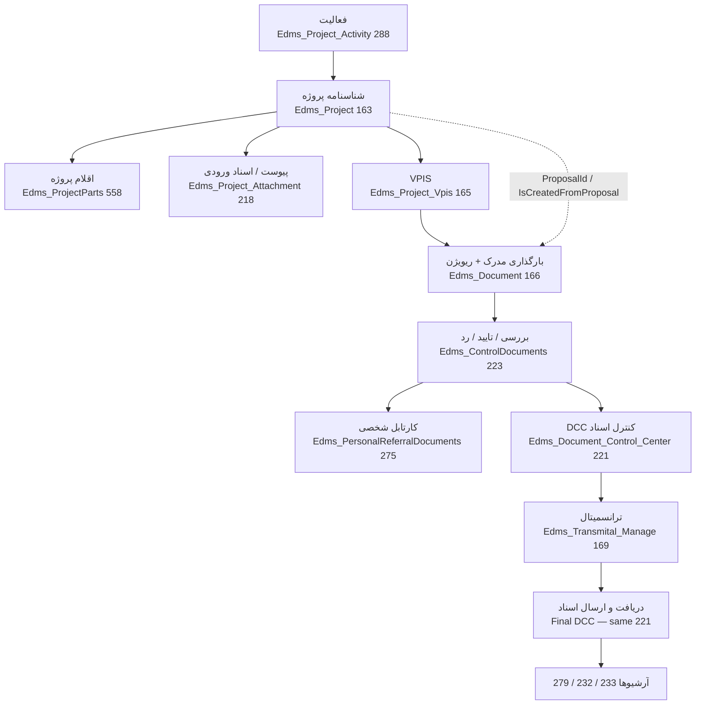

# 03 — HTS EDMS: process, live pages, access, reports

> As-is documentation of the **live** HTS menu **Engineering → مهندسی پروژه** (`CaptionsLibrary.EdmsSystem` = مهندسی پروژه). No Havayar mapping and no code changes.
>
> Companion field catalog: `04-HTS-Edms-Entities-Fields.md`.

Confirmed against HTS source on **2026-09-15**. Persian captions are from `CaptionsLibrary.fa-IR.resx`. `SystemPage` numeric IDs are from `Pages.cs`. Controllers/actions/views were checked in `Areas\Edms`. Live `Edms_Document_Status.Document_Status_Title` rows were **not** queried (TotalSystem MCP unavailable) — enum LocalizedDescription captions from resx are used instead.

---

## 1. Sources

| What | Path |
|---|---|
| Live menu (the one that actually renders) | `Presentation\WebApplication\HtsWebApplication\Areas\Epms\Views\Shared\Menu\_EpmsMenu.cshtml` — block `<!--سیستم کنترل اسناد-->` |
| Shell that includes that menu | `Presentation\WebApplication\HtsWebApplication\Views\Shared\Layouts\Partials\_ModulesMenu.cshtml` (`Html.RenderPartial(MVC.Epms.Shared.Views.Menu._EpmsMenu, Model)` when `user.HasAccess(SystemType.Engineering)`) |
| Href → `PartialTitle` | `Infrastructure\Hts.Web.Core\General\Helpers\ApplicationHelpers\MessageTranslator.cs` |
| `PartialTitle` → controller action | `Presentation\WebApplication\HtsWebApplication\Controllers\HomeController.cs` (`LoadPartial`) |
| Area route | `Presentation\WebApplication\HtsWebApplication\Areas\Edms\EdmsAreaRegistration.cs` → `/Edms/{controller}/{action}/{id}` |
| `SystemPage` IDs | `Infrastructure\Hts.Core\Enums\Pages.cs` |
| `PermissionType` | `Infrastructure\Hts.Core\Enums\PermissionType.cs` |
| Authorize filter | `Presentation\WebApplication\HtsWebApplication\Infrastructure\Filters\ActionFilters\PermissionAuthorizeAttribute.cs` |
| Document status enum | `Infrastructure\Hts.Core\Enums\EdmsDocumentStatus.cs` |
| Persian captions | `Infrastructure\Hts.Core\Resources\CaptionsLibrary.fa-IR.resx` |
| Edms controllers | `Presentation\WebApplication\HtsWebApplication\Areas\Edms\Controllers\` |
| Edms views | `Presentation\WebApplication\HtsWebApplication\Areas\Edms\Views\EdmsSystem\` |

Client navigation: menu `<a href="edms-…" class="load-partial">` posts `{ partialType: href }` to `Home.LoadPartial`, which `RedirectToAction`s the T4MVC load action. MVC URL shape is `/Edms/{ControllerName}/{Action}`.

---

## 2. `_EdmsMenu.cshtml` is not rendered

`Areas\Edms\Views\Shared\Menu\_EdmsMenu.cshtml` exists and still lists a **smaller** Edms menu (no activity, no project parts, fewer reports, different archive caption for attachments). It is **not** used at runtime.

In `_ModulesMenu.cshtml` the call is commented:

```csharp
//    Html.RenderPartial(MVC.Edms.Shared.Views.Menu._EdmsMenu, Model);
```

The live tree is only the EdmsSystem block inside `_EpmsMenu.cshtml`. Differences vs `_EdmsMenu.cshtml` (stale file, do not treat as live):

| Topic | Live `_EpmsMenu` Edms block | Unused `_EdmsMenu` |
|---|---|---|
| Caption for project list | `IdProjects` (شناسنامه پروژه ها) | `ProjectManagement` (مدیریت پروژه ها) |
| Activity / parts / ExtraInfo / most reports | present (ExtraInfo commented) | missing |
| Archive attachments caption | `ProjectInputDocumentsArchive` | `ArchiveOfBiddingDocuments` |
| DCC item order | Control → Transmittal → Final | Control → Final → Transmittal |

---

## 3. Access model

- **System:** `SystemType.Engineering` (every Edms controller has `[PermissionAuthorize(SystemType.Engineering)]`).
- **Admin:** `UserType.Admin` bypasses `PermissionAuthorize` and most data filters.
- **Page gate (menu):** `user.HasAccess(systemType, SystemPage.X)` — needs at least one `PermissionType` other than `NoAccess` on that page.
- **Load actions:** `[PermissionAuthorize(SystemType.Engineering, SystemPage.X)]` with **no** `PermissionType` args → user must have the system + any non-`NoAccess` permission on that page (`PermissionAuthorizeAttribute`).
- **CRUD:** `DoOperation(..., OperationType)` uses reflection in the filter: `Add` → `PermissionType.New` (4), `Update` → `Edit` (5), `Delete` → `Delete` (6). `FullAccess` (2) satisfies those checks. `Read` (3) is enough to open a page but not to mutate.
- **Grid POSTs** (`Get*GridData`) usually have **no** page-level `[PermissionAuthorize]` — only the controller-level Engineering check. Data scoping is done inside the action with extra `PermissionType`s (see each page).
- **CRUD permission IDs used as extras on Edms pages** (not every page uses all of them):

| `PermissionType` | Id | Used on (live) |
|---|---|---|
| `FullAccess` | 2 | upload, check/approve, DCC, final DCC, personal archive (filter) |
| `Read` | 3 | DCC + final DCC grid (`hasReadPermission` / `hasOnlyReadPermission`) |
| `ShowAll` | 7 | activity, cartable, public archive, cumulative performance, client/vendor report; workload report **reads ShowAll on page `Edms_TimeScheduleReport` (306)** even though that menu item is dead |
| `ViewAttachment` | 20 | project attachment + transmittal attachment download; project-attachment archive |
| `ProjectManagerAccess` | 68 | public archive, MDR, delay, hold (filters to `Project_Manager_FK == PersonelId`) |
| `RemoveComment` | 72 | public archive comment delete |
| `TenderDocType_Only_Spec_Access` | 75 | project input-document archive |
| `TenderDocType_NotIn_Spec_Proposal_Access` | 76 | same |
| `TenderDocType_SpecAndProposal_Access` | 79 | same |
| `Edms_ShowForecastExecutionTime` | 83 | cartable — hide column `ForecastExecutionTimeInText` if missing |
| `Edms_HasConfidentialProjectPermission` | 100 | project identity form (`_ProjectManagement.cshtml`) |
| `TakvinProjectPermission` | 171 | public archive — تکوین projects + `NotificationMethodId = NotifyToBeneficiaries` |

Standard `New` / `Edit` / `Delete` apply via `DoOperation` on project, parts, VPIS, upload, comments, transmittal, ExtraInfo (dead menu), activity.

---

## 4. Process (live)



Operational sequence observed in controllers (not a single wizard):

1. **Activity** (`ModuleType_FK == 386` hardcoded in `EdmsProjectActivityController` / cumulative report). Status comments on an activity use `EdmsDocumentStatus.Approve` (2) or `Commented` (4). New activity auto-inserts an Issue (5) comment.
2. **Project identity** — code generated on add (`IProjectService.GetProjectCode`). Nested child pages: parts (`Edms_Project_Part` 164), attachments (`Edms_Project_Attachment` 218), notes (no own `SystemPage`). Changing `Project_Status_FK` between lookup **4** (در جریان, code comment) and **7** (متوقف شده) bulk-applies `HoldByProject` (27) / `UnHold` (12) comments on the project’s documents.
3. **VPIS** — document numbers/titles, discipline, checker/approver users, man-hours, Excel import `DoOperationByExcel`. Responsibles: `Edms_Project_Vpis_Responsible`.
4. **Upload** — first issue `LastStatus`/comment **Issue (5)**; `isNewRevision` copies files and may clone an Approve comment on vendor projects. Hold/UnHold (11/12) available on this page.
5. **Check/approve** — checker then approver (`CheckedUser_FK` / `ApprovedUser_FK` copied from VPIS). Allowed action statuses listed in §6.7. Email via `_edmsDocumentUploadCommentService.SendEmail`.
6. **DCC** — documents already internally approved (`Approve` 2, or vendor `ApproveByEmployer` 8). DCC comments set `IsForDcc = false`. `ApprovedByDcc` (6) on a VPIS title containing `*` notifies open-order VPIS (`IOpenOrderRequestService`).
7. **Transmittal** — attaching documents inserts **NotReview (13)** comments (`AddNotReviewComments`).
8. **Final DCC** — employer-facing statuses (`IsForEmployer`, excluding status 23 ReplaySheetFromClient in the dropdown). Comments set `IsForDcc = true`. `SendEmailToEmployer` uses `Gnr_MainConfiguration` key `EdmsDccUserId` (`userId,email` pipe-separated).
9. **Archives** — personal / public / project input documents (latter unions project + proposal + tender attachments).

Cartable (2) is a **work queue**, not a separate entity: `GetPersonalReferralDocuments` over documents the user (or subordinates / supervised projects) must act on.

---

## 5. Live menu tree

Parent: `CaptionsLibrary.EngineeringSystem` = سیستم مهندسی → `CaptionsLibrary.EdmsSystem` = مهندسی پروژه.

`ul[moduletype=edmsModuleType]`. Submenu visibility: any of the `pageIds` in `_EpmsMenu.cshtml` (includes dead `Edms_TimeScheduleReport` 306).

| # | Menu href | Caption key | Caption (fa-IR) | `SystemPage` | Id |
|---|---|---|---|---|---|
| 1 | `edms-projectActivity` | `Edms_Project_Activity` | ثبت فعالیت ها | `Edms_Project_Activity` | 288 |
| 2 | `edms-personalReferralDocuments` | `PersonalCartable` | کارتابل شخصی | `Edms_PersonalReferralDocuments` | 275 |
| 3 | `edms-projectManagement` | `IdProjects` | شناسنامه پروژه ها | `Edms_Project` | 163 |
| 4 | `edms-ProjectParts` | `ProjectParts` | اقلام پروژه | `Edms_ProjectParts` | 558 |
| 5 | `edms-projectVpisManagement` | `ProjectVpisManagement` | مدیریت Vpis | `Edms_Project_Vpis` | 165 |
| 6 | `edms-documentUpload` | `DocumentUpload` | بارگذاری اسناد | `Edms_Document` | 166 |
| 7 | `edms-controlDocuments` | `CheckAndApproveDocuments` | بررسی/تایید/رد اسناد | `Edms_ControlDocuments` | 223 |
| — | *(submenu)* | `Dcc` | DCC | 221 **or** 169 | |
| 8 | `edms-documentControlCenter` | `ControlDocuments` | کنترل اسناد (DCC) | `Edms_Document_Control_Center` | 221 |
| 9 | `edms-transmitalManage` | `Transmital` | ترانسمیتال | `Edms_Transmital_Manage` | 169 |
| 10 | `edms-finalDocumentControlCenter` | `FinalControlDocuments` | دریافت و ارسال اسناد | `Edms_Document_Control_Center` | **221** (same as 8) |
| — | *(submenu)* | `Reports` | گزارشات | | |
| 11 | `edms-mdrReport` | `MdrReport` | گزارش MDR | `Edms_Mdr_Report` | 235 |
| 12 | `edms-cumulativePerformanceReport` | `CumulativePerformanceReport` | گزارش تجمعی عملکرد/فعالیت | `Edms_CumulativePerformanceReport` | 291 |
| 13 | `edms-personnelWorkLoadReport` | `PersonnelWorkLoadReport` | گزارش حجم کاری پرسنل | `Edms_PersonnelWorkLoadReport` | 361 |
| 14 | `edms-personnelCumulativeWorkLoadReport` | `PersonnelCumulativeWorkLoadReport` | گزارش تجمعی حجم کاری پرسنل | `Edms_PersonnelWorkLoadReport` | **361** (same as 13) |
| 15 | `edms-personnelPerformanceReport` | `Edms_PersonnelPerformance_Report` | گزارش عملکرد پرسنل | `Edms_PersonnelPerformance_Report` | 245 |
| 16 | `edms-documentDelayReport` | `Edms_DocumentDelayReport` | گزارش تاخیرات مدارک | `Edms_DocumentDelayReport` | 238 |
| 17 | `edms-documentHoldReport` | `Edms_DocumentHoldReport` | گزارش توقفات مدارک | `Edms_DocumentHoldReport` | 248 |
| 18 | `edms-projectProgressReport` | `Edms_ProjectProgress_Report` | گزارش پیشرفت پروژه | `Edms_ProjectProgress_Report` | 246 |
| 19 | `edms-projectSummerizedReport` | `ProjectSummerizedReport` | گزارش تجمعی پروژه | `Edms_ProjectSummerized_Report` | 282 |
| 20 | `edms-indexEvaluationReport` | `IndexEvaluationReport` | گزارش شاخص ارزیابی | `Edms_IndexEvaluationReport` | 380 |
| 21 | `edms-clientAndVendorDocumentReport` | `ClientAndVendorDocumentReport` | گزارش اسناد کارفرما / وندور | `EdmsClientAndVendorDocumentReport` | 532 |
| — | *(submenu)* | `Archive` | آرشیو | | |
| 22 | `edms-personalDocumentArchive` | `PersonalArchive` | آرشیو شخصی | `Edms_Personal_Document_Archive` | 233 |
| 23 | `edms-allDocumentArchive` | `PublicArchive` | آرشیو کلی | `Edms_All_Document_Archive` | 232 |
| 24 | `edms-projectAttachmentsArchive` | `ProjectInputDocumentsArchive` | آرشیو اسناد ورودی پروژه | `Edms_Project_Attachment_Archive` | 279 |
| — | *(submenu)* | `SystemManual` | راهنمای سیستم | *(no SystemPage)* | |
| 25 | `Home.LoadFile` (encoded) | `PersianVersion` | نسخه فارسی - Fa | — | PDF `EDMS_HELP_Rev_01_Fa.pdf` |
| 26 | `Home.LoadFile` (encoded) | `LatinVersion` | نسخه لاتین - En | — | PDF `EDMS_HELP_Rev_02_En.pdf` |

Shared page IDs: **221** = both DCC screens; **361** = both workload reports.

---

## 6. Live pages (controller / actions / view)

Convention: controller-level `[SessionExpire]` + `[PermissionAuthorize(SystemType.Engineering)]`. Load = GET `[AjaxOnly]`. Grid = POST `[AjaxOnly]`. MVC URL = `/Edms/{T4MVC NameConst}/{Action}`.

### 6.1 Activity — `edms-projectActivity`

| | |
|---|---|
| Controller | `Areas\Edms\Controllers\EdmsProjectActivityController.cs` |
| View | `Views\EdmsSystem\_EdmsProjectActivity.cshtml` |
| Load | `LoadPage` → `SystemPage.Edms_Project_Activity` |
| Grid | `GetGridData`, `GetCommentsGridData` |
| Mutate | `DoOperation(Edms_Project_Activity, OperationType)`, `DoCommentOperation(Edms_Project_Activity_Comment)` |

Filter: `ShowAll` → all rows with `ModuleType_FK == 386`; else subordinates (`Edms_User_Subordinate`) or own `CreatedUser_FK`. Lookups: projects; `HRM_OrgUnit` via `GetForRegisterActivities`; activity type `Gnr_LookupType` **84**; comment statuses IDs **2** and **4**.

### 6.2 Personal cartable — `edms-personalReferralDocuments`

| | |
|---|---|
| Controller | `EdmsPersonalReferralDocumentsController.cs` |
| View | `_EdmsPersonalReferralDocuments.cshtml` |
| Load | `LoadPage` → 275 |
| Grid | `GetGridData` → `IEdmsDocumentUploadService.GetPersonalReferralDocuments` |

No `DoOperation` on this page (queue only). `ShowAll` or Admin; else supervisor projects (`Edms_Project_User.UserIsSupervisor`) or subordinate personnel. Column `ForecastExecutionTimeInText` hidden without `Edms_ShowForecastExecutionTime`. Row colours by `LastDocument_Status_FK` (Hold 11, Commented 4, RejectByEmployer 7, …).

### 6.3 Project identity — `edms-projectManagement`

| | |
|---|---|
| Controller | `ProjectManagementController.cs` |
| View | `_ProjectManagement.cshtml` + `_ProjectPart.cshtml` + `_ProjectAttachment.cshtml` + `_EdmsProjectNote.cshtml` |
| Load | `LoadProjectPage` → 163 |
| Nested loads | `LoadProjectPartsPage` → **164** `Edms_Project_Part`; `LoadProjectAttachmentPage` → **218**; `LoadNotePage` (Engineering only, no extra SystemPage) |
| Grid | `GetProjectGridData`, `GetProjectPartsGridData`, `GetAttachmentGridData`, `GetProjectNoteGridData`, `GetCompaniesData` |
| Mutate | `DoOperation(Edms_Project)`, `DoProjectPartOperation`, `DoAttachmentOperation`, `DoProjectNoteOperation` |
| Files | `ViewAttachedFile` / `ViewAttachedFileOld` / `ViewAttachedFileInServer` / `ViewProjectNoteAttachedFile` — attachment actions require `ViewAttachment` on 218 |

Lookups: project status type **2**; note status type **120**; attachment doc type **65**; companies `Gnr_ManCompany` where `ManCompany_Type == "COMP"`; tenders; confidential users. UI flag `hasConfidentialPermission` = `Edms_HasConfidentialProjectPermission` on page 163.

On add, `Project_Code` is generated. On update, progress rows and confidential users are deleted and re-inserted from the posted graph.

### 6.4 Project parts (standalone) — `edms-ProjectParts`

| | |
|---|---|
| Controller | `ProjectPartManagementController.cs` |
| View | `_ProjectPartsManagement.cshtml` |
| Load | `LoadPage` → **558** `Edms_ProjectParts` (distinct from nested 164) |
| Grid | `GetGridData(parentId)`, `GetProjectGridData` |
| Mutate | `DoOperation(Edms_Project_Part)` |

Same entity `Edms_Project_Part` as the nested project tab; different `SystemPage`.

### 6.5 VPIS — `edms-projectVpisManagement`

| | |
|---|---|
| Controller | `ProjectVpisManagementController.cs` |
| View | `_ProjectVpisManagement.cshtml` |
| Load | `LoadProjectVpisManagementPage` → 165 |
| Grid | `GetProjectVpisGridData`, `GetProjectVpisResponsibleGridData` |
| Mutate | `DoOperation(Edms_Project_Vpis)`, `DoOperationByExcel` (still page 165 only — **does not** require `ImportByExcel`) |

Lookups: `Edms_DocType`, `Edms_DocDisipline`, `Edms_PageSize`, doc class type **72**. `IEntityService<Edms_DocStage>` / `Edms_DocUnit` are injected but **not referenced** in the controller body (legacy). Excel columns include `Project_Code`, `Document_Number`, etc.

### 6.6 Document upload / revisions — `edms-documentUpload`

| | |
|---|---|
| Controller | `EdmsDocumentUploadController.cs` |
| View | `_EdmsDocumentUpload.cshtml` + `DocumentUploadPartials\_DocumentUploadComment.cshtml` |
| Load | `LoadDocumentUploadPage` → 166; `LoadDocumentUploadCommentPage` / `LoadDocumentUploadCartablePage` → **168** `Edms_Document_Comment` |
| Grid | `GetDocumentUploadGridData` (`FullAccess` widens project list), comment grids |
| Mutate | `DoOperation(Edms_Document, Edms_Document_Comment, OperationType, isNewRevision)`; comment CRUD; four file pairs (main / native / secondary / reply sheet) |
| Download | `DownloadDocumentFiles`, `DownloadDocumentCommentFile`, `DownloadTransmitalFiles` |

Non-admin without `FullAccess`: only projects where the user is **main** VPIS responsible (`Edms_Project_Vpis_Responsible.IsMain == true`), excluding confidential projects unless listed in `Edms_ConfidentialProject_User`. New document comment status **Issue (5)**; Hold/UnHold lookups; hold cause type **89**, hold responsible type **104**. `IsLatest` marks current revision. Email/notification on Issue.

### 6.7 Check and approve — `edms-controlDocuments`

| | |
|---|---|
| Controller | `ControlDocumentsController.cs` |
| View | `_ControlDocuments.cshtml` |
| Load | `LoadControlDocumentsPage` → 223; comment partial → 168 |
| Grid | `GetControlDocumentsGridData` — `FullAccess` / `ShowAll` vs checker/approver filters (Issue, Approve, vendor ApproveByEmployer without `ApprovedDate`, IssueForClient, ReplaySheet) |
| Mutate | `DoOperation` — checker must stamp `CheckedDate` before approver; reject/comment clears dates |

**Statuses offered on the form** (`FillData`): Approve (2), Commented (4), IssueForClient (24), ApproveByEmployer (8) labelled in UI as `Approved By Client`, RejectByEmployer (7) labelled `Reject`, Archived (26). Notification method lookup type **323** (`EdmsDocumentNotificationMethod.NotifyToEngineering` = 2418, `NotifyToBeneficiaries` = 2419). Email after status change.

### 6.8 DCC — `edms-documentControlCenter`

| | |
|---|---|
| Controller | `DocumentControlCenterController.cs` |
| View | `_DocumentControlCenter.cshtml` |
| Load | `LoadDocumentControlCenterPage` → **221** |
| Grid | `FullAccess` / `Read` vs approved documents (`Approve`, vendor `ApproveByEmployer`) |
| Mutate | `DoOperation`; comments `IsForDcc = false` |
| Status dropdown | `Edms_Document_Status` where `IsVisible && IsForDcc == true` |

`ApprovedByDcc` + VPIS title containing `*` → open-order VPIS email check.

### 6.9 Transmittal — `edms-transmitalManage`

| | |
|---|---|
| Controller | `TransmitalManagementController.cs` |
| View | `_TransmitalManagement.cshtml` + `TransmitalManagementPartials\_TransmitalAttachment.cshtml` |
| Load | `LoadTransmitalPage` → 169; `LoadTransmitalAttachmentPage` → **220** `Edms_Transmital_Attachment` |
| Grid | `GetTransmitalGridData`, `GetProjectDocuments`, `GetAttachmentGridData` |
| Mutate | `DoOperation(Edms_Transmital, hasReplySheet, OperationType)` — add/update writes **NotReview** comments; attachments `ViewAttachment` on 220 |

### 6.10 Final DCC — `edms-finalDocumentControlCenter`

| | |
|---|---|
| Controller | `FinalDocumentControlCenterController.cs` |
| View | `_FinalDocumentControlCenter.cshtml` |
| Load | `LoadFinalDocumentControlCenterPage` → **221** (same page id as §6.8) |
| Grid | statuses in `{ ApprovedByDcc, NotReview, UnHoldByEmployer, SendEmailToClient, ApproveByEmployer, Archived }` |
| Mutate | `DoOperation` (comments `IsForDcc = true`); `SendEmailToEmployer(DccOperationModel)` |
| Status dropdown | `IsVisible && IsForEmployer && Document_Status_ID != 23` |

### 6.11 Archives

**Personal** — `PersonalDocumentArchiveController`, `_PersonalDocumentArchive.cshtml`, 233. Grid uses `FullAccess`/`ShowAll` on **page 166** (upload), not 233.

**Public** — `AllDocumentArchiveController`, `_AllDocumentArchive.cshtml`, 232. Filter chain: Admin → `ShowAll` → `Edms_Project_User` (non-supervisor) → `ProjectManagerAccess` → `TakvinProjectPermission` (+ user group **92**). Exclude confidential unless in `Edms_ConfidentialProject_User`. Special case `UserId == 306` further filters `PreparedUser_FK`. `RemoveComment` on 232. `onlyShowFinalBook` query flag.

**Project input documents** — `ProjectAttachmentArchiveController`, `_ProjectAttachmentArchive.cshtml`, 279. Unions `Edms_Project_Attachment` with proposal/tender attachments. Three `TenderDocType_*` permissions filter spec vs proposal vs other types. `ViewAttachment` on 279.

### 6.12 System manuals

No controller under Areas/Edms. Links: `Url.Action(MVC.Home.LoadFile(DataEncoding.EncodeContent(...)))` to `Content.uploads.edms.EDMS_HELP_Rev_01_Fa_pdf` / `EDMS_HELP_Rev_02_En_pdf`. Visible to anyone who can open the Edms submenu.

---

## 7. Nested / non-menu `SystemPage` values

Present in `Pages.cs` and used by Edms controllers, but **not** top-level live menu items:

| `SystemPage` | Id | Where |
|---|---|---|
| `Edms_Project_Part` | 164 | Nested parts tab on project identity (not the 558 standalone page) |
| `Edms_Document_Comment` | 168 | Comment partials from upload / check / DCC |
| `Edms_Project_Attachment` | 218 | Nested attachments on project identity |
| `Edms_Transmital_Attachment` | 220 | Nested transmittal files |
| `Edms_Document_ExtrInfo` | 543 | Dead menu; controller still live (see §8) |
| `Edms_TimeScheduleReport` | 306 | Dead menu; controller still live; **ShowAll for workload reports is checked on this page** |

`ProjectUsers` = 477 exists in `Pages.cs` but is **not** in the Edms menu block (access-permission module). `Edms_Project_User` is still used as a filter table for archives / cartable / client-vendor report.

---

## 8. Dead menu (commented in live `_EpmsMenu`)

| Href | Caption key | Caption (fa-IR) | `SystemPage` | Id | Still in codebase? |
|---|---|---|---|---|---|
| `edms-documentExtraInfo` | `EdmsExtraInformation` | اطلاعات تکمیلی اسناد مهندسی | `Edms_Document_ExtrInfo` | 543 | Yes — `EdmsDocumentExtraInfoController` + `_EdmsDocumentExtraInfo.cshtml` + entity `Edms_Document_ExtraInfo`. Entity/process still reachable by URL if permissions exist. |
| `edms-timeScheduleReport` | `TimeScheduleReport` | گزارش برنامه زمانی | `Edms_TimeScheduleReport` | 306 | Yes — `EdmsTimeScheduleReportController` + `_EdmsTimeScheduleReport.cshtml`. Workload reports still authorize `ShowAll` against **this** page. |

Do **not** treat these as Havayar gaps unless product still uses the controllers.

---

## 9. Live reports (all)

Every live Reports submenu item, with load action, view, and data source as wired in the controller.

| Menu href | Caption (fa-IR) | Page id | Controller | Load | View | Grid / notes |
|---|---|---|---|---|---|---|
| `edms-mdrReport` | گزارش MDR | 235 | `MdrReportController` | `LoadPage` | `_MdrReport.cshtml` | `GetMdrReportGridData(projectId)`; `ProjectManagerAccess` checked on **232**; project dropdown skips status 3 and 5 (comments: شروع نشده / خاتمه یافته). Service/view `Vw_Edms_Mdr`. |
| `edms-cumulativePerformanceReport` | گزارش تجمعی عملکرد/فعالیت | 291 | `CumulativePerformanceReportController` | `LoadPage` | `_CumulativePerformanceReport.cshtml` | Shamsi `fromDate`/`toDate`; `ModuleType_FK == 386`; `ShowAll` or own `UserId`. From `IProjectService.GetCumulativePerformanceReportModel` (activities, not documents). |
| `edms-personnelWorkLoadReport` | گزارش حجم کاری پرسنل | 361 | `EdmsPersonnelWorkLoadReportController.LoadPage` | `_EdmsPersonnelWorkLoadReport.cshtml` | `GetGridData(projectId, personnelId)`; `ShowAll` is **`Edms_TimeScheduleReport` (306)** |
| `edms-personnelCumulativeWorkLoadReport` | گزارش تجمعی حجم کاری پرسنل | 361 | same controller `LoadCumulativePage` | `_EdmsPersonnelCumulativeWorkLoadReport.cshtml` | `GetCumulativeGridData(personnelId)`; same ShowAll-on-306 quirk |
| `edms-personnelPerformanceReport` | گزارش عملکرد پرسنل | 245 | `PersonnelPerformanceReportController` | `LoadPersonnelPerformanceReportPage` | `_PersonnelPerformanceReport.cshtml` | `GetPersonnelPerformanceReportGridData(fromDate, toDate)`; `Vw_Edms_PersonelPerformance` |
| `edms-documentDelayReport` | گزارش تاخیرات مدارک | 238 | `DocumentDelayReportController` | `LoadPage` | `_DocumentDelayReport.cshtml` | manager filter via 232 `ProjectManagerAccess`; `Vw_Edms_DocumentDelay` |
| `edms-documentHoldReport` | گزارش توقفات مدارک | 248 | `DocumentHoldReportController` | `LoadPage` | `_DocumentHoldReport.cshtml` | same manager filter; `Vw_Edms_Document_Hold` |
| `edms-projectProgressReport` | گزارش پیشرفت پروژه | 246 | `ProjectProgressReportController` | `LoadProjectProgressReportPage` | `_ProjectProgressReport.cshtml` | `IProjectProgressService.GetProjectProgressModel`; `Vw_Edms_ProjectProgress` |
| `edms-projectSummerizedReport` | گزارش تجمعی پروژه | 282 | `ProjectSummerizedReportController` | `LoadPage` | `_ProjectSummerizedReport.cshtml` | `Vw_Edms_ProjectSummerized` |
| `edms-indexEvaluationReport` | گزارش شاخص ارزیابی | 380 | `EdmsIndexEvaluationReportController` | `LoadPage` | `_EdmsIndexEvaluationReport.cshtml` | Admin and non-admin both call `GetIndexEvaluationReport()` (no extra filter in controller); `Vw_Edms_IndexEvaluation` |
| `edms-clientAndVendorDocumentReport` | گزارش اسناد کارفرما / وندور | 532 | `EdmsClientAndVendorDocumentReportController` | `LoadPage` | `_EdmsClientAndVendorDocumentReport.cshtml` | requires `projectId`; `ShowAll` or `Edms_Project_User`; skips project status 3 |

Time-schedule report is **dead in the menu** (§8) even though `EdmsTimeScheduleReportController` exists.

---

## 10. Document status machine (pages that write comments)

Full enum + flags: `04-HTS-Edms-Entities-Fields.md` §2. Page-level allowed **writes**:

| Page | Typical comment statuses |
|---|---|
| Upload | Issue (5); Hold (11); UnHold (12); ReplaySheet (22) with reply-sheet files |
| Check/approve | 2, 4, 24, 8, 7, 26 (see §6.7) |
| DCC | rows with `IsForDcc == true` (includes ApprovedByDcc 6, Reject 1, … — exact set is the status table, not re-listed in C#) |
| Transmittal add/update | NotReview (13) auto |
| Final DCC | `IsForEmployer` except 23; `SendEmailToClient` (15) via email action |
| Project status 4↔7 | HoldByProject (27) / UnHold (12) |
| Activity | Issue on create; user comments 2 or 4 |

EPMS-oriented values on the **same** enum/table (Commited 17, UnCommit 18, ApprovedBySale 19, CommentedBySale 20, RejectedBySale 25) are **not** offered by Edms page `FillData` methods above.

`LastStatusId` / `LastStatusUserId` / `LastCommentDate*` on `Edms_Document` are denormalized. Controllers update check/approve **dates** in C#; they do not assign `LastStatusId` in the Edms services searched — likely a **SQL trigger** on `Edms_Document_Comment` (trigger script not in the HTS repo paths searched).

---

## 11. Email and configuration

| Event | Code |
|---|---|
| Upload Issue | `_edmsDocumentUploadCommentService.SendEmail(..., EdmsDocumentStatus.Issue)` and `SendNotification` |
| Check/approve, DCC, final DCC | `SendEmail` after successful comment |
| Final DCC → employer | `SendEmailToEmployer`; config `EdmsDccUserId` |
| DCC ApprovedByDcc + `*` in VPIS title | `CheckOpenOrderRequestVpisRevisionAndSendEmailNotification` |
| Project `MiscEmailAddress`, `Transmital_Recipient`, `Transmital_CC` | stored on `Edms_Project`, used when building transmittal/employer mail (service layer) |

---

## 12. Lookups used by live pages (`Gnr_LookupType`)

| Type id | Used for | Page |
|---|---|---|
| 2 | `Project_Status_FK` | project identity (code comments: 3 شروع نشده, 4 در جریان, 5 خاتمه یافته, 7 متوقف شده) |
| 65 | `Project_Document_Type_FK` | project attachments |
| 72 | `DocClass_FK` | VPIS |
| 84 | `ActivityType_FK` | activity |
| 89 | `HoldCause_FK` | upload comments |
| 104 | `HoldResponsibleId` | upload comments |
| 120 | `Edms_ProjectNote.StatusId` | project notes |
| 323 | `NotificationMethodId` | check/approve (`2418` / `2419` in `EdmsDocumentNotificationMethod.cs`) |

Master tables (not lookups): `Edms_DocType`, `Edms_DocDisipline`, `Edms_DocPoi`, `Edms_PageSize`, `Edms_Document_Status`.

---

## 13. Could not verify

- Live `Gnr_Page` titles / `Gnr_PageAction` rows in TotalSystem (MCP `user-mssql-totalsystem` was not connected).
- Live `Edms_Document_Status` flag columns (`IsForDocumentUpload`, `IsForDcc`, `IsForEmployer`, `IsVisible`) and Persian `Document_Status_Title` per id — documented from enum + `FillData` filters only.
- SQL trigger that denormalizes `Edms_Document.LastStatusId` (not found in repo).
- PDF binaries for the system manuals (paths referenced from T4MVC `Content.uploads.edms.*` only).
- Exact `Gnr_Lookup` labels for types 2/65/72/84/89/104/120/323 (need TotalSystem `Gnr_Lookup`).
- Whether `Edms_DocStage` / `Edms_DocUnit` still have data; controller injects them but does not call them.
