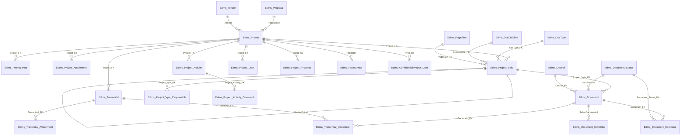

# 04 — HTS EDMS: entities, fields, document status machine

> Field catalog from `Data Persistence\Hts.Data.Model\MainEntities\Edms_*.cs` (EF model of TotalSystem). Persian captions from `CaptionsLibrary.fa-IR.resx` when a matching key exists. **No invented fields.** Navigation collections are listed under Relationships, not as extra columns.
>
> Process/pages: `03-HTS-Edms-Process-Pages-Access.md`.
>
> FK mapping: `Data Persistence\Hts.Data.DataBase\DataBase\ModelCreator.cs`.

Confirmed against HTS source on **2026-09-15**. Live lookup *labels* and `Edms_Document_Status` table rows were not queried.

---

## 1. Entity map

Also outbound (not Edms-owned): `Inq_TechnicalInquiry.EdmsProjectId`, `Inv_Specific_Equipment.EdmsProjectId`, `OilGas_WorkReport.ProjectId`, `Pln_ProductionOrder.EdmsProjectId`, `Srv_Mission.ProjectId`, `Sup_OpenOrderRequestVpis`.

---

## 2. Document status machine

Source: `Infrastructure\Hts.Core\Enums\EdmsDocumentStatus.cs` (`byte`). Display strings: `[LocalizedDescription("Key")]` → `CaptionsLibrary.fa-IR.resx`. Table `Edms_Document_Status` stores runtime titles and flags.

**Id 28 is unused** (enum jumps 27 → 29). `UnHold` (12) and `UnHoldByEmployer` (14) share LocalizedDescription key `UnHold`.

| Id | Enum | LocalizedDescription key | Caption (fa-IR) | Notes from live pages |
|---|---|---|---|---|
| 1 | `Reject` | `Rejected` | رد شد | DCC reject; `IsForDcc` comments |
| 2 | `Approve` | `Approved` | تایید شد | Check/approve; activity comments; DCC grid input |
| 3 | `ApprovedAsNote` | `ApprovedAsNote` | تایید مشروط | Internal conditional approve (legend `InternalApproved` is جدا) |
| 4 | `Commented` | `Commented` | کامنت شده | Check/approve; activity; cartable colour |
| 5 | `Issue` | `Issued` | صادر شده | Default on upload / new activity |
| 6 | `ApprovedByDcc` | `ApprovedByDcc` | تایید کنترل کننده | DCC; final-DCC inbox |
| 7 | `RejectByEmployer` | `RejectByEmployer` | توسط کارفرما رد شد | Check/approve UI label `Reject`; final DCC |
| 8 | `ApproveByEmployer` | `ApproveByEmployer` | توسط کارفرما تایید شد | Check/approve UI `Approved By Client`; vendor path |
| 9 | `ApprovedAsNoteByEmployer` | `ApprovedAsNoteByEmployer` | توسط کارفرما تایید مشروط شد | Employer; project-note status filter |
| 10 | `CommentedByEmployer` | `CommentedByEmployer` | اصلاحی کارفرما شد | Employer |
| 11 | `Hold` | `IsHold` | معلق | Upload; legend colour |
| 12 | `UnHold` | `UnHold` | UnHold *(English in resx)* | Upload; project un-hold |
| 13 | `NotReview` | `NotReview` | **no resx key** | Auto on transmittal; waiting on employer |
| 14 | `UnHoldByEmployer` | `UnHold` | UnHold | Final DCC grid filter |
| 15 | `SendEmailToClient` | `SendEmailToClient` | ارسال ایمیل به کارفرما | Final DCC email path |
| 16 | `ReIssued` | `ReIssued` | ارسال مجدد | Employer re-issue legend |
| 17 | `Commited` | `Commited` | تایید/ارسال شده | EPMS-oriented; not in Edms `FillData` |
| 18 | `UnCommit` | `UnCommit` | لغو ارسال | EPMS-oriented |
| 19 | `ApprovedBySale` | `ApprovedBySale` | Approve *(English)* | EPMS-oriented |
| 20 | `CommentedBySale` | `CommentedBySale` | Commented *(English)* | EPMS-oriented |
| 21 | `AsBuild` | `AsBuiled` *(typo in attribute)* | طبق ساخت | Project note status list |
| 22 | `ReplaySheet` | `ReplaySheet` | Reply Sheet | Upload reply-sheet files |
| 23 | `ReplaySheetFromClient` | `ReplaySheetFromClient` | Client Reply Sheet | Excluded from final-DCC dropdown (`!= 23`) |
| 24 | `IssueForClient` | `IssueForClient` | Issue For Client | Check/approve |
| 25 | `RejectedBySale` | `RejectedBySale` | Reject *(English)* | EPMS-oriented |
| 26 | `Archived` | `Archived` | **no resx key** | Check/approve + final DCC |
| 27 | `HoldByProject` | `HoldByProject` | Hold By Project | Project status → متوقف |
| 29 | `ConvertToGeneralPackage` | `ConvertToGeneralPackage` | تبدیل به جنرال پکیج | Enum only; not referenced in Edms controllers searched |

Toolbar legend (`_DocumentStatusToolbarTemplate.cshtml`): Hold, InternalCommented, InternalApproved, EmployerApproved, EmployerApprovedAsNote, EmployerCommented, EmployerReject, EmployerReIssued, IssueForClient.

### `Edms_Document_Status` table flags

File: `MainEntities\Edms_Document_Status.cs`.

| Property | Type | Caption | Role |
|---|---|---|---|
| `Document_Status_ID` | `byte` PK | — | equals enum value |
| `Document_Status_Title` | `string(400)` | — | **live Persian title in DB** (not verified here) |
| `IsForDocumentUpload` | `bool` | no resx | comment dropdown on upload comment page |
| `IsForDcc` | `bool?` | no resx | DCC dropdown (`== true`) |
| `IsVisible` | `bool` | no resx | combined with the flags above |
| `IsForEmployer` | `bool` | no resx | final DCC dropdown |

Same table is reused by `Epms_Document_Comment` and `Epms_Metre_Equipment_Financial_Comment` (ModelCreator).

Typical write path: insert `Edms_Document_Comment` → denormalize `Edms_Document.LastStatusId` / `LastStatusUserId` / `LastCommentDate` (trigger not in repo).

---

## 3. Lookups (`Gnr_LookupType` ids from Edms controllers)

| Type | Column | Caption key | Caption (fa-IR) |
|---|---|---|---|
| 2 | `Edms_Project.Project_Status_FK` | `Project_Status` | وضعیت پروژه |
| 65 | `Edms_Project_Attachment.Project_Document_Type_FK` | — | (no dedicated key; attachment type) |
| 72 | `Edms_Project_Vpis.DocClass_FK` | `DocClass` | کلاس مدرک |
| 84 | `Edms_Project_Activity.ActivityType_FK` | `ActivityType` | نوع فعالیت |
| 89 | `Edms_Document_Comment.HoldCause_FK` | `HoldCause` | متولی Hold |
| 104 | `Edms_Document_Comment.HoldResponsibleId` | `HoldResponsible` | مسئول Hold |
| 120 | `Edms_ProjectNote.StatusId` | — | note status |
| 323 | `Edms_Document.NotificationMethodId` | `NotificationMethod` | شیوه اطلاع رسانی |

`EdmsDocumentNotificationMethod`: `NotifyToEngineering = 2418`, `NotifyToBeneficiaries = 2419` (`Infrastructure\Hts.Core\Enums\EdmsDocumentNotificationMethod.cs`).

---

## 4. `Edms_Project`

File: `MainEntities\Edms_Project.cs`. PK `Edms_Project_ID`. Caption `EdmsProject` = پروژه مهندسی; menu uses `IdProjects` = شناسنامه پروژه ها.

| Property | Type | Null | Caption key | Caption (fa-IR) | FK / notes |
|---|---|---|---|---|---|
| `Edms_Project_ID` | `int` | PK | — | | |
| `Project_Code` | `string(128)` | yes | `Project_Code` | کد پروژه | generated on add |
| `Project_Name` | `string(256)` | yes | `Project_Name` | نام پروژه | |
| `Project_Title` | `string(256)` | yes | `Project_Title` | **no resx** | |
| `Main_Client_FK` | `int` | no | `MainClient` | مشتری | `Gnr_ManCompany` required |
| `Project_Manager_FK` | `short?` | yes | `Project_Manager` | مدیر پروژه | `HRM_Personel` |
| `BeneficiaryUnit_FK` | `short?` | yes | `BeneficiaryUnit` | واحد ذینفع | `HRM_OrgUnit` |
| `Project_Engineer_FK` | `short?` | yes | `ProjectEngineer` | مهندس پروژه | `HRM_Personel` |
| `Project_Coordinator_FK` | `short?` | yes | `ProjectCordinator` *(typo in resx)* | هماهنگ کننده | `HRM_Personel` |
| `DccUserId` | `short?` | yes | — | **no resx** | `Gnr_User` |
| `Project_Startdate` | `string(10)` | yes | `Project_StartDate` | تاریخ شروع | Miladi text, fixed char |
| `Project_Startdate_Shamsi` | `string(10)` | yes | `Project_Startdate_Shamsi` | تاریخ شروع پروژه | |
| `Project_Enddate` | `string(10)` | yes | `Project_Enddate` | تاریخ پایان | |
| `Project_Enddate_Shamsi` | `string(10)` | yes | `Project_Enddate_Shamsi` | تاریخ پایان پروژه | |
| `Project_Status_FK` | `short` | no | `Project_Status` | وضعیت پروژه | `Gnr_Lookup` type 2, required |
| `Transmital_PreField` | `string(2048)` | yes | `Transmital_PreField` | پیش کد ترانسمیتال | |
| `Transmital_Recipient` | `string(4000)` | yes | `TransmitalReciept` | گیرنده ترانسمیتال | |
| `Transmital_CC` | `string(4000)` | yes | `TransmitalCC` | گیرنده کپی ترانسمیتال | |
| `MiscEmailAddress` | `string(1024)` | yes | `MiscEmailAddress` | ایمیل متفرقه/عمومی | |
| `Project_Description` | `string(2400)` | yes | `Project_Description` | توضیحات | |
| `AllowedHavayar_DelayDay` | `byte?` | yes | `AllowedHavayar_DelayDay` | تاخیر مجاز هوایار | |
| `AllowedEmployer_DelayDay` | `byte?` | yes | `AllowedEmployer_DelayDay` | تاخیر مجاز کارفرما | |
| `SalesExpertUserId` | `short?` | yes | `SalesExpert` | کارشناس فروش | `HRM_Personel` |
| `ProcessExpertId` | `short?` | yes | `ProcessExpert` | کارشناس فرآیند | |
| `MechanicalExpertId` | `short?` | yes | `MechanicalExpert` | کارشناس مکانیک | |
| `ControlExpertId` | `short?` | yes | `ControlExpert` | کارشناس کنترل | |
| `InstrumentationExpertId` | `short?` | yes | `InstrumentationExpert` | کارشناس ابزاردقیق | |
| `ElectricalExpertId` | `short?` | yes | `ElectricalExpert` | کارشناس برق | |
| `PipingExpertId` | `short?` | yes | `PipingExpert` | کارشناس پایپینگ | |
| `IsVendorProject` | `bool` | no | `IsVendorProject` | پروژه وندوری | |
| `ProjectInspectorId` | `short?` | yes | `ProjectInspector` | بازرس پروژه | `HRM_Personel` |
| `MechanicalSuppliesResponsibleId` | `short?` | yes | — | **no resx** | `HRM_Personel` |
| `ElectricalSuppliesResponsibleId` | `short?` | yes | — | **no resx** | |
| `ExternalSuppliesResponsibleId` | `short?` | yes | — | **no resx** | |
| `IsConfidential` | `bool` | no | `IsConfidential` | محرمانه | |
| `ProposalId` | `short?` | yes | — | **no resx** | `Epms_Proposal` |
| `IsCreatedFromProposal` | `bool` | no | — | **no resx** | |
| `TenderId` | `short?` | yes | — | **no resx** | `Epms_Tender` |
| `CustomPermissionUserIds` | `string(50)` | yes | — | **no resx** | CSV |
| `CustomPermissionUsersInText` | `string(512)` | yes | — | **no resx** | |
| `IsTakvinProject` | `bool` | no | `TakvinProject` | پروژه تکوین | |
| `BeneficiariesIds` | `string(512)` | yes | — | **no resx** | personnel ids; archive تکوین filter |
| `CreatedUserId` | `short` | no | — | | `Gnr_User` required |
| `UpdatedUserId` | `short` | no | — | | `Gnr_User` required |
| `CreatedDate` | `DateTime` | no | — | | |
| `UpdatedDate` | `DateTime` | no | — | | |
| `Comment` | `string(4000)` | yes | `Comment` | کامنت | |

Children: parts, attachments, VPIS, activity, progress, users, notes, transmittals, confidential users. Computed `CodeName` used in lookups is **not** on this generated class (extension/partial elsewhere).

---

## 5. `Edms_Project_Part`

`MainEntities\Edms_Project_Part.cs`. Menu `ProjectParts` = اقلام پروژه. `Quantity` precision **(12,2)** (ModelCreator).

| Property | Type | Null | Caption key | Caption (fa-IR) | FK |
|---|---|---|---|---|---|
| `Edms_Project_Part_ID` | `int` | PK | | | |
| `Project_FK` | `int` | no | | | `Edms_Project` required |
| `Part_FK` | `long` | no | `Parts` | قطعات | `Inv_Part` |
| `Quantity` | `decimal` | no | `Quantity` | مقدار | |
| `EquipmentCode` | `string(2048)` | yes | `EquipmentCode` | کد تجهیز | |
| `EquipmentName` | `string(2048)` | yes | `EquipmentName` | عنوان تجهیز | |
| `Description` | `string(4000)` | yes | `Description` | توضیحات | |

---

## 6. `Edms_Project_Attachment`

`MainEntities\Edms_Project_Attachment.cs`. Nested page 218; archive 279. Caption `ProjectInputDocuments` = اسناد ورودی پروژه.

| Property | Type | Null | Caption key | Caption (fa-IR) | Notes |
|---|---|---|---|---|---|
| `Project_Attachment_ID` | `int` | PK | | | |
| `Project_FK` | `int` | no | | | `Edms_Project` |
| `Attachment_FileName` | `string(255)` | yes | `Attachment_FileName` | عنوان فایل پیوست | |
| `Attachment_FileContent` | `byte[]` | yes | | | legacy blob |
| `CreatedUser_FK` | `short?` | yes | | | `Gnr_User` |
| `CreatedDate` | `string(10)` | yes | | | Shamsi-like text |
| `CreatedTime` | `string(5)` | yes | | | |
| `Attachment_Comment` | `string(4000)` | yes | `Attachment_Comment` | توضیحات پیوست | |
| `Project_Document_Type_FK` | `short?` | yes | | | `Gnr_Lookup` type 65 |
| `DocumentCode` | `string(2048)` | yes | `DocumentCode` | کد سند | trailing space in resx |
| `DocumentName` | `string(4000)` | yes | `DocumentName` | نام سند | |
| `AttachmentFilePath` | `string(1024)` | yes | | | disk path used by ViewAttachedFile |
| `Attachment_FileSize` | `long?` | yes | | | |

---

## 7. `Edms_Project_Vpis`

`MainEntities\Edms_Project_Vpis.cs`. `Document_Weight` precision **(5,2)**.

| Property | Type | Null | Caption key | Caption (fa-IR) | FK |
|---|---|---|---|---|---|
| `Project_Vpis_ID` | `int` | PK | `Project_Vpis_ID` | شناسه Vpis | |
| `Project_FK` | `int` | no | | | `Edms_Project` required |
| `Document_Number` | `string(256)` | yes | `Document_Number` | کد مدرک | |
| `Document_Title` | `string(1024)` | yes | `Document_Title` | عنوان مدرک | `*` triggers open-order notify |
| `Document_Weight` | `decimal?` | yes | `Document_Weight` | وزن مدرک | |
| `DocType_FK` | `byte?` | yes | `DocType` | نوع مدرک | `Edms_DocType` |
| `DocClass_FK` | `short?` | yes | `DocClass` | کلاس مدرک | lookup 72 |
| `DocDisipline_FK` | `short?` | yes | `DocDisipline` | دیسیپلین مدرک | `Edms_DocDisipline` |
| `PageSize_FK` | `byte?` | yes | `PageSize` | سایز صفحه | `Edms_PageSize` |
| `CheckedUser_FK` | `short?` | yes | `CheckedUser` | کاربر بررسی کننده | `Gnr_User` |
| `ApprovedUser_FK` | `short?` | yes | `ApprovedUser` | کاربر تاییدکننده | `Gnr_User` |
| `First_Issue_Baseline` | `date?` | yes | `First_Issue_Baseline` | تاریخ مبنای اولین مدرک | |
| `First_Issue_BaselineInText` | `string(10)` | yes | | | Shamsi |
| `First_Issue_Plan` | `date?` | yes | `First_Issue_Plan` | تاریخ برنامه جایگزین | |
| `First_Issue_PlanInText` | `string(10)` | yes | `PlanIssueDate` | Plan Issue Date | related UI |
| `Rev0_ManHour` | `int?` | yes | `Rev0_ManHour` | **no resx** | |
| `Rev1_ManHour` | `int?` | yes | `Rev1_ManHour` | **no resx** | |
| `RevN_ManHourPercent` | `byte?` | yes | `RevN_ManHourPercent` | **no resx** | |
| `RevN_ManHour` | `int?` | yes | `RevN_ManHour` | **no resx** | |
| `OrgUnit_FK` | `short?` | yes | | | `HRM_OrgUnit` |
| `SimilarVpisId` | `int?` | yes | `SimilarVpis` | Vpis مترادف | self-FK (`Edms_Project_Vpis2` nav name) |
| `Description` | `string(4000)` | yes | `Description` | توضیحات | |

Related caption `SimilarVendorVpis` = Vpis مترادف (وندوری); `ForecastIssueDate` = پیشبینی تاریخ ارسال (UI; **not** a column on this live entity — forecast exists on leftover `Edms_Project_Vpis2`).

---

## 8. `Edms_Project_Vpis_Responsible`

`MainEntities\Edms_Project_Vpis_Responsible.cs`.

| Property | Type | Null | Caption key | Caption (fa-IR) | FK |
|---|---|---|---|---|---|
| `Project_Vpis_Responsible_ID` | `int` | PK | | | |
| `Project_Vpis_FK` | `int` | no | | | `Edms_Project_Vpis` |
| `Responsible_FK` | `short` | no | | | `HRM_Personel` |
| `WeightFactor` | `byte` | no | `WeightFactor` | ضریب وزنی | |
| `IsMain` | `bool?` | yes | `IsMain` | اصلی | upload project list uses `IsMain == true` |

---

## 9. `Edms_Document`

`MainEntities\Edms_Document.cs`. Shamsi date/time columns are fixed-length non-unicode (ModelCreator).

| Property | Type | Null | Caption key | Caption (fa-IR) | Notes |
|---|---|---|---|---|---|
| `Document_ID` | `int` | PK | | | |
| `Project_Vpis_FK` | `int` | no | | | `Edms_Project_Vpis` required |
| `DocPoi_FK` | `byte` | no | `DocPoi` | هدف از تولید مدرک | `Edms_DocPoi` required |
| `Document_FileName` | `string(2040)` | yes | `Document_FileName` | عنوان فایل | PDF/main |
| `Document_FilePath` | `string(1024)` | yes | | | |
| `Document_NativeFileName` | `string(2040)` | yes | `Document_NativeFileName` | فایل اصلی مدرک | CAD/native |
| `Document_NativeFilePath` | `string(1024)` | yes | | | |
| `Document_SecondaryFileName` | `string(2040)` | yes | `Document_SecondaryFileName` | فایل ثانوی | |
| `Document_SecondaryFilePath` | `string(1024)` | yes | | | |
| `Document_ReplySheetFileName` | `string(2040)` | yes | `Document_ReplySheetFileName` | فایل ReplySheet | |
| `Document_ReplySheetFilePath` | `string(1024)` | yes | | | |
| `Document_SecondReplySheetFileName` | `string(2040)` | yes | `Document_SecondReplySheetFileName` | فایل دوم ReplySheet | |
| `Document_SecondReplySheetFilePath` | `string(1024)` | yes | | | |
| `Document_FileSize` | `long?` | yes | `Document_FileSize` | سایز فایل اصلی | |
| `Document_NativeFileSize` | `long?` | yes | `Document_NativeFileSize` | | |
| `Document_SecondaryFileSize` | `long?` | yes | `Document_SecondaryFileSize` | | |
| `Document_ReplySheetFileSize` | `long?` | yes | `Document_ReplySheetFileSize` | | |
| `Document_SecondReplySheetFileSize` | `long?` | yes | `Document_SecondReplySheetFileSize` | | |
| `Revision` | `byte?` | yes | `Revision` | نسخه | |
| `Due_Date` | `date` | no | `DueDate` | تاریخ تحویل | |
| `Due_Date_Shamsi` | `string(10)` | yes | | | bound from Shamsi UI |
| `ConsumedManHours` | `int?` | yes | `ConsumedManHours` | نفر ساعت | minutes; check/approve can change |
| `LastStatusId` | `byte?` | yes | `LastStatus` | آخرین وضعیت | → `Edms_Document_Status` |
| `LastStatusUserId` | `short?` | yes | | | `Gnr_User` |
| `LastCommentDate` | `date?` | yes | | | |
| `LastCommentDateShamsi` | `string(10)` | yes | | | |
| `HasClientComment` | `bool` | no | `HasClientComment` | **no resx** | |
| `IsLatest` | `bool` | no | `IsLatest` | **no resx** | current revision |
| `CreatedUser_FK` | `short` | no | | | `Gnr_User` required |
| `CreatedDate` | `date?` | yes | | | overwritten on every non-delete save in upload `DoOperation` |
| `CreatedDate_Shamsi` | `string(10)` | yes | | | |
| `CreatedTime` | `string(5)` | yes | | | |
| `PreparedUser_FK` | `short` | no | `PreparedUser` | کاربر آماده کننده | `Gnr_User` required |
| `PreparedDate` | `date?` | yes | | | |
| `PreparedDate_Shamsi` | `string(10)` | yes | | | |
| `CheckedUser_FK` | `short?` | yes | `CheckedUser` | کاربر بررسی کننده | copied from VPIS |
| `CheckedDate` | `date?` | yes | | | |
| `CheckedDate_Shamsi` | `string(10)` | yes | | | |
| `ApprovedUser_FK` | `short?` | yes | `ApprovedUser` | کاربر تاییدکننده | |
| `ApprovedDate` | `date?` | yes | | | |
| `ApprovedDate_Shamsi` | `string(10)` | yes | | | |
| `NotificationMethodId` | `short?` | yes | `NotificationMethod` | شیوه اطلاع رسانی | lookup 323 |

Partial in `Entities\Common\ElectricalDocumentManagementSystem\Edms_Document.cs` adds non-mapped `ConsumedManHoursInText` (hour:minute helper; getter currently returns empty string after `ToHourAndMinute()`).

---

## 10. `Edms_Document_Comment`

`MainEntities\Edms_Document_Comment.cs`. Status log / cartable line.

| Property | Type | Null | Caption key | Caption (fa-IR) | Notes |
|---|---|---|---|---|---|
| `Document_Comment_ID` | `int` | PK | | | |
| `Document_FK` | `int` | no | | | `Edms_Document` required |
| `Document_Status_FK` | `byte` | no | | | `Edms_Document_Status` required |
| `Attachment_FileName` | `string(800)` | yes | `Attachment_FileName` | عنوان فایل پیوست | |
| `Attachment_FilePath` | `string(1024)` | yes | | | |
| `CreatedUser_FK` | `short` | no | | | `Gnr_User` |
| `CreatedDate_Shamsi` | `string(10)` | yes | | | |
| `CreatedDate` | `date` | no | | | |
| `CreatedTime` | `string(5)` | yes | | | |
| `Comment` | `string(4000)` | yes | `Comment` | کامنت | |
| `IsForDcc` | `bool` | no | `IsForDcc` | **no resx** | false on DCC page; true on final DCC |
| `ReceivedTransmittalNumber` | `string(1024)` | yes | `ReceivedTransmitalNumber` | شماره ترانسمیتال دریافتی | spelling Transmittal vs Transmital |
| `HoldCause_FK` | `short?` | yes | `HoldCause` | متولی Hold | lookup 89 |
| `HoldResponsibleId` | `short?` | yes | `HoldResponsible` | مسئول Hold | lookup 104 |
| `CreationDateTime` | `DateTime?` | yes | | | |
| `CreationDateTimeInText` | `string(16)` | yes | | | Shamsi datetime |

---

## 11. `Edms_Document_ExtraInfo`

`MainEntities\Edms_Document_ExtraInfo.cs`. Dead menu page 543; entity still mapped.

| Property | Type | Null | Caption key | Caption (fa-IR) |
|---|---|---|---|---|
| `Id` | `int` | PK | | |
| `EdmsDocumentId` | `int` | no | `EdmsDocumentId` | شناسه سند مهندسی والد |
| `ReceivedDateByVendor` | `DateTime?` | yes | `ReceivedDateByVendor` | تاریخ دریافت توسط وندور |
| `ReceivedDateByVendorInText` | `string(16)` | yes | | |
| `EmailToDCCDate` | `DateTime?` | yes | `EmailToDCCDate` | تاریخ ارسال ایمیل به DCC |
| `EmailToDCCDateInText` | `string(16)` | yes | | |
| `SendDateByHavayar` | `DateTime?` | yes | `SendDateByHavayar` | تاریخ ارسال توسط هوایار |
| `SendDateByHavayarInText` | `string(16)` | yes | | |
| `PoupakLastRevesion` | `int?` | yes | `PoupakLastRevesion` | آخرین ریویژن پوپک |
| `PoupakUploadDate` | `DateTime?` | yes | `PoupakUploadDate` | تاریخ بارگذاری پوپک |
| `PoupakUploadDateInText` | `string(16)` | yes | | |
| `PoupakHavayarReplyDate` | `DateTime?` | yes | `PoupakHavayarReplyDate` | تاریخ پاسخ پوپک |
| `PoupakHavayarReplyDateInText` | `string(16)` | yes | | |
| `PoupakFinalStatus` | `string(10)` | yes | `PoupakFinalStatus` | وضعیت نهایی پوپک |
| `Description` | `string(1024)` | yes | `Description` | توضیحات |
| `CreatedUserId` | `short` | no | | `Gnr_User` |
| `CreatedDate` | `DateTime?` | yes | | |
| `CreatedDateInText` | `string(16)` | yes | | |
| `UpdatedUserId` | `short?` | yes | | `Gnr_User` |
| `UpdatedDate` | `DateTime?` | yes | | |
| `UpdatedDateInText` | `string(16)` | yes | | |

---

## 12. Transmittal

### `Edms_Transmital`

`MainEntities\Edms_Transmital.cs`. Caption `Transmital` = ترانسمیتال.

| Property | Type | Null | Caption key | Caption (fa-IR) | FK |
|---|---|---|---|---|---|
| `Transmital_ID` | `int` | PK | | | |
| `Transmital_No` | `string(800)` | yes | `Transmital_No` | شماره ترانسمیتال | |
| `Project_FK` | `int` | no | | | `Edms_Project` |
| `UserDefinedNumber` | `string(160)` | yes | `UserDefinedNumber` | شماره تعریف شده کاربر | |
| `Transmital_Comment` | `string(4000)` | yes | `Transmital_Comment` | توضیحات ترانسمیتال | |
| `IsForReplySheet` | `bool` | no | `IsForReplySheet` | **no resx** | set from `hasReplySheet` |
| `CreatedUser_FK` | `short` | no | | | `Gnr_User` |
| `CreatedDate` | `string(10)` | yes | | | |
| `CreatedTime` | `string(5)` | yes | | | |

### `Edms_Transmital_Document`

`MainEntities\Edms_Transmital_Document.cs`. Junction + send-to-employer stamp. Column name typo `SendToEmployer_ShamiDate`.

| Property | Type | Null | Caption key | Caption (fa-IR) |
|---|---|---|---|---|
| `Transmital_Document_ID` | `int` | PK | | |
| `Transmital_FK` | `int` | no | | |
| `Document_FK` | `int` | no | | |
| `IsSendToEmployer` | `bool?` | yes | `IsSendToEmployer` | ارسال به کارفرما |
| `SendToEmployer_Date` | `date?` | yes | | |
| `SendToEmployer_ShamiDate` | `string(10)` | yes | | Shamsi |
| `SendToEmployer_Time` | `string(5)` | yes | | |

### `Edms_Transmital_Attachment`

`MainEntities\Edms_Transmital_Attachment.cs`. Caption `TransmitalAttachment` = پیوست ترانسمیتال. Related: `InternalTransmital` / `EmployerTransmital`.

| Property | Type | Null | Caption key | Caption (fa-IR) |
|---|---|---|---|---|
| `Transmital_Attachment_ID` | `int` | PK | | |
| `Transmital_FK` | `int` | no | | |
| `Attachment_FileName` | `string(255)` | yes | `Attachment_FileName` | عنوان فایل پیوست |
| `Attachment_FileContent` | `byte[]` | yes | | |
| `CreatedUser_FK` | `short?` | yes | | |
| `CreatedDate` | `string(10)` | yes | | |
| `CreatedTime` | `string(5)` | yes | | |
| `Attachment_Comment` | `string(4000)` | yes | `Attachment_Comment` | توضیحات پیوست |
| `IsForEmployer` | `bool` | no | `IsForEmployer` | **no resx** |
| `AttachmentFilePath` | `string(1024)` | yes | | |
| `Attachment_FileSize` | `long?` | yes | | |

---

## 13. Activity

### `Edms_Project_Activity`

`MainEntities\Edms_Project_Activity.cs`. Live Edms rows use **`ModuleType_FK == 386`** (hardcoded; `ModuleType` enum in Core only defines `Epms = 616`).

| Property | Type | Null | Caption key | Caption (fa-IR) | FK |
|---|---|---|---|---|---|
| `Project_Activity_ID` | `int` | PK | | | |
| `ModuleType_FK` | `short` | no | | | 386 Edms / 387 Epms (from controllers) |
| `Project_FK` | `int?` | yes | | | `Edms_Project` |
| `Proposal_FK` | `short?` | yes | | | `Epms_Proposal` |
| `Project_Name` | `string(4000)` | yes | `Project_Name` | نام پروژه | free text |
| `BeneficiaryUnit_FK` | `short?` | yes | `BeneficiaryUnit` | واحد ذینفع | `HRM_OrgUnit` |
| `ActivityType_FK` | `short?` | yes | `ActivityType` | نوع فعالیت | lookup 84 |
| `ActivityComment` | `string(4000)` | yes | `ActivityComment` | شرح فعالیت | |
| `ActivityDate` | `string(10)` | no | `ActivityDate` | تاریخ فعالیت | required Shamsi |
| `ActivityDate_Miladi` | `date?` | yes | | | used by cumulative report |
| `Duration` | `short` | no | `Duration` | طول / مدت | |
| `Comment` | `string(4000)` | yes | `Comment` | کامنت | |
| `CreatedUser_FK` | `short` | no | | | `Gnr_User` |
| `CreatedDate` | `string(10)` | yes | | | |
| `CreatedTime` | `string(5)` | yes | | | |

### `Edms_Project_Activity_Comment`

`MainEntities\Edms_Project_Activity_Comment.cs`. `Status_FK` → `Edms_Document_Status`.

| Property | Type | Null | Notes |
|---|---|---|---|
| `Project_Activity_Comment_ID` | `int` PK | | |
| `Project_Activity_FK` | `int` | no | |
| `Status_FK` | `byte` | no | 5 on auto-create; UI 2 or 4 |
| `CreatedUser_FK` | `short` | no | |
| `CreatedDate_Shamsi` | `string(10)` | yes | |
| `CreatedDate` | `date` | no | |
| `CreatedTime` | `string(5)` | yes | |
| `Comment` | `string(4000)` | yes | `Comment` = کامنت |

---

## 14. Access / progress / notes / subordinates

### `Edms_Project_User`

`MainEntities\Edms_Project_User.cs`. Not a live menu page; filters archives, cartable, client-vendor report.

| Property | Type | Null | Caption key | Caption (fa-IR) |
|---|---|---|---|---|
| `Edms_ProjectUser_ID` | `int` PK | | | |
| `Project_FK` | `int` | no | | |
| `User_FK` | `short` | no | | `Gnr_User` |
| `UserIsSupervisor` | `bool` | no | `UserIsSupervisor` | سرپرست |

### `Edms_ConfidentialProject_User`

`MainEntities\Edms_ConfidentialProject_User.cs`.

| Property | Type | Null | FK |
|---|---|---|---|
| `Id` | `int` PK | | |
| `ProjectId` | `int` | no | `Edms_Project` |
| `UserId` | `short` | no | `Gnr_User` |

### `Edms_User_Subordinate`

`MainEntities\Edms_User_Subordinate.cs`. Cartable / activity `ShowAll` false path.

| Property | Type | Null | FK |
|---|---|---|---|
| `Id` | `int` PK | | |
| `User_FK` | `short` | no | `Gnr_User` (manager) |
| `Subordinate_Personel_FK` | `short` | no | `HRM_Personel` |
| `Subordinate_User_FK` | `short?` | yes | `Gnr_User` |

### `Edms_Project_Progress`

`MainEntities\Edms_Project_Progress.cs`. Per-status % on the project form; rebuilt on every project update.

| Property | Type | Null | Caption key | Caption (fa-IR) |
|---|---|---|---|---|
| `Project_Progress_ID` | `int` PK | | | |
| `Project_FK` | `int` | no | | |
| `Document_Status_FK` | `byte` | no | | `Edms_Document_Status` |
| `Progress_Percentage` | `byte` | no | `Progress_Percentage` | درصد پیشرفت |

### `Edms_ProjectNote`

`MainEntities\Edms_ProjectNote.cs`. Nested on project identity. `AttachmentFileSize` is computed.

| Property | Type | Null | Caption key | Caption (fa-IR) | FK |
|---|---|---|---|---|---|
| `Id` | `int` PK | | | | |
| `ProjectId` | `int` | no | | | `Edms_Project` |
| `Note` | `string(2048)` | no | `Note` | شرح یادداشت | |
| `StatusId` | `short` | no | | | lookup 120 required |
| `ProctorId` | `short?` | yes | | | `HRM_Personel` |
| `ClosureProctorId` | `short?` | yes | | | `HRM_Personel` |
| `ClosureReason` | `string(512)` | yes | `ClosureReason` | دلیل بسته شدن | |
| `ClosureDate` | `date?` | yes | | | |
| `ClosureDateInText` | `string(16)` | yes | | | |
| `AttachmentFileName` | `string(1024)` | yes | | | |
| `AttachmentFileContent` | `byte[]` | yes | | | |
| `AttachmentFileSize` | `long?` | yes | | computed | |
| `CreatedUserId` | `short` | no | | | `Gnr_User` |
| `CreatedDate` | `DateTime` | no | | | |
| `CreatedDateInText` | `string(16)` | no | | | |
| `Comment` | `string(2048)` | yes | `Comment` | کامنت | |

---

## 15. Masters

### `Edms_DocType`

| Property | Type | Notes |
|---|---|---|
| `DocType_ID` | `byte` identity PK | |
| `DocType_Code` | `string(40)` | shown in VPIS dropdown |
| `DocType_Title` | `string(400)` | |

### `Edms_DocDisipline`

| Property | Type | Notes |
|---|---|---|
| `DocDisipline_ID` | `short` PK | |
| `DocDisipline_Code` | `string(40)` | VPIS dropdown |
| `DocDisipline_Title` | `string(400)` | |

### `Edms_DocDisipline_Responsible`

| Property | Type | FK |
|---|---|---|
| `DocDisipline_Responsible_ID` | `short` PK | |
| `DocDisipline_FK` | `short` | `Edms_DocDisipline` |
| `Responsible_FK` | `short` | `HRM_Personel` |
| `IsMain` | `bool?` | |

### `Edms_DocPoi`

| Property | Type | Caption |
|---|---|---|
| `DocPoi_ID` | `byte` identity PK | |
| `DocPoi_Code` | `string(40)` | upload dropdown uses **code** |
| `DocPoi_Title` | `string(240)` | `DocPoi` = هدف از تولید مدرک |

### `Edms_PageSize`

| Property | Type |
|---|---|
| `PageSize_ID` | `byte` identity PK |
| `PageSize` | `string(80)` — stored **and** displayed |

`Edms_Document_Status`: §2.

---

## 16. Leftover / unused by live controllers

### `Edms_Project_Vpis2`

`MainEntities\Edms_Project_Vpis2.cs` — `DbSet` in `TotalSystemDataBase`. Composite key `(Project_Vpis_ID, Project_FK)`. Extra columns vs live VPIS: `Document_InternalCode` (`Document_InternalCode` = کد هوایاری), `DocClass` as `byte?` (not lookup FK), `DocStage_FK`, `DocUnit_FK`, `First_Issue_Forecast`. **No Edms controller references this type.** Do not confuse with navigation `Edms_Project_Vpis.Edms_Project_Vpis2` which is the **SimilarVpisId** self-relation.

### `Edms_DocStage` / `Edms_DocUnit`

Empty partials under `Entities\Common\ElectricalDocumentManagementSystem\`. Injected on `ProjectVpisManagementController` but unused. `ReadData.cs` still has `SELECT * FROM Edms_DocStage` / `Edms_DocUnit`. **Not** in `MainEntities\Edms_*.cs`.

Older copies under `Entities\Common\ElectricalDocumentManagementSystem\` (including `Edms_Transmital_Reciver`, `Edms_Project_Vpis_List`) are **not** the EF MainEntities catalog.

---

## 17. Report views (`MainEntities\Vw_Edms_*.cs`)

Not `Edms_*` tables; backing for §9 of file 03. Column lists are the generated view classes (composite keys are EF artifacts).

| View class | Used by |
|---|---|
| `Vw_Edms_Mdr` | MDR (also `Document_Number`, discipline, responsible, dates, status, delay fields — see file) |
| `Vw_Edms_DocumentDelay` | delay report |
| `Vw_Edms_Document_Hold` | hold report (`HoldSource`, `Hold_Producer`) |
| `Vw_Edms_PersonelPerformance` | personnel performance |
| `Vw_Edms_ProjectProgress` | progress (counts Issued / NotIssued / delays / NotReview / Approved) |
| `Vw_Edms_ProjectSummerized` | summarized project |
| `Vw_Edms_IndexEvaluation` | index evaluation (`FinalStatus`, `Disipline`) |
| `Vw_Edms_Document` / `Vw_Edms_LastDocument` / `Vw_Edms_LastDocumentForUploadPage` / `Vw_Edms_Document_LastStatus` | services/grids (upload & last-status), not separate menu pages |

Workload / cumulative performance / client-vendor reports are built in `EdmsDocumentUploadService` / `IProjectService` (not only these views).

---

## 18. Caption keys missing in `fa-IR.resx`

Do not invent Persian for: `NotReview`, `Archived`, `Project_Title`, `Rev0_ManHour`, `Rev1_ManHour`, `RevN_ManHourPercent`, `RevN_ManHour`, `IsTakvinProject` (use `TakvinProject` instead), `ProposalId`, `TenderId`, `DccUserId`, `CustomPermissionUserIds`, `IsCreatedFromProposal`, `IsLatest`, `HasClientComment`, `IsForReplySheet`, `IsForEmployer`, `IsForDcc`, `IsForDocumentUpload`, `IsVisible`, `BeneficiariesIds`, supply-responsible ids, `MechanicalSuppliesResponsibleId` family.

For statuses 13 and 26, use `Edms_Document_Status.Document_Status_Title` from TotalSystem when implementing.

---

## 19. Could not verify

- Live `Gnr_Lookup` titles for types in §3.
- Live `Edms_Document_Status` flag matrix and titles.
- Whether `Edms_Project_Vpis2` / `Edms_DocStage` / `Edms_DocUnit` still have rows.
- SQL trigger that maintains `Edms_Document.LastStatusId`.
- `Gnr_User` vs `HRM_Personel` display names on every expert column in the project form (only FK mapping verified).
