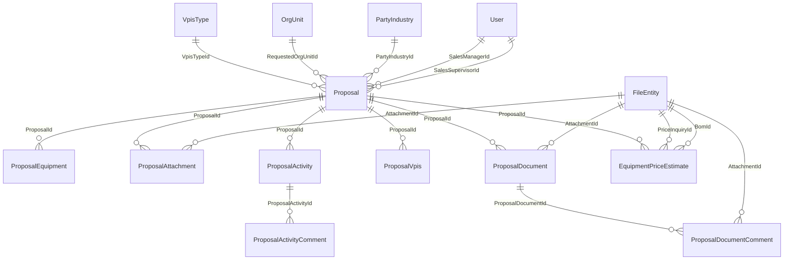

# HavayarApp — EPMS as implemented (`Entities.App.Epms`)

> Snapshot of **what exists in code today** (2026-09-15). Not a gap analysis and not a target design. Incomplete-looking screens, unused partials, and unused entity fields are listed as they are implemented.
>
> Live Panel menu / `system.RoleAccess` were **not** queried: MCP `user-mssql-havayar` and `user-mssql-totalsystem` did not complete tool discovery/auth in this pass. Repo SQL seeds for Epms menu/RoleAccess were not found.

## 1. Module map

| Concern | As implemented |
|---|---|
| Schema | `Epms` |
| Namespace | `Entities.App.Epms` / `Entities.App.Epms.Enums` |
| Controller files | `WebApp/Controllers/Dynamic/Epms/*.cs` |
| Controller C# namespace | `WebApp.Controllers.Dynamic` (folder is `Epms`; namespace is **not** nested) |
| Route prefix | `[Route("Panel/Epms/[controller]")]` |
| Views | `WebApp/Views/Panel/Epms/{Entity}/` |
| EntityAction | **none** (`WebApp/Actions/Epms` does not exist; no `[EntityAction]` on Epms types) |
| Background jobs | **none** (`App.BackgroundJob/Jobs/Epms` does not exist; no `Entities/Hts/Epms`) |
| `HtsId` | **none** on any Epms entity |
| Dedicated service | **none** |

All entities inherit `Entities.Base.BaseEntity` → `BaseEntity<long>` (`Entities/Base/BaseEntity.cs`).

### 1.1 Inherited `BaseEntity` fields (every Epms table)

| Property | Persian (`DisplayName`) | Type / notes |
|---|---|---|
| `Id` | شناسه | `long?`, identity PK |
| `CreatedById` | شناسه ایجاد کننده | `long?` |
| `ModifiedById` | شناسه ویرایش کننده | `long?` |
| `ModifiedBy` | ویرایش کننده | `User?`, `[NotMapped]` |
| `CreatedByName` | نام ایجاد کننده | `string?`, MaxLength 150 |
| `CreatedBy` | ایجاد کننده | `User?`, `[NotMapped]` |
| `ModifiedByName` | نام ویرایش کننده | `string?`, MaxLength 150 |
| `ModifiedDateMiladiDateTime` | تاریخ میلادی ویرایش | `DateTime?` |
| `ModifiedDateShamsiDateTime` | تاریخ شمسی ویرایش | `string?`, MaxLength 30 |
| `CreatedOnMiladiDateTime` | تاریخ میلادی ایجاد | `DateTime?` |
| `CreatedOnShamsiDateTime` | تاریخ شمسی ایجاد | `string?`, MaxLength 30 |
| `IsActive` | وضعیت فعال بودن | `IsActiveEnum?` |

`IsActiveEnum` (`Entities/Base/BaseEntity.cs`): `DeActive = 0` غیر فعال, `Active = 1` فعال, `Deleted = 2` حذف شده.

### 1.2 Entity relationship (as coded)

`ProposalActivityComment.Status` uses **`Entities.App.Edms.Enums.DocumentStatusEnums`**, not an Epms enum.

---

## 2. Enums (`Entities/App/Epms/Enums/`)

Numeric values are the C# enum values. Members without `= n` use C# default (0-based sequential).

### 2.1 `ProposalStatusEnum.cs`

| Member | Value | `[Display(Name)]` |
|---|---|---|
| `NotStarted` | 3 | شروع نشده |
| `InProgress` | 4 | در جریان |
| `Terminated` | 5 | خاتمه یافته |
| `Cancelled` | 6 | لغو شده |
| `Stopped` | 7 | متوقف شده |
| `Loss` | 2748 | باخت |
| `Win` | 2773 | برد |
| `SendToMetre` | 2774 | منتظر برسی توسط متره |
| `WaitingSellerCheckMeterDocuments` | 2775 | منتظر برسی مدارک متره توسط فروش |

### 2.2 `ProposalRequestEnum.cs`

| Member | Value | `[Display(Name)]` |
|---|---|---|
| `Technical` | 247 | تکنیکال |
| `Commercia` | 248 | تجاری |
| `TechnicalAndCommercial` | 249 | تکنیکال و تجاری |

Member name is `Commercia` (as spelled in source).

### 2.3 `ProposalDocumentStatusEnum.cs`

No explicit values except C# defaults:

| Member | Value | `[Display(Name)]` |
|---|---|---|
| `Submit` | 0 | ثبت اولیه |
| `Approve` | 1 | تایید |
| `Commented` | 2 | نظر داده شده |
| `Hold` | 3 | منتظر |
| `IssueForClient` | 4 | ارسال برای مشتری |
| `Reject` | 5 | رد شده |

### 2.4 `ProposalActivityStatusEnum.cs`

| Member | Value | `[Display(Name)]` |
|---|---|---|
| `Issue` | 1 | ثبت اولیه |
| `Commented` | 2 | کامنت |
| `Reject` | 3 | عدم تایید |
| `Approve` | 4 | تایید شده |

### 2.5 `ProposalActivityActivityTypeEnum.cs`

| Member | Value | `[Display(Name)]` |
|---|---|---|
| `Mission` | 373 | ماموریت |
| `Meeting` | 374 | جلسه |
| `ReadingSpec` | 375 | خواندن اسپک |
| `EngineeringConsultation` | 376 | مشاوره مهندسی |
| `Test` | 377 | تست |
| `Visit` | 378 | بازدید |
| `VendorDocumentReview` | 379 | بررسی مدارک وندور |
| `SupplierTechnicalProposalReview` | 380 | بررسی پیشنهاد فنی تامین کنندگان |
| `PurchaseDataSubmission` | 381 | ارایه داده های خرید |
| `RoutineProductServices` | 382 | خدمات محصولات روتین |
| `Study` | 383 | مطالعه |
| `AttendingTrainingCourse` | 384 | شرکت در دوره آموزشی |
| `SendingDocumentToEmployer` | 385 | ارسال مدرک به کارفرما |
| `Other` | 401 | سایر |
| `Coding` | 402 | کدینگ |
| `IndustrialDesignAndDrafting` | 403 | طراحی و نقشه کشی صنعتی |
| `TechnicalProposalPreparation` | 463 | تهیه پروپوزال فنی |
| `QuantitySurveyAndFinancialEstimation` | 464 | متره و برآورد مالی |
| `EngineeringDocumentPreparation` | 465 | تهیه مدارک مهندسی |
| `TCLPreparation` | 466 | تهیه TCL |
| `PlanningAndControl` | 467 | برنامه ریزی و کنترل |
| `DCC` | 468 | DCC |

Same numeric set as `Entities.App.Edms.Enums.ProjectActivityTypeEnum`.

### 2.6 `EquipmentPriceEstimateStatusEnum.cs`

| Member | Value | `[Display(Name)]` |
|---|---|---|
| `Submit` | 0 | ثبت اولیه |
| `SendToSell` | 1 | ارسال به فروش |
| `Approved` | 2 | تایید |
| `Rejected` | 3 | رد شده |
| `Closed` | **50** | بسته شده |

---

## 3. Entities

`[Table]` / `[Display(Name)]` / `[DisplayName]` / `[DisplayInfo]` / `[MaxLength]` below are copied from source. `DisplayInfo` second bool is `addToTable` (grid metadata).

### 3.1 `Proposal` — `Entities/App/Epms/Proposal.cs`

`[Display(Name = "پروپوزال")]` `[Table("Proposal", Schema = "Epms")]`

| Property | Persian | Type | DisplayInfo / constraints |
|---|---|---|---|
| `Title` | عنوان | `string` | String, required, `showInRelationData`, MaxLength 500 |
| `Code` | کد | `string?` | String, MaxLength 500 |
| `RequestedOrgUnitId` | شناسه واحد درخواست دهنده | `long` | Long |
| `RequestedOrgUnit` | واحد درخواست دهنده | `OrgUnit?` | Entity |
| `SalesExperts` | کارشناسان فروش | `string?` | ListString |
| `SalesExpertIds` | شناسه کارشناسان فروش | `string?` | ListLong |
| `PartyIndustryId` | شناسه صنعت | `long?` | Long |
| `PartyIndustry` | صنعت | `PartyIndustry?` | Entity |
| `ProposalRequest` | نوع پروپوزال درخواستی | `ProposalRequestEnum` | Select |
| `Status` | وضعیت | `ProposalStatusEnum` | Select |
| `Comment` | کامنت | `string?` | String, MaxLength 500 |
| `TenderName` | نام مناقصه | `string?` | String |
| `SalesManagerId` | شناسه مدیر فروش | `long?` | Long |
| `SalesManager` | مدیر فروش | `User?` | Entity |
| `StartMiladiDate` | تاریخ شروع میلادی | `DateTime?` | Date |
| `StartShamsiDate` | تاریخ شروع شمسی | `string?` | DateShamsi |
| `TenderMiladiDate` | تاریخ مناقصه میلادی | `DateTime?` | Date |
| `TenderShamsiDate` | تاریخ مناقصه شمسی | `string?` | DateShamsi |
| `IsSendToMetre` | ارسال به متره | `bool` | Boolean, default `false` |
| `SalesSupervisorId` | شناسه سرپرست فروش | `long?` | Long |
| `SalesSupervisor` | سرپرست فروش | `User?` | Entity |
| `VpisTypeId` | شناسه نوع مدرک درخواستی | `long?` | Long |
| `VpisType` | نوع مدرک درخواستی | `VpisType?` | Entity |
| `IsForProductEngineeringDepartment` | برای بخش مهندسی محصول است | `bool` | Boolean, default `false` |
| `HasGeneralPackage` | دارای بسته عمومی | `bool` | Boolean, default `false` |
| `Revision` | بازنگری | `int` | Int |
| `RevisionDescription` | توضیحات بازنگری | `string` | String (non-nullable in source) |
| `ProposalEquipments` | تجهیزات | `List<ProposalEquipment>` | ListEntity, default `new()` |
| `ProposalAttachment` | پیوست | `List<ProposalAttachment>` | ListEntity, default `new()` (property name is singular) |
| `ProposalDocuments` | مدارک | `List<ProposalDocument>` | ListEntity, default `new()` |

**As implemented on the Edit page:** `WebApp/Views/Panel/Epms/Proposal/Edit.cshtml` binds title, code (disabled), requested org unit, industry, sales experts, request type, status, tender name, sales manager, start/tender Shamsi dates, sales supervisor, VPIS type, revision (disabled), revision description, comment, plus **پیوست** and **مدارک** tabs. It does **not** bind `IsSendToMetre`, `IsForProductEngineeringDepartment`, or `HasGeneralPackage`. There is **no تجهیزات tab** on Edit even though the entity, `_ProposalEquipmentPartial.cshtml`, and helper action exist.

`ProposalController.Edit` includes `ProposalAttachment` and `ProposalDocuments` only (not `ProposalEquipments`).

### 3.2 `ProposalEquipment` — same file

`[Display(Name = "تجهیزات پروپوزال")]` `[Table("ProposalEquipment", Schema = "Epms")]`

| Property | Persian | Type | Notes |
|---|---|---|---|
| `ProposalId` | (none) | `long` | FK |
| `Proposal` | (none) | `Proposal` | navigation |
| `Name` | نام تجهیز | `string` | String |
| `Model` | مدل تجهیز | `string` | String |
| `SupplierName` | نام تامین کننده | `string` | String |
| `Standard` | استاندارد | `string` | DisplayInfo type **Int** while C# type is **string** |
| `Mount` | تعداد | `int` | Int |
| `TechnicalSpecifications` | مشخصات فنی | `string` | String |
| `Comment` | کامنت | `string` | String |

### 3.3 `ProposalAttachment` — same file

`[Display(Name = "پیوست پروپوزال")]` `[Table("ProposalAttachment", Schema = "Epms")]`

| Property | Persian | Type | Notes |
|---|---|---|---|
| `ProposalId` | (none) | `long` | FK |
| `Proposal` | (none) | `Proposal` | navigation |
| `Revision` | بازنگری | `int` | default 0 |
| `IsSendToProjectAttachments` | ارسال شده به مهندسی پروژه | `bool` | default `false`; **not** bound on `_ProposalAttachmentPartial.cshtml` |
| `AttachmentId` | شناسه فایل | `long` | Long |
| `Attachment` | فایل | `FileEntity` | File |

### 3.4 `ProposalDocument` — `Entities/App/Epms/ProposalDocument.cs`

`[Display(Name = "مدارک پروپوزال")]` `[Table("ProposalDocument", Schema = "Epms")]`

| Property | Persian | Type | Notes |
|---|---|---|---|
| `Proposal` | پروپوزال | `Proposal` | Entity, required |
| `ProposalId` | (none) | `long` | FK |
| `AttachmentId` | (none) | `long` | |
| `Attachment` | پیوست | `FileEntity` | File |
| `Revision` | بازنگری | `int?` | default 0 |
| `ConsumedManHours` | نفر ساعت به دقیقه | `int` | Int |
| `LastCommentStatus` | آخرین وضعیت کامنت | `ProposalDocumentStatusEnum` | default `Submit` |
| `Comment` | کامنت | `string` | String |
| `ProposalDocumentComments` | کامنت ها | `List<ProposalDocumentComment>` | ListEntity |

`_ProposalDocumentPartial.cshtml` binds attachment, last comment status, revision, consumed man hours. Nested comments are **not** rendered there.

### 3.5 `ProposalDocumentComment` — same file

`[Display(Name = "کامنت های مدارک پروپوزال")]` `[Table("ProposalDocumentComment", Schema = "Epms")]`

| Property | Persian | Type | Notes |
|---|---|---|---|
| `ProposalDocument` | مدارک پروپوزال | `ProposalDocument` | Entity, required |
| `ProposalDocumentId` | (none) | `long` | FK, `OnDelete(NoAction)` via `PartSparePartConfiguration` (class name in source) |
| `Comment` | کامنت | `string` | String |
| `AttachmentId` | (none) | `long` | |
| `Attachment` | پیوست | `FileEntity` | File |
| `Status` | وضعیت | `ProposalDocumentStatusEnum` | default `Submit` |

### 3.6 `ProposalActivity` — `Entities/App/Epms/ProjectActivity.cs`

**Class name `ProposalActivity`, table name `ProjectActivity`.** File is `ProjectActivity.cs`.

`[Display(Name = "فعالیت های پروپوزال")]` `[Table("ProjectActivity", Schema = "Epms")]`

| Property | Persian | Type | Notes |
|---|---|---|---|
| `Proposal` | پروپوزال | `Proposal` | Entity, required |
| `ProposalId` | شناسه پروپوزال | `long` | Long, required |
| `ProjectName` | نام پروژه | `string?` | String, MaxLength 4000, `showInRelationData` |
| `BeneficiaryUnit` | واحد ذینفع | `OrgUnit?` | Entity |
| `BeneficiaryUnitId` | شناسه واحد ذینفع | `long?` | Long |
| `Type` | نوع فعالیت | `ProposalActivityActivityTypeEnum` | Select, required |
| `Comment` | کامنت | `string?` | String |
| `MiladiDate` | تاریخ میلادی فعالیت | `DateTime?` | Date |
| `ShamsiDate` | تاریخ شمسی فعالیت | `string?` | DateShamsi |
| `Duration` | طول/مدت (دقیقه) | `long` | Long |
| `Status` | وضعیت | `ProposalActivityStatusEnum` | Select |
| `ProposalActivityComments` | کامنت فعالیت های پروپوزال | `List<ProposalActivityComment>` | ListEntity |

This is a **different table** from `Edms.ProjectActivity` (same table name, different schema).

### 3.7 `ProposalActivityComment` — same file

`[Display(Name = "کامنت فعالیت های پروپوزال")]` `[Table("ProposalActivityComment", Schema = "Epms")]`

| Property | Persian | Type | Notes |
|---|---|---|---|
| `ProposalActivity` | فعالیت پروپوزال | `ProposalActivity` | Entity, required |
| `ProposalActivityId` | شناسه فعالیت پروپوزال | `long` | Long, required |
| `Status` | وضعیت سند | `DocumentStatusEnums` | **Edms** enum, required |
| `Comment` | کامنت | `string` | String |

Partial `_ProposalActivityCommentPartial.cshtml` binds status with `Html.GetEnumSelectList(typeof(Entities.App.Edms.Enums.DocumentStatusEnums))`.

### 3.8 `ProposalVpis` — `Entities/App/Epms/ProposalVpis.cs`

`[Display(Name = "پروپوزال Vpis")]` `[Table("ProposalVpis", Schema = "Epms")]`

| Property | Persian | Type | Notes |
|---|---|---|---|
| `Proposal` | پروپوزال | `Proposal` | Entity, required |
| `ProposalId` | شناسه پروپوزال | `long` | Long, required |
| `VpisTypeId` | شناسه نوع مدرک | `long?` | Long |
| `VpisType` | نوع مدرک | `VpisType?` | DisplayInfo type **Long** (not Entity) |
| `DocumentTitle` | عنوان مدرک | `string` | String, required, `showInRelationData`, MaxLength 2000 |
| `DocumentNumber` | شماره مدرک | `string` | String, MaxLength 2000 |
| `MainResponsibleId` | (none) | `long?` | |
| `MainResponsible` | مسئول اصلی | `User?` | Entity |
| `ControlResponsibleId` | (none) | `long?` | |
| `ControlResponsible` | مسئول کنترل | `User?` | Entity |
| `ApprovedUserId` | (none) | `long?` | |
| `ApprovedUser` | تایید کننده | `User?` | Entity |
| `Comment` | کامنت | `string?` | String, MaxLength 2000 |

`Edit.cshtml` also exposes a numeric input bound to `vpisType` (entity navigation) with a number mask — as implemented.

### 3.9 `EquipmentPriceEstimate` — `Entities/App/Epms/EquipmentPriceEstimate.cs`

`[Display(Name = "برآورد هزینه تجهیزات")]` `[Table("EquipmentPriceEstimate", Schema = "Epms")]`

| Property | Persian | Type | Notes |
|---|---|---|---|
| `Proposal` | پروپوزال | `Proposal` | Entity, required |
| `ProposalId` | (none) | `long` | FK |
| `PriceInquiryId` | (none) | `long` | non-nullable |
| `PriceInquiry` | استعلام قیمت | `FileEntity` | File |
| `BomId` | (none) | `long` | non-nullable |
| `Bom` | Bom | `FileEntity` | File |
| `Revision` | بازنگری | `int?` | default 0 |
| `ConsumedManHours` | نفر ساعت به دقیقه | `int` | Int |
| `Comment` | کامنت | `string` | String |
| `Status` | وضعیت | `EquipmentPriceEstimateStatusEnum` | Select |

There is **one** CRUD entity/page for price estimate (not four HTS-style financial pages). No Commit-specific action.

### 3.10 `VpisType` — `Entities/App/Epms/VpisType.cs`

`[Display(Name = "نوع اسناد VPIS")]` `[Table("VpisType", Schema = "Epms")]`

| Property | Persian | Type | Notes |
|---|---|---|---|
| `Title` | عنوان | `string` | String, required, `showInRelationData`, MaxLength 500 |

---

## 4. Controllers and public actions

All five controllers: `[ApiController]`, `[ApiResultFilter]`, `[Route("Panel/Epms/[controller]")]`.

`ActionAccessType` / `ActionAccessItemType` numeric values (`Common/Entities/Enums/`): View=1, Api=2; List=1, FetchData=2, Save=3, Create=4, Update=5, Delete=6. `ExportToExcel` is tagged **Api only** (no `ActionAccessItemType`).

Helpers **without** `[ActionDisplayName]` are **not** in the permission catalog (`EndpointService` skips them). They are still HTTP-reachable for an authenticated user unless other middleware blocks them.

### 4.1 `ProposalController` — `WebApp/Controllers/Dynamic/Epms/ProposalController.cs`

`[ControllerInfo("پروپوزال", typeof(Proposal))]`  
URL base: `/Panel/Epms/Proposal/`

| Action | HTTP | `[ActionDisplayName]` | AccessType | ItemType | Returns |
|---|---|---|---|---|---|
| `Save` | POST | ذخیره | Api | Save | Add or Update |
| `Add` | POST | درج | Api | Create | entity; **sets `Code` via `GetProposalCode`** |
| `Update` | POST | ویرایش | Api | Update | entity |
| `Delete` | GET | حذف | Api | Delete | Ok |
| `Edit` | GET | ویرایش اطلاعات | View | Update | `Views/Panel/Epms/Proposal/Edit.cshtml` |
| `New` | GET | درج اطلاعات | View | Create | same Edit view, empty model |
| `List` | GET | لیست اطلاعات | View | List | `Views/Panel/Epms/Proposal/List.cshtml` |
| `ExportToExcel` | POST | خروجی اکسل | Api | *(none)* | xlsx |
| `FetchData` | POST | دریافت اطلاعات | Api | FetchData | DataTable JSON |
| `ProposalEquipmentPartial` | GET | **no attribute** | — | — | `_ProposalEquipmentPartial.cshtml` |
| `ProposalAttachmentPartial` | GET | **no attribute** | — | — | `_ProposalAttachmentPartial.cshtml` |
| `ProposalDocumentPartial` | GET | **no attribute** | — | — | `_ProposalDocumentPartial.cshtml` |

**Implemented extra logic — `GetProposalCode` / `GetSaleDepartmentAlias`:** on Add only, code = `HY-PRO-{alias}-{nnn}` where count is `Proposal.Code.Contains(alias)` + 1, padded to 3 digits. Alias by hardcoded `RequestedOrgUnitId`: `140→EC`, `745→IG`, `142→TC`, `278→IC`, else `""`. There is no convert-to-project action and no send-to-metre action (only the unused `IsSendToMetre` field).

### 4.2 `VpisTypeController` — `WebApp/Controllers/Dynamic/Epms/VpisTypeController.cs`

`[ControllerInfo("اسناد VPIS", typeof(VpisType))]`  
URL base: `/Panel/Epms/VpisType/`

Standard CRUD: `Save`/`Add`/`Update`/`Delete`/`Edit`/`New`/`List`/`ExportToExcel`/`FetchData` with the same DisplayName/Access pattern as Proposal (no helper partials).

Views: `Views/Panel/Epms/VpisType/Edit.cshtml`, `List.cshtml`. Edit uses **legacy** icon buttons and `post('/VpisType/save', ...)` rather than `<form-action-buttons>` / `$$.post('save')`.

### 4.3 `ProposalVpisController` — `WebApp/Controllers/Dynamic/Epms/ProposalVpisController.cs`

`[ControllerInfo("پروپوزال Vpis", typeof(ProposalVpis))]`  
URL base: `/Panel/Epms/ProposalVpis/`

Standard CRUD only (same action table as VpisType). Views: `ProposalVpis/Edit.cshtml`, `List.cshtml`.

### 4.4 `ProposalActivityController` — `WebApp/Controllers/Dynamic/Epms/ProposalActivityController.cs`

`[ControllerInfo("فعالیت های پروپوزال", typeof(ProposalActivity))]`  
URL base: `/Panel/Epms/ProposalActivity/`

| Extra action | HTTP | Attribute | Returns |
|---|---|---|---|
| `ProposalActivityCommentPartial` | GET | **no `[ActionDisplayName]`** | `_ProposalActivityCommentPartial.cshtml` |

Otherwise standard CRUD. Views: `ProposalActivity/Edit.cshtml`, `List.cshtml`.

### 4.5 `EquipmentPriceEstimateController` — `WebApp/Controllers/Dynamic/Epms/EquipmentPriceEstimateController.cs`

`[ControllerInfo("برآورد هزینه تجهیزات", typeof(EquipmentPriceEstimate))]`  
URL base: `/Panel/Epms/EquipmentPriceEstimate/`

Standard CRUD only. Views: `EquipmentPriceEstimate/Edit.cshtml`, `List.cshtml`.

---

## 5. Views (all paths under `WebApp/Views/Panel/Epms/`)

| Path | Used by | Contents (as implemented) |
|---|---|---|
| `Proposal/List.cshtml` | `List` | `<datatableprofile entity-Type="typeof(Proposal)">` |
| `Proposal/Edit.cshtml` | `Edit`, `New` | Form + پیوست/مدارک tabs; `form-action-buttons` |
| `Proposal/_ProposalEquipmentPartial.cshtml` | helper `ProposalEquipmentPartial` | Row editor; **not referenced from Edit tabs** |
| `Proposal/_ProposalAttachmentPartial.cshtml` | Edit tab + helper | revision + file |
| `Proposal/_ProposalDocumentPartial.cshtml` | Edit tab + helper | file, last status, revision, man-hours |
| `ProposalActivity/List.cshtml` | `List` | `<datatableprofile entity-Type="typeof(ProposalActivity)">` |
| `ProposalActivity/Edit.cshtml` | `Edit`, `New` | activity form + comments partial hook |
| `ProposalActivity/_ProposalActivityCommentPartial.cshtml` | helper | comment + Edms `DocumentStatusEnums` |
| `ProposalVpis/List.cshtml` | `List` | datatableprofile `ProposalVpis` |
| `ProposalVpis/Edit.cshtml` | `Edit`, `New` | proposal + VPIS fields (includes numeric `vpisType`) |
| `EquipmentPriceEstimate/List.cshtml` | `List` | datatableprofile |
| `EquipmentPriceEstimate/Edit.cshtml` | `Edit`, `New` | form + `EquipmentPriceEstimateStatusEnum` |
| `VpisType/List.cshtml` | `List` | `<datatableprofile entity-type="typeof(VpisType)">` |
| `VpisType/Edit.cshtml` | `Edit`, `New` | title + legacy toolbar |

No cartable / archive / performance-report views under `Views/Panel/Epms`.

---

## 6. EntityAction / jobs / SQL / menu

| Area | Finding |
|---|---|
| `WebApp/Actions/Epms` | **Does not exist** |
| `[EntityAction]` targeting Epms types | **None** |
| `App.BackgroundJob/Jobs/Epms` | **Does not exist** |
| `Entities/Hts/Epms` | **Does not exist** |
| Seed SQL `SystemMenu` / `RoleAccess` for `/panel/epms` | **None** in `Data/Scripts` (AfterSales/Bpm/Sale/Trn seeds exist; Epms does not) |
| `Entities/Auth/Role.cs` HasData | **No Epms role** (only `Edms.Documents.DccUsers` among engineering roles) |
| SavedQuery / DataProfile seed for Epms entities | **None** in repo SQL; List pages rely on runtime `datatableprofile` / `InitializeDataProfiles()` |
| Live menu | **Not verified** — MCP SQL unavailable |

Panel menu is stored in `system.SystemMenu` (Menu Builder). Expected URL shape if a menu item exists: `/panel/epms/proposal/list` (lowercase is the Menu Builder convention). This file does not claim those rows exist in the live database.

---

## 7. Other code that references Epms

- `Entities/Auth/User.cs` has `using Entities.App.Epms;` (no Epms navigation property was found in that file beyond the using).
- `WebApp/Views/Panel/Edms/ProjectActivity/Edit.cshtml` imports `Entities.App.Epms.Enums` but binds `ProjectActivityTypeEnum` from Edms.

No convert-to-`Edms.Project` method exists in Epms controllers.
