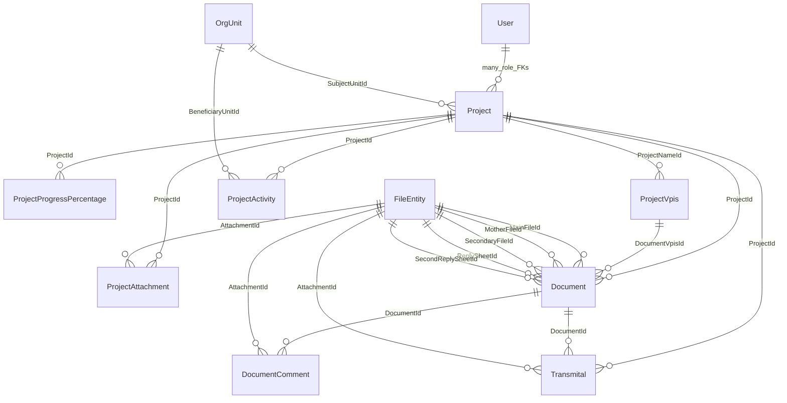

# HavayarApp — EDMS as implemented (`Entities.App.Edms`)

> Snapshot of **what exists in code today** (2026-09-15). Not a gap analysis. Incomplete-looking features (commented actions, unreachable code, duplicate enum values, status-number remapping in sync jobs) are documented as implemented.
>
> Live Panel menu / `system.RoleAccess` / job schedules were **not** queried: MCP `user-mssql-havayar` and `user-mssql-totalsystem` did not complete tool discovery/auth in this pass.

## 1. Module map

| Concern | As implemented |
|---|---|
| Schema | `Edms` |
| Namespace | `Entities.App.Edms` / `Entities.App.Edms.Enums` / `Entities.App.Edms.Views` |
| Controller files | `WebApp/Controllers/Dynamic/Edms/*.cs` |
| Controller C# namespace | `WebApp.Controllers.Dynamic` |
| Route prefix | `[Route("Panel/Edms/[controller]")]` |
| Views | `WebApp/Views/Panel/Edms/{Entity}/` |
| ViewModels | `WebApp/ViewModels/Edms/` |
| EntityAction | `WebApp/Actions/Edms/ProjectAction.cs`, `DocumentCommentAction.cs` |
| Background jobs | `App.BackgroundJob/Jobs/Edms/` (`ProjectJob`, `ProjectVpisJob`, `DocumentJob`) |
| HTS mirror (job source only) | `Entities/Hts/Edms/` |
| Dedicated service | `Data/Services/Edms/*` — MDR report only; registered in `WebApp/Program.cs` as `AddScoped<IEdmsMdrReportService, EdmsMdrReportService>()` |
| Seeded role | `Edms.Documents.DccUsers` (`Entities/Auth/Role.cs` HasData Id=`200000`) |

Inherited `BaseEntity` fields: same as EPMS spec §1.1 (`Id`, audit, `IsActive`).

### 1.1 Entity relationship (as coded)



`ProjectVpis` navigation to project is named **`ProjectName` / `ProjectNameId`** (not `Project` / `ProjectId`).

There is no separate “project parts” entity. Product documents are a **query page** over Bom/Inv (`ListDocumentProduct`), not an Edms table.

Keyless SQL view `Edms.vw_PartDocumentPrice` is mapped in `Entities/App/Edms/Views/vw_PartDocumentPrice.cs` and `Data/ApplicationDbContext.cs`.

---

## 2. Enums (`Entities/App/Edms/Enums/`)

### 2.1 `DocumentStatusEnums.cs`

Gaps in numbering (19, 35, 36) are as in source — those values are not defined.

| Member | Value | `[Display(Name)]` |
|---|---|---|
| `NotIssue` | 1 | NotIssue صادر نشده |
| `Issue` | 2 | Issue صادر شده |
| `RejectByReviewer` | 3 | RejectByReviewer رد شده بررسی کننده |
| `ApproveByReviewer` | 4 | ApproveByReviewer تایید شده بررسی کننده |
| `CommentedByReviewer` | 5 | CommentedByReviewer نظر داده شده بررسی کننده |
| `RejectByApprover` | 6 | RejectByApprover رد شده تایید کننده |
| `ApproveByApprover` | 7 | ApproveByApprover تایید شده تایید کننده |
| `CommentedByApprover` | 8 | CommentedByApprover نظر داده شده تایید کننده |
| `ApprovedByDcc` | 9 | ApprovedByDcc تایید DCC |
| `RejectByDcc` | 10 | RejectByDcc رد شده DCC |
| `CommentedByDcc` | 11 | CommentedByDcc نظر داده شده DCC |
| `RejectByClient` | 12 | RejectByClient رد توسط کارفرما |
| `ApproveByClient` | 13 | ApproveByClient تایید توسط کارفرما |
| `ApprovedAsNoteByClient` | 14 | ApprovedAsNoteClient تایید با یادداشت توسط کارفرما |
| `CommentedByClient` | 15 | CommentedByClient نظر داده شده توسط کارفرما |
| `Hold` | 16 | Hold معلق |
| `UnHold` | 17 | UnHold خارج از انتظار |
| `NotReview` | 18 | NotReview بررسی نشده |
| `SendEmailToClient` | 20 | SendEmailToClient ارسال ایمیل به مشتری |
| `ReIssued` | 21 | ReIssued صادر مجدد |
| `Commited` | 22 | Commited ثبت شده |
| `UnCommit` | 23 | UnCommit لغو ثبت |
| `ApprovedBySale` | 24 | ApprovedBySale تایید توسط فروش |
| `CommentedBySale` | 25 | CommentedBySale نظر داده شده توسط فروش |
| `RejectedBySale` | 26 | RejectedBySale رد توسط فروش |
| `AsBuild` | 27 | AsBuild طبق ساخت |
| `ReplaySheet` | 28 | ReplaySheet برگه پاسخ |
| `ReplaySheetFromClient` | 29 | ReplaySheetFromClient برگه پاسخ از مشتری |
| `IssueForClient` | 30 | IssueForClient صادر برای مشتری |
| `Archived` | 31 | Archived بایگانی شده |
| `HoldByProject` | 32 | HoldByProject در انتظار توسط پروژه |
| `ConvertToGeneralPackage` | 33 | ConvertToGeneralPackage تبدیل به پکیج عمومی |
| `CommentedInternal` | 34 | CommentedInternal نظر داده شده داخلی |
| `ApprovalInternal` | 37 | ApprovalInternal تایید داخلی |
| `ReviewIssuer` | 38 | ReviewIssuer بررسی شده توسط صادر کننده |

`Archived` exists on the enum. There is **no** archive List/controller action.

HTS comment-status integers are **not** stored 1:1. `DocumentJob.MapDocumentStatus` remaps HTS `Document_Status_FK` onto these values (see §8). Example: HTS `5` → Havayar `Issue = 2`.

### 2.2 `ProjectStatusEnum.cs`

| Member | Value | `[Display(Name)]` |
|---|---|---|
| `StartNotStarted` | 0 | شروع نشده |
| `InProcess` | 1 | در جریان |
| `Completed` | 2 | خاتمه یافته |
| `Canceled` | 3 | لغو شده |
| `Stopped` | 4 | متوقف شده |
| `PendingFinalBook` | 5 | در انتظار final book |
| `Loss` | 6 | باخت |
| `Win` | 7 | برد |

`ProjectJob.MapProjectStatus` maps **HTS** codes `3,4,5,6,7,2432,2748,2773` onto these 0–7 values (see §8). Havayar stored values are 0–7, not the HTS lookup ids.

Also used by `Entities.App.Pln.PlaningProject.ProjectStatus` (planning module, not an Edms page).

### 2.3 `ProjectActivityTypeEnum.cs`

Identical members/values to Epms `ProposalActivityActivityTypeEnum` (373–385, 401–403, 463–468). File: `Entities/App/Edms/Enums/ProjectActivityTypeEnum.cs`.

### 2.4 `ProjectVpisDocTypeEnum.cs`

| Member | Value | Display |
|---|---|---|
| `SCH` | 0 | SCH |
| `RPT` | 1 | RPT |
| `CHR` | 2 | CHR |
| `LST` | 3 | LST |
| `Dwg` | 4 | DWG |
| `DGM` | 5 | DGM |
| `DSN` | 6 | DSN |
| `PHL` | 7 | PHL |
| `Cal` | 8 | CAL |
| `DSH` | 9 | DSH |
| `BOM` | 10 | BOM |
| `PRC` | 11 | PRC |
| `Anl` | 12 | ANL |
| `Spc` | 13 | SPC |
| `Crt` | 14 | CRT |
| `ManName` | 15 | MAN |

Sync: `ProjectVpisJob.MapDocType` uses `htsValue - 1`.

### 2.5 `ProjectVpisClassDocumentEnum.cs`

| Member | Value | Display |
|---|---|---|
| `IFA` | 0 | IFA |
| `IFI` | 1 | IFI |

Sync: HTS lookup `309→IFA`, `310→IFI` (`HtsDocClassIfa/Ifi` in `ProjectVpisJob`).

### 2.6 `ProjectVpisDisplayingEnum.cs` (discipline)

`GN = 0`, then sequential:

| Member | Value | Display |
|---|---|---|
| `GN` | 0 | GN |
| `PM` | 1 | PM |
| `PR` | 2 | PR |
| `IC` | 3 | IC |
| `EL` | 4 | EL |
| `ME` | 5 | ME |
| `PI` | 6 | PI |
| `QC` | 7 | QC |
| `CV` | 8 | CV |
| `IS` | 9 | IS |
| `IE` | 10 | IE |

Sync: `MapDiscipline` uses `htsValue - 1`.

### 2.7 `ProjectVpisPageSizeEnum.cs`

| Member | Value | Display |
|---|---|---|
| `A4` | 0 | A4 |
| `A5` | 1 | A5 |
| `A6` | 2 | A6 |
| `A1` | 3 | A1 |
| `A2` | 4 | A2 |
| `A3` | 5 | A3 |

Sync `MapPageSize` is **not** by these numbers: HTS `1→A1`, `2→A2`, `3→A3`, `4→A4`, `5→A5`, `6→A6`.

### 2.8 `ProjectAttachmentTypeEnum.cs`

| Member | Value | `[Display(Name)]` |
|---|---|---|
| `Proposal` | 257 | پروپزال |
| `Metre` | 258 | متره |
| `Spec` | 259 | Spec |
| `MOM` | 260 | MOM |
| `ProductionOrder` | 261 | سفارش ساخت |
| `Contract` | **262** | قرارداد |
| `Document` | **262** | داکیومنت |
| `DocumentsFormat` | 471 | فرمت مدارک |

`Contract` and `Document` share value **262**. `ProjectJob.MapAttachmentType` casts HTS type id if defined, else `Document`.

### 2.9 `DocumentLegalHolderEnum.cs`

| Member | Value | Display |
|---|---|---|
| `Engineering` | 0 | مهندسی |
| `ProjectName` | 1 | پروژه |
| `EmployerName` | 2 | کارفرما |
| `Supplies` | 3 | تدارکات |
| `Sales` | 4 | فروش |
| `Management` | 5 | مدیریت |
| `Production` | 6 | تولید |
| `QualityControl` | 7 | کنترل کیفیت |
| `ForeignTrader` | 8 | بازرگانی خارجی |
| `Services` | 9 | خدمات |
| `Contractor` | 10 | پیمانکار |

Sync: `DocumentJob.MapLegalHolder` = HTS `holdCauseFk - 409`.

### 2.10 `DocumentGoalOfProductionEnum.cs`

| Member | Value | Display |
|---|---|---|
| `IFR` | 0 | IFR |
| `IFA` | 1 | IFA |
| `IFI` | 2 | IFI |
| `AFC` | 3 | AFC |
| `AB` | 4 | AB |

Sync: `MapGoalOfProduction` = HTS `docPoiFk - 1`.

---

## 3. Entities

### 3.1 `Project` — `Entities/App/Edms/Project.cs`

`[Display(Name = "پروژه ")]` `[Table("Project", Schema = "Edms")]`

| Property | Persian | Type | Notes |
|---|---|---|---|
| `Title` | عنوان | `string` | required, `showInRelationData`, MaxLength 500 |
| `Name` | نام | `string?` | MaxLength 500 |
| `Code` | کد | `string?` | MaxLength 200; auto-filled by `ProjectAction.CheckCode` if empty |
| `ContractPartyCustomer` | شرکت طرف قرارداد (مشتری) | `string?` | MaxLength 500 |
| `ProjectName` | نام سایت (یا نام پروژه اصلی در مدارک کارفرما) | `string?` | MaxLength 500 |
| `PackageType` | نوع پکیج (هوا، درایر، نیتروژن و غیره) | `string?` | MaxLength 200 |
| `StartMiladiDate` | تاریخ شروع میلادی | `DateTime?` | |
| `StartShamsiDate` | تاریخ شروع شمسی | `string?` | SearchPath `StartMiladiDate`, MaxLength 30 |
| `ExpirationMiladiDate` | تاریخ پایان میلادی | `DateTime?` | |
| `ExpirationShamsiDate` | تاریخ پایان شمسی | `string?` | SearchPath `ExpirationMiladiDate`, MaxLength 30 |
| `ProjectManagerId` | شناسه مدیر پروژه | `long?` | |
| `ProjectManager` | مدیر پروژه | `User?` | |
| `Status` | وضعیت | `ProjectStatusEnum` | required |
| `ProjectManagerPSLId` | شناسه مهندس مسئول psl | `long?` | |
| `ProjectManagerPSL` | مهندس مسئول psl | `User?` | |
| `CoordinatorId` | شناسه هماهنگ کننده | `long?` | |
| `Coordinator` | هماهنگ کننده | `User?` | |
| `SubjectUnitId` | شناسه واحد ذینفع | `long` | non-nullable |
| `SubjectUnit` | واحد ذینفع | `OrgUnit` | |
| `SalesExpertId` | شناسه کارشناس فروش | `long?` | |
| `SalesExpert` | کارشناس فروش | `User?` | |
| `DccId` | شناسه dcc | `long?` | |
| `Dcc` | dcc | `User?` | |
| `ProcessEngineerId` | شناسه کارشناس فرآیند | `long?` | |
| `ProcessEngineer` | کارشناس فرآیند | `User?` | |
| `MechanicExpertId` | شناسه کارشناس مکانیک | `long?` | |
| `MechanicExpert` | کارشناس مکانیک | `User?` | |
| `ControlEngineerId` | شناسه کارشناس کنترل | `long?` | |
| `ControlEngineer` | کارشناس کنترل | `User?` | |
| `ToolExpertId` | شناسه کارشناس ابزار دقیق | `long?` | |
| `ToolExpert` | کارشناس ابزار دقیق | `User?` | |
| `ElectricEngineerId` | شناسه کارشناس برق | `long?` | |
| `ElectricEngineer` | کارشناس برق | `User?` | |
| `PipingExpertId` | شناسه کارشناس پایپینگ | `long?` | |
| `PipingExpert` | کارشناس پایپینگ | `User?` | |
| `ProjectReviewerId` | شناسه بازرس پروژه | `long?` | |
| `ProjectReviewer` | بازرس پروژه | `User?` | |
| `PowerAndPrecisionPrepManagerId` | شناسه مسئول تدارکات برق/ابزار دقیق | `long?` | |
| `PowerAndPrecisionPrepManager` | مسئول تدارکات برق/ابزار دقیق | `User?` | |
| `MechanicalPreparationsResponsibleId` | شناسه مسئول تدارکات مکانیک | `long?` | |
| `MechanicalPreparationsResponsible` | مسئول تدارکات مکانیک | `User?` | |
| `ForeignPreparationsAgentId` | شناسه مسئول تدارکات خارجی | `long?` | |
| `ForeignPreparationsAgent` | مسئول تدارکات خارجی | `User?` | |
| `HasAccessToArchiveAndInputDocumentsId` | شناسه دارای دسترسی به آرشیو و اسناد ورودی (غیر مهندسی) | `long?` | single user FK |
| `HasAccessToArchiveAndInputDocuments` | دارای دسترسی به آرشیو و اسناد ورودی (غیر مهندسی) | `User?` | |
| `ProjectIsVendoriType` | پروژه از نوع وندوری هست | `bool` | default false |
| `TransmissionPrefix` | پیش کد ترانسمیتال | `string?` | MaxLength 200 |
| `TransmitterRecipient` | گیرنده ترانسمیتال | `string?` | MaxLength 500 |
| `ReceiverCopyTransmital` | گیرنده کپی ترانسمیتال | `string?` | MaxLength 500 |
| `EmailAddress` | ایمیل متفرقه/عمومی | `string?` | MaxLength 500 |
| `Explanation` | توضیحات | `string?` | MaxLength 2000 |
| `IsConfidential` | محرمانه است | `bool` | default false |
| `SensitiveUsers` | کاربران محرمانه | `string?` | names CSV/text |
| `SensitiveUsersIds` | شناسه کاربران محرمانه | `string?` | ids text |
| `IsTakvinProject` | پروژه تکوین است | `bool` | default false |
| `UserBenefitTakvin` | کاربران تکوین | `string?` | |
| `UserBenefitTakvinIds` | شناسه کاربران تکوین | `string?` | ListLong |
| `LegalDelayHavayar` | روز تاخیر مجاز هوایار | `int?` | digits regex |
| `LegalClientDayDelay` | روز تاخیر مجاز کارفرما | `int?` | digits regex |
| `ProgressPercentage` | درصد پیشرفت | `List<ProjectProgressPercentage>` | |
| `ProjectAttachments` | پیوست | `List<ProjectAttachment>` | |
| `HtsId` | (no DisplayName) | `long` | TotalSystem/HTS id for sync |

Edit view builds `Title` in JS from customer + site + package (`Project/Edit.cshtml`). Title and code inputs are **disabled** on the form; code is produced on save by EntityAction.

### 3.2 `ProjectProgressPercentage` — same file

`[Display(Name = "درصد پیشرفت")]` `[Table("ProjectProgressPercentage", Schema = "Edms")]`

| Property | Persian | Type |
|---|---|---|
| `ProjectId` / `Project` | (none) | FK |
| `Status` | وضعیت | `DocumentStatusEnums?` |
| `Percentage` | درصد | `int?` |
| `HtsId` | (none) | `long` |

Partial: `_ProjectProgressPercentagePartial.cshtml`.

### 3.3 `ProjectAttachment` — same file

`[Display(Name = "پیوست پروژه")]` `[Table("ProjectAttachment", Schema = "Edms")]`

| Property | Persian | Type | Notes |
|---|---|---|---|
| `ProjectId` / `Project` | (none) | FK | |
| `Attachment` | فایل پیوست | `FileEntity` | `addToTable: false`, types `.rar,.zip,.pdf,.excel,.word` |
| `AttachmentId` | (none) | `long` | |
| `Comment` | توضیحات | `string` | |
| `Type` | نوع مدرک | `ProjectAttachmentTypeEnum` | |
| `HtsId` | (none) | `long` | |

Partials/list: `_ProjectAttachmentsPartial.cshtml`, `ProjectAttachmentList.cshtml` (`<datatableprofile unicode="ProjectAttachment">`).

### 3.4 `ProjectVpis` — `Entities/App/Edms/ProjectVpis.cs`

`[Display(Name = "Vpis پروژه")]` `[Table("ProjectVpis", Schema = "Edms")]`

| Property | Persian | Type | Notes |
|---|---|---|---|
| `ProjectName` | پروژه | `Project?` | navigation name |
| `ProjectNameId` | (none) | `long?` | FK to `Project` |
| `Code` | کد | `string?` | MaxLength 200 |
| `Title` | عنوان | `string?` | MaxLength 500 |
| `Weight` | وزن | `decimal?` | |
| `Type` | نوع | `ProjectVpisDocTypeEnum?` | |
| `ClassDocument` | کلاس مدرک | `ProjectVpisClassDocumentEnum?` | |
| `Displaying` | دیسپلین | `ProjectVpisDisplayingEnum?` | |
| `PageSize` | سایز صفحه | `ProjectVpisPageSizeEnum?` | |
| `FirstDegreeDocumentMiladiDate` | تاریخ مبنای اولین مدرک (میلادی) | `DateTime?` | |
| `FirstDegreeDocumentShamsiDate` | تاریخ مبنای اولین مدرک (شمسی) | `string?` | |
| `ReplaceMiladiDate` | تاریخ برنامه جایگزین | `DateTime?` | |
| `ReplaceShamsiDate` | تاریخ برنامه جایگزین شمسی | `string?` | |
| `PersonHourRevisionZero` | نفر ساعت برای ریویژن 0 | `int?` | |
| `PersonHourRevisionOne` | نفر ساعت برای ریویژن 1 | `int?` | |
| `PersonHourRevisionTwo` | نفر ساعت برای ریویژن 2 | `int?` | |
| `PersonHourRevisionThree` | نفر ساعت برای ریویژن 3 | `int?` | |
| `ReviewerNames` | بررسی کنندگان | `string?` | |
| `ReviewersId` | (none) | `string?` | CSV of user ids |
| `Producer` / `ProducerId` | تهیه کننده | `User?` / `long?` | |
| `Approver` / `ApproverId` | تایید کننده | `User?` / `long?` | |
| `Description` | توضیحات | `string?` | sync may append `[RevN: n%]` |
| `HtsId` | (none) | `long` | |

`ProjectVpisController.Add` also inserts a `Document` with `Revision = 0`, `Status = NotIssue`, `ApproverId` from VPIS, `ReviewerId` = `ReviewersId.Split(',')[0].ToInt()`.

### 3.5 `Document` — `Entities/App/Edms/Document.cs`

`[Display(Name = "مدارک مهندسی")]` `[Table("Document", Schema = "Edms")]`

| Property | Persian | Type | Notes |
|---|---|---|---|
| `Project` / `ProjectId` | پروژه | `Project?` / `long?` | `showInRelationData` on Project |
| `DocumentVpis` / `DocumentVpisId` | سند | `ProjectVpis?` / `long?` | |
| `GoalOfProduction` | هدف از تولید مدرک | `DocumentGoalOfProductionEnum?` | |
| `HourPrePerson` | نفر ساعت | `int?` | |
| `PublicationShamsiDate` | تاریخ انتشار/ارسال | `string?` | DateShamsi |
| `PublicationMiladiDate` | تاریخ انتشار/ارسال | `DateTime?` | Date (same Persian label as Shamsi) |
| `ApprovedShamsiDateTime` | تاریخ تایید شمسی | `string?` | set by `DocumentCommentAction` on ApproveByApprover |
| `ApprovedMiladiDateTime` | تاریخ تایید میلادی | `DateTime?` | |
| `RevieweShamsiDateTime` | تاریخ بررسی شمسی | `string?` | spelling **Reviewe** |
| `RevieweMiladiDateTime` | تاریخ بررسی میلادی | `DateTime?` | |
| `Reviewer` / `ReviewerId` | بررسی کننده | `User?` / `long?` | |
| `Approver` / `ApproverId` | تایید کننده | `User?` / `long?` | |
| `Comment` | توضیحات | `string?` | MaxLength 2000 |
| `MainFile` / `MainFileId` | فایل اصلی | `FileEntity?` / `long?` | |
| `MotherFile` / `MotherFileId` | فایل مادر | `FileEntity?` / `long?` | |
| `SecondaryFile` / `SecondaryFileId` | فایل ثانوی | `FileEntity?` / `long?` | |
| `ReplySheet` / `ReplySheetId` | فایل ReplySheet | `FileEntity?` / `long?` | |
| `SecondReplySheet` / `SecondReplySheetId` | فایل ReplySheet دوم | `FileEntity?` / `long?` | |
| `Status` | وضعیت مدرک | `DocumentStatusEnums?` | |
| `Revision` | بازنگری | `int` | |
| `IsLatest` | آخرین رویژن | `bool` | maintained in `DocumentController.Save` |
| `Comments` | کامنتها | `List<DocumentComment>` | |
| `HtsId` | (none) | `long` | |

Revisions are **multiple `Document` rows** sharing `ProjectId` + `DocumentVpisId`, not a child table.

### 3.6 `DocumentComment` — same file

`[Display(Name = "کامنت های مدارک مهندسی")]` `[Table("DocumentComment", Schema = "Edms")]`

| Property | Persian | Type | Notes |
|---|---|---|---|
| `Document` / `DocumentId` | (none) | FK | |
| `Attachment` / `AttachmentId` | پیوست | `FileEntity?` / `long?` | |
| `Comment` | توضیحات | `string?` | MaxLength 2000 |
| `Status` | وضعیت مدرک | `DocumentStatusEnums?` | copied onto document after add |
| `LegalHolder` | متولی Hold | `DocumentLegalHolderEnum?` | |
| `HOLDOwner` / `HOLDOwnerId` | مسئول Hold | `User?` / `long?` | capital **HOLD** |
| `HoldDetails` | توضیحات Hold | `string?` | MaxLength 2000 |
| `HtsId` | (none) | `long` | |

### 3.7 `Transmital` — `Entities/App/Edms/Transmital.cs`

`[Display(Name = "ترانسمیتال")]` `[Table("Transmital", Schema = "Edms")]`  
Spelling **Transmital** throughout (no second `t`). **No `HtsId`.** No transmital sync job.

| Property | Persian | Type | Notes |
|---|---|---|---|
| `Project` / `ProjectId` | پروژه | required Entity | |
| `Document` / `DocumentId` | مدرک | required Entity | |
| `Number` | شماره ترانسمیتال | `string?` | auto `{TransmissionPrefix}-{0000}` unless reply-sheet |
| `DefinedByUserNumber` | شماره تعریف شده توسط کاربر | `string?` | used when `IsForReplySheet` |
| `Comments` | توضیحات | `string?` | |
| `EmployerRelated` | مربوط به کارفرما | `bool?` | default false |
| `IsForReplySheet` | برای ReplySheet | `bool?` | default false |
| `DeliveryDateToEmployer` | تاریخ ارسال به کارفرما | `string?` | DateShamsi only (no Miladi twin) |
| `Attachment` / `AttachmentId` | پیوست | `FileEntity?` / `long?` | |

`Add`/`Update` call `AddNotReviewComments`: insert comment Status=`NotReview` text `ایجاد شده از ترانسمیتال`, and set document status to `NotReview`.

### 3.8 `ProjectActivity` — `Entities/App/Edms/ProjectActivity.cs`

`[Display(Name = "فعالیت های پروژه")]` `[Table("ProjectActivity", Schema = "Edms")]`  
**No `HtsId`.** No activity sync job. No comment child collection (unlike Epms `ProposalActivity`).

| Property | Persian | Type |
|---|---|---|
| `Project` / `ProjectId` | پروژه | required |
| `ProjectName` | نام پروژه | `string?` |
| `BeneficiaryUnit` / `BeneficiaryUnitId` | واحد ذینفع | `OrgUnit?` / `long?` |
| `Type` | نوع فعالیت | `ProjectActivityTypeEnum` required |
| `Comment` | کامنت | `string?` |
| `MiladiDate` / `ShamsiDate` | تاریخ فعالیت | `DateTime?` / `string?` |
| `Duration` | طول/مدت (دقیقه) | `long?` |

### 3.9 `vw_PartDocumentPrice` — `Entities/App/Edms/Views/vw_PartDocumentPrice.cs`

Keyless EF view `Edms.vw_PartDocumentPrice`: `Id`, `ProductId`, `InternalTotalBuyPrice`, `ExternalTotalBuyPrice`, `BuyPrice`. No CRUD page. Consumers: `ProductPriceCompareController`, `ProductPriceSnapshotJob`, `Data/Scripts/PartPrice.sql`, `QueryDesigner95_ProductFormulView.sql`.

---

## 4. Controllers and public actions

`ActionAccessType`: View=1, Api=2. `ActionAccessItemType`: List=1, FetchData=2, Save=3, Create=4, Update=5, Delete=6, Custom=1000. `ExportToExcel` is Api **without** ItemType unless noted.

### 4.1 `ProjectController` — `WebApp/Controllers/Dynamic/Edms/ProjectController.cs`

`[ControllerInfo("پروژه ", typeof(Project))]`  
URL base: `/Panel/Edms/Project/`

| Action | HTTP | DisplayName | Type / Item | View / note |
|---|---|---|---|---|
| `Save` | POST | ذخیره | Api / Save | `Repository.SaveAsync` (triggers BeforeSave `CheckCode`) |
| `Add` | POST | درج | Api / Create | |
| `Update` | POST | ویرایش | Api / Update | |
| `Delete` | GET | حذف | Api / Delete | |
| `Edit` | GET | ویرایش اطلاعات | View / Update | `Project/Edit.cshtml` (includes progress + attachments) |
| `New` | GET | درج اطلاعات | View / Create | same Edit |
| `List` | GET | لیست اطلاعات | View / List | `Project/List.cshtml` |
| `ProjectAttachmentList` | GET | لیست اطلاعات پیوست پروژه | View / List | `Project/ProjectAttachmentList.cshtml` |
| `ExportToExcel` | POST | خروجی اکسل | Api / *(none)* | |
| `FetchData` | POST | دریافت اطلاعات | Api / FetchData | |
| `ProjectProgressPercentagePartial` | GET | **no attribute** | helper | `_ProjectProgressPercentagePartial.cshtml` |
| `ProjectAttachmentsPartial` | GET | **no attribute** | helper | `_ProjectAttachmentsPartial.cshtml` |

### 4.2 `ProjectVpisController` — `WebApp/Controllers/Dynamic/Edms/ProjectVpisController.cs`

`[ControllerInfo("Vpis پروژه", typeof(ProjectVpis))]`  
`/Panel/Edms/ProjectVpis/` — standard Save/Add/Update/Delete/Edit/New/List/ExportToExcel/FetchData. **Add** creates initial `Document` (see §3.4). Views: `ProjectVpis/Edit.cshtml`, `List.cshtml`.

### 4.3 `ProjectActivityController` — `WebApp/Controllers/Dynamic/Edms/ProjectActivityController.cs`

`[ControllerInfo("فعالیت های پروژه", typeof(ProjectActivity))]`  
`/Panel/Edms/ProjectActivity/` — standard CRUD only. Views: `ProjectActivity/Edit.cshtml`, `List.cshtml`.

### 4.4 `TransmitalController` — `WebApp/Controllers/Dynamic/Edms/TransmitalController.cs`

`[ControllerInfo("ترانسمیتال", typeof(Transmital))]`  
`/Panel/Edms/Transmital/` — standard CRUD + numbering / `AddNotReviewComments` on Add and Update. Views: `Transmital/Edit.cshtml`, `List.cshtml`.

### 4.5 `DocumentController` — `WebApp/Controllers/Dynamic/Edms/DocumentController.cs`

`[ControllerInfo("مدارک مهندسی", typeof(Document))]`  
Injects `IEdmsMdrReportService`. URL base: `/Panel/Edms/Document/`

#### Permission-catalog actions

| Action | HTTP | DisplayName | Type / Item | Returns |
|---|---|---|---|---|
| `Save` | POST `Save/{CanEditDocument?}` | ذخیره | Api / Save | sets `IsLatest` across same project+VPIS, then Add/Update |
| `Add` | POST | درج | Api / Create | forces `Status=Issue`; strips comments unless `CanEditDocument`; adds Issue `DocumentComment` |
| `Update` | POST | ویرایش | Api / Update | if `NotIssue` → `Issue`; may add Issue/ReplySheet comments |
| `Delete` | GET | حذف | Api / Delete | |
| `Edit` | GET | ویرایش اطلاعات | View / **Custom** | **old** `Document/Edit.cshtml` (single revision) |
| `EditAsGroup` | GET | ویرایش اطلاعات تکمیلی | View / Update | `Document/EditAsGroup.cshtml` + `DocumentGroupEditViewModel` |
| `New` | GET | درج اطلاعات | View / Create | **EditAsGroup** (empty VM); old Edit return is commented |
| `List` | GET | لیست اطلاعات | View / List | `Document/List.cshtml` |
| `ExportToExcel` | POST | خروجی اکسل | Api / *(none)* | |
| `FetchData` | POST | دریافت اطلاعات | Api / FetchData | |
| `MdrReport` | GET | صفحه گزارش MDR | View / List | `Document/MdrReport.cshtml` |
| `GetMdrReport` | GET | گزارش MDR | Api / Custom | `IEdmsMdrReportService.GetReportAsync` |
| `GetMdrReportPost` | POST | گزارش MDR | Api / Custom | same |
| `ExportMdrToExcel` | POST | خروجی اکسل MDR | Api / Custom | `EdmsMdrReportExcelExporter` |
| `PersonnelWorkLoadReport` | GET | صفحه گزارش حجم کاری پرسنل | View / List | `Document/PersonnelWorkLoadReport.cshtml` |
| `GetPersonnelWorkLoadReport` | POST | گزارش حجم کاری پرسنل | Api / Custom | in-controller builder; requires ProjectId **or** PersonnelId |
| `ListDocumentProduct` | GET `DocumentProducts/ListDocumentProduct` | مدارک محصولات | View / Custom | `DocumentProducts/ListDocumentProduct.cshtml` |
| `DocumentProductFetchData` | POST | دریافت اطلاعات مدارک محصولات | Api / FetchData | joins `ProductFormul` / `Part` / prices / extra info |

#### Helpers without `[ActionDisplayName]`

| Action | HTTP | Returns |
|---|---|---|
| `AddNewComment` | POST | `DocumentComment.AddAsync` (status required; AfterAdd action updates document) |
| `AddEditComment` | POST | appends `" *اصلاح* "` to comment text then **Add** (not update) |
| `RevisionsListPartial` | GET | `_DocumentRevisionsListPartial.cshtml` |
| `RevisionEditorPartial` | GET | `_DocumentRevisionEditorPartial.cshtml` |
| `RevisionDetailsPartial` | GET | `_DocumentRevisionDetailsPartial.cshtml` |
| `NewRevisionEditorPartial` | GET | new revision = max+1, status `NotReview` |
| `DocumentCommentPartial` | GET | `_DocumentCommentPartial.cshtml` |
| `DocumentCommentPartialEdit` | GET | `_DocumentCommentPartialEdit.cshtml`; filters statuses via `GetFilteredStatusOptions` unless `editStatus` |
| `DocumentVpisSummaryPartial` | GET | `_DocumentVpisSummaryPartial.cshtml` |

#### Commented (present in source, not routed)

```csharp
//[HttpGet("DocumentProducts/List")]
//[ActionDisplayName("مدارک محصولات", ...)]
//public IActionResult DocumentProductList()
//    return View(@"\Views\Panel\Edms\Document\DocumentProducts\List.cshtml");
```

File `DocumentProducts/List.cshtml` still exists (datasheet toolbar + Document datatableprofile) but the action is commented.

#### DCC / status filter (implemented)

`DocumentCommentPartialEdit` sets `currentUserIsDcc = CurrentUserHasRole("Edms.Documents.DccUsers")`. `projectType` = 1 if `Project.ProjectIsVendoriType` else 0.

`GetFilteredStatusOptions` (static on the controller):

- **DCC user:** NotIssue→Issue; Issue/ReviewIssuer→ reviewer approve/reject/comment; ApproveByReviewer→ approver approve/reject/comment; ApproveByApprover→ DCC approve/reject; NotReview **or** item ApprovedByDcc → client outcomes + ReIssued; ApproveByClient→ReIssued.
- **Non-DCC** (`projectType` 0 and 1): same chain only through reviewer/approver comments. The two non-DCC branches are **the same filter** in source.

There is **no** separate DCC / Final DCC / cartable page. DCC is this role + optional `Project.Dcc` user FK.

Nested types on the controller: `PersonnelWorkLoadReportFilter` (`ProjectId`, `PersonnelId`), `PersonnelWorkLoadReportResponse`, `PersonnelWorkLoadReportItemDto` (rev0/1/N and checking man-hours, month buckets, production dates).

---

## 5. Views (`WebApp/Views/Panel/Edms/`)

| Path | Used by |
|---|---|
| `Project/List.cshtml` | Project List — `datatableprofile` `Project` |
| `Project/Edit.cshtml` | Project Edit/New — staff FKs, transmittal prefix, confidential/takvin, progress + attachment tabs |
| `Project/_ProjectProgressPercentagePartial.cshtml` | helper |
| `Project/_ProjectAttachmentsPartial.cshtml` | helper |
| `Project/ProjectAttachmentList.cshtml` | `ProjectAttachmentList` — `unicode="ProjectAttachment"` |
| `ProjectVpis/List.cshtml` | List |
| `ProjectVpis/Edit.cshtml` | Edit/New — Type/Class/Displaying/PageSize enums |
| `ProjectActivity/List.cshtml` | List |
| `ProjectActivity/Edit.cshtml` | Edit/New |
| `Transmital/List.cshtml` | List |
| `Transmital/Edit.cshtml` | Edit/New |
| `Document/List.cshtml` | Document List |
| `Document/Edit.cshtml` | `Edit(id)` still live |
| `Document/EditAsGroup.cshtml` | `EditAsGroup`, `New` — revision group UI |
| `Document/_DocumentRevisionsListPartial.cshtml` | helper |
| `Document/_DocumentRevisionEditorPartial.cshtml` | helper / new revision |
| `Document/_DocumentRevisionDetailsPartial.cshtml` | helper |
| `Document/_DocumentCommentPartial.cshtml` | helper |
| `Document/_DocumentCommentPartialEdit.cshtml` | helper (filtered statuses) |
| `Document/_DocumentVpisSummaryPartial.cshtml` | helper |
| `Document/MdrReport.cshtml` | MDR filters + Apex/table UI calling GetMdrReportPost / ExportMdrToExcel |
| `Document/PersonnelWorkLoadReport.cshtml` | personnel workload filters + POST GetPersonnelWorkLoadReport |
| `Document/DocumentProducts/ListDocumentProduct.cshtml` | live product-docs grid — `unicode="ListDocumentProduct"` |
| `Document/DocumentProducts/List.cshtml` | **orphaned by commented action**; datasheet buttons remain in file |

ViewModels: `WebApp/ViewModels/Edms/DocumentGroupEditViewModel.cs`, `DocumentRevisionSummaryViewModel`, `DocumentProductListDto.cs`.

MDR DTOs: `Data/Services/Edms/MdrReportModels.cs` (`MdrReportFilter`, `MdrReportItemDto`, `MdrRevisionDto`). Service logic: `EdmsMdrReportService.cs`, `EdmsMdrReportLogic.cs`, exporter `EdmsMdrReportExcelExporter.cs`. SQL reference copies: `Docs/Sql/Edms_MDR_Report.sql`, `Edms_MdrDashboard_Query.sql`, `Edms_MdrDashboard_Provision.sql`. MDR query **excludes** projects with `StartNotStarted` and `Completed`.

There are **no** dedicated views for delay / Hold / progress dashboard / summary / KPI / client-vendor evaluation / cumulative personnel performance / three archives.

---

## 6. EntityAction (`WebApp/Actions/Edms/`)

No Epms actions. Two Edms classes, discovered via `builder.Services.AddEntityActions(typeof(Program).Assembly)`.

### 6.1 `ProjectAction.cs`

| Method | Trigger | Name | Persian | Priority |
|---|---|---|---|---|
| `CheckCode` | `BeforeSave` | `CheckCode` | بررسی و تولید کد پروژه | 1 |

If `Code` is empty, builds `{SP|VP|TP}/{prefix}/{ShamsiYear}/{counter}`:

- Type: `IsTakvinProject` → `TP`, else `ProjectIsVendoriType` → `VP`, else `SP`.
- Prefix: `GetOrganizationUnit` reads `OrgUnit.ProjectPrefixCode` and **returns it**. A following `switch (organizationUnitId)` with hardcoded EC/EN/IG/… aliases is **unreachable**.
- Counter: last project of same `SubjectUnitId`, last `/` segment + 1; reset when year changes. Collision retry does `counter += 1` on a **string** (`"01" + 1` → `"011"`), as written.

Throws if org unit missing or `ProjectPrefixCode` empty.

### 6.2 `DocumentCommentAction.cs`

| Method | Trigger | Name | Persian | Priority |
|---|---|---|---|---|
| `ChangeDocumentStatus` | `AfterAdd` | `ChangeDocumentStatus` | تغییر وضعیت مدرک | 1 |

Requires `model.Status`. Copies status onto `Document`. If current user is document Approver and status is `ApproveByApprover`, stamps approved dates. If current user is Reviewer and status is `ApproveByReviewer`, stamps `Reviewe*` dates. Updates document audit fields and `SaveChangesAsync`.

---

## 7. Background jobs (`App.BackgroundJob/Jobs/Edms/`)

Handlers are `[JobHandler("...")]` methods, catalogued into `system.JobDefinition` / scheduled in `system.JobSchedule` (live schedules **not** queried). Source HTS tables live on `HtsDbContext` via `Entities/Hts/Edms/`.

| Class | Method | `[JobHandler]` | What it does |
|---|---|---|---|
| `ProjectJob.cs` | `SyncProjectsFromHts` | هماهنگ کردن پروژه‌ها از HTS | Upsert `Edms.Project` by `HtsId` (fallback match `Code` if HtsId=0). Maps users, org unit via Hamkaran id, confidential users, `MapProjectStatus`. Skips if beneficiary unit not found. |
| `ProjectJob.cs` | `SyncProjectAttachmentsFromHts` | انتقال پیوست‌های پروژه از HTS | Files + `ProjectAttachment` / `HtsId`; requires projects already synced |
| `ProjectJob.cs` | (same class, invoked from project sync) | progress rows | `Edms_Project_Progress` → `ProjectProgressPercentage`; **casts HTS status byte to `DocumentStatusEnums` if defined** |
| `ProjectVpisJob.cs` | `SyncProjectVpisFromHts` | هماهنگ کردن VPIS پروژه‌ها از HTS | Requires projects with `HtsId`. Maps type/class/discipline/page size (see §2). Producer from `Edms_Project_Vpis_Responsible` (`IsMain`). Reviewer from HTS checked user. |
| `DocumentJob.cs` | `SyncDocumentsFromHts` | هماهنگ کردن مدارک مهندسی از HTS | Pages HTS documents (500). Requires VPIS `HtsId`. Maps status via `MapDocumentStatus` (not 1:1). |
| `DocumentJob.cs` | `SyncDocumentCommentsFromHts` | هماهنگ کردن کامنت مدارک مهندسی از HTS | Comments + Hold legal holder offset 409 |
| `DocumentJob.cs` | `SyncDocumentFilesFromHts` | انتقال فایل‌های مدارک مهندسی از HTS | Main/mother/secondary/reply files via `IFileService` |

HTS entity files (job DTOs, not App entities):

- `Hts_Edms_Project.cs` → table `Edms_Project`
- `Hts_Edms_ConfidentialProject_User.cs`
- `Hts_Edms_Project_Attachment.cs`
- `Hts_Edms_Project_Progress.cs`
- `Hts_Edms_Project_Vpis.cs`
- `Hts_Edms_Project_Vpis_Responsible.cs`
- `Hts_Edms_Document.cs`
- `Hts_Edms_Document_Comment.cs`

**No job** for `Transmital`, `ProjectActivity`, or any Epms table.

Schema patches used by sync: `Data/Scripts/AddEdmsProjectHtsId.sql`, `Data/Scripts/AddEdmsDocumentHtsId.sql` (`HtsId` + `SecondReplySheetId` + indexes).

### 7.1 `DocumentJob.MapDocumentStatus` (HTS FK → Havayar enum)

| HTS `statusFk` | Havayar |
|---|---|
| 1 | `RejectByDcc` (10) |
| 2 | `ApproveByReviewer` or `ApproveByApprover` via `MapHtsApproveStatus` |
| 3 | `CommentedByApprover` (8) |
| 4 | `CommentedByDcc` or `CommentedByReviewer` |
| 5 | **`Issue` (2)** |
| 6 | `ApprovedByDcc` (9) |
| 7–13 | client/hold/NotReview as in source switch |
| 14 | `UnHold` |
| 15–29 | sale / as-build / reply / issue-for-client / archived / hold-by-project / convert-to-general-package |

Unmapped HTS values → `null`.

---

## 8. Menu, RoleAccess, SQL seeds

| Source | Finding |
|---|---|
| `Data/Scripts` Epms/Edms `SystemMenu` / `RoleAccess` | **No** dedicated seed. Other modules (Bpm, AfterSales, Sale, Trn) have seeds; Edms/Epms do not. |
| `Entities/Auth/Role.cs` | `Edms.Documents.DccUsers` / Title `مهندسی -مدارک - کاربران DCC` / Id `200000` (HasData). Region comment in file still says `Sup.OpenOrderRequest Role Seed`. |
| List grids | Default `datatableprofile` by entity type (or `unicode=` for attachment / ListDocumentProduct). **No** SavedQuery seed for Edms DataProfiles in repo. |
| Live `system.SystemMenu` / `RoleAccess` | **Not verified** (MCP SQL down). Expected path shape if menu exists: `/panel/edms/project/list`, `/panel/edms/document/list`, `/panel/edms/document/mdrreport`, `/panel/edms/document/personnelworkloadreport`, `/panel/edms/document/documentproducts/listdocumentproduct`, etc. |
| Other SQL that **reads** Edms | `SyncAfterSalesPhase11FromTotalSystem.sql` (`Edms.Project`), `SyncOpenOrderRequestFromTotalSystem.sql` (Project/Vpis/Document), `SyncBpmDocumentSystemFromTotalSystem.sql` (count check only; does not sync Edms) |

---

## 9. Cross-module consumers of `Entities.App.Edms` (not Edms pages)

| Location | Use |
|---|---|
| `Entities/App/Sup/OpenOrderRequest.cs` | `ProjectId`, `ProjectVpisId`, `DocumentId` FKs |
| `App.BackgroundJob/Jobs/Sup/OpenOrderRequestJob.cs` | includes handler «بررسی تغییر Revision مدارک VPIS و اعلام به واحد فروش/پروژه» (Sup job, not Edms folder) |
| `Entities/App/Inq/TechnicalInquiry.cs` | `ProjectId` |
| `Entities/App/Sale/AfterSalesMisc.cs` | `Project` / `ProjectId` |
| `Entities/App/Sale/ProductionOrder.cs` | `EdmsProject` **`int?`** (HTS id style, not `Edms.Project` FK) |
| `Entities/App/Pln/PlaningProject.cs` | `ProjectStatusEnum` |
| `WebApp/Views/Panel/Sale/OilGasWorkReport/Edit.cshtml` | `@using Entities.App.Edms` |
| `WebApp/Views/Panel/Eng/CompressorSizing/Calculator.cshtml` | `@using Entities.App.Edms` |
| `WebApp/Views/Panel/Sup/OpenOrderRequest/_LinkVpisPartial.cshtml` | VPIS linker |
| `WebApp/Controllers/SystemControllers/PanelController.cs` | `using Entities.App.Edms` |

---

## 10. Permission / access notes as implemented

- Primary CRUD actions have `[ActionDisplayName]` and appear in Role UI after WebApp restart (`InitializeAccessControllers`).
- Helpers without the attribute (partials, `AddNewComment`, `AddEditComment`) are **outside** the permission catalog.
- `Document.Edit` is `ActionAccessItemType.Custom`; `EditAsGroup` is `Update`.
- MDR and personnel-workload **pages** are `View` + `List`; data APIs are `Api` + `Custom`.
- DCC is a **named role** used to filter comment status options, not a separate controller.
