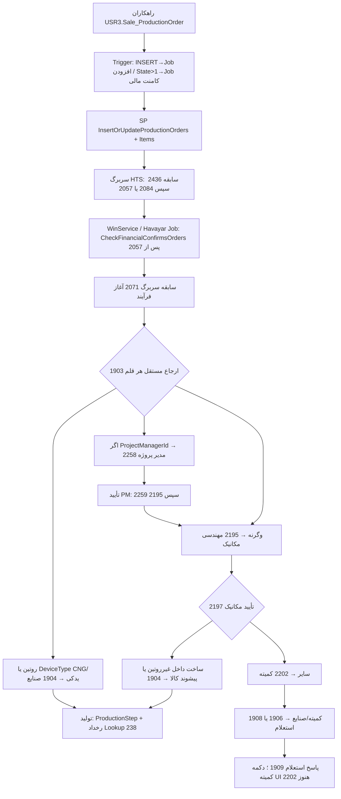

# سفارش ساخت و اقلام — نمای کلی مقایسه HTS و HavayarApp

> فقط مستندسازی. **هیچ تغییری در کد، SQL، منو، جاب یا دسترسی اعمال نشده و نباید از این پوشه به‌عنوان مجوز پیاده‌سازی خوانده شود.**  
> تاریخ تطبیق: **2026-09-15**. منبع گردش: modernization v2/v3. موجودی‌ها: `01-HTS-Inventory.md` و `02-Havayar-Inventory.md`. الگوی نگارش: `Specs/AfterSalesServiceSystem/00-Overview-and-Conventions.md`.

## 1. هدف

ثبت **آنچه در HTS زنده است** در برابر **آنچه الان در HavayarApp پیاده شده** تا مالک محصول ردیف‌به‌ردیف در `03-Gap-Register.md` تصمیم بگیرد چه چیزی اصلاح، حفظ، یا آگاهانه متفاوت بماند.

این پوشه:

- بازنویسی `docs/modernization/production-order-item-workflow-v2.md` / `v3` نیست.
- پیشنهاد اجرای کد، migration، seed منو یا تغییر جاب نیست.
- درخت منوی سایر سیستم‌های HTS را پوشش نمی‌دهد.

خروجی قابل اقدام برای شما: ستون خالی **تصمیم** در فایل 03.

## 2. محدوده

### داخل محدوده

دو مسیر منوی **زنده** HTS و هر آنچه کاربر از داخل همان دو صفحه می‌بیند یا صدا می‌زند:

| صفحه زنده HTS | href | `SystemPage` | معادل مسیر Havayar (کنترلر) |
|---|---|---|---|
| اقلام سفارش ساخت | `planning-productionOrderItem` | `214` | `/Panel/ProductionOrderItem/...` |
| سفارش ساخت | `planning-productionOrder` | `463` | `/Panel/ProductionOrder/...` |

فرزندان داخل همین دو صفحه: گردش تأیید، BOM، کامنت/سابقه، استعلام، پیوست سربرگ، سریال روی قلم زنده، جابه‌جایی، توقف تولید، تأخیر **اگر از همین صفحه باز شود**، اعلان‌ها، جاب‌ها، تریگر/Action، دسترسی‌ها.

### همسایه‌های منو — فقط موجودی، بدون تحلیل فیلدبه‌فیلد

گزارش BOM، گزارش کامنت، کسری، تأخیر مستقل (صفحه `362`)، گزارش تأخیر، تحویل به‌موقع، تأییدکننده تجهیز. فهرست «هست در HTS / هست در Havayar» در 01 و 02 است؛ مگر اینکه از داخل 214/463 باز شوند، وارد Gap-Register به‌عنوان صفحه فرزند نمی‌شوند.

### خارج از محدوده

منوی آموزش، BPM، خدمات پس از فروش و بقیه سیستم‌ها. لایه‌های **کامنت‌شده** HTS (`Hdr/Itm`، `Itm_New`) فقط وقتی ذکر می‌شوند که بدون آن‌ها نگاشت زنده مبهم شود.

## 3. قرارداد مقایسه

هر موضوع یکی از این وضعیت‌ها را می‌گیرد. **Match خالص در 03 فهرست نمی‌شود.**

| وضعیت | معنی |
|---|---|
| `Match` | رفتار/فیلد/صفحه با شاهد دو طرف معادل است (شاید نام متفاوت). در 03 نمی‌آید. |
| `Partial` | معادل وجود دارد ولی ناقص، جابه‌جا، یا با شرط متفاوت است — **Missing ننویسید**. |
| `Missing` | در HTS زنده شاهد دارد و در Havayar معادل قابل‌اتکا پیدا نشد. |
| `NewInHavayar` | در Havayar هست و در مسیر زنده 214/463 معادل عملیاتی ندارد (ابزار مهاجرت، تب اضافه، فیلد جدید). |
| `IntentionalChange` | اختلاف با شاهد، ولی از کامنت کد / v2/v3 / طراحی پنل به‌نظر آگاهانه می‌آید؛ تأیید با شماست. |

شدت در 03: **High** (مسیر روزانه یا وضعیت غلط) / **Medium** (قابلیت ناقص) / **Low** (جاگیری، نام، ابزار).

شاهد الزامی است: `path:line` نسبت به ریشه HTS یا HavayarApp. اگر موجودی 01/02 برای یک ادعا کافی نبود، از سورس خوانده شده است.

## 4. واژه‌نامه وضعیت (کدهای کلیدی)

جزئیات Lookup و ابهام‌ها: v2 بخش ۴، v3 بخش ۱، و 01 بخش ۶. اینجا فقط کدهایی که تطبیق به آن‌ها وابسته است.

### سربرگ — HTS LookupType `280` → Havayar `ProductionOrderStateEnum`

| کد HTS | عنوان | enum Havayar |
|---|---|---|
| `2055` / `2056` / `2436` | ایجاد / ویرایش / خوانده‌شده از راهکاران | `Submit = 1` |
| `2084` | در انتظار تایید مالی | `FinancialUnitReview = 2` |
| `2057` / `2071` | تایید مالی / تایید مالی و آغاز فرآیند ساخت | `FinancialApproval = 3` |
| `2207` | منسوخ شده | `Obsolete = 4` |

تأیید مالی در راهکاران است (مالک سیستم، v3). نگاشت عددی Rahkaran `State` 1..4 با همین enum در جاب ورود Havayar انجام می‌شود.

### قلم — چهار بُعد (نتیجه اصلی v2)

| بُعد HTS | فیلد Havayar | LookupType |
|---|---|---|
| `BuyStatusId` | `CheckStatus` | `254` |
| `ProductionStepId` | `ProductionStep` | `58` |
| `ProductionStatusId` | `ProductionStatus` | `238` (+ کدهای کارتابل در enum تولید) |
| `StatusId` | `Status` | `105` (`579`/`580`/`581`) |

کدهای کارتابل کلیدی: `1903` ثبت اولیه؛ `1904`/`1905` صنایع داخلی/خارجی؛ `1906` استعلام؛ `1908` وزارت صنایع؛ `1909` ارسال به رئیس کمیته؛ `2202` انتظار بررسی کمیته؛ `2195` مهندسی مکانیک؛ `2196`/`2199`/`2200` برق (در `CheckStatusEnum` Havayar نیستند)؛ `2197`/`2198` تایید/رد مکانیک؛ `2201` بازنگری مهندسی؛ `2258`–`2261` مدیر پروژه؛ `2208` منسوخ قلم.

مرحله نمونه: `210` برنامه‌ریزی، `213` انتظار مهندسی، `214` منتظر تولید، `1380` انتظار مدیر پروژه، `221` آماده ارسال، `2744` انتظار صنایع، `227` باطل.

## 5. نقشه موجودیت

| جدول / مفهوم HTS | موجودیت Havayar | Schema | نکته نگاشت |
|---|---|---|---|
| `Pln_ProductionOrder` | `ProductionOrder` | `Sale` | `Number` متنی است؛ `ProductionOrderNumber` عددی راهکاران؛ `RahkaranId` → `HamkaranId` |
| `Pln_ProductionOrderComment` | `ProductionOrderComment` | `Sale` | `StatusId` → جفت `PreviousState`/`NewState` |
| `Pln_ProductionOrderItem` | `ProductionOrderItem` | `Sale` | `BuyStatusId` → `CheckStatus`؛ `RahkaranId` تاریخچه → `RahkaranHistoryId`؛ Id قلم ERP → `HamkaranId` |
| `Pln_ProductionOrder_Itm_New_Comment` | `ProductionOrderItemComment` | `Sale` | همان جدول سابقه New/Original در HTS |
| `Pln_ProductionOrderItemInquiry` | `ProductionOrderItemInquiry` | `Sale` | |
| `Pln_ProductionOrderItemBom` | `ProductionOrderItemBom` | `Sale` | |
| `Pln_ProductionOrderItemBomChanges` | فیلدهای `SaleUnitDetails` / `NeedsAVL` روی BOM | `Sale` | جدول جدا نیست |
| `Pln_ProductionOrder_Delay` | `ProductionOrderDelay` | `Pln` | در HTS UI صفحه `362`؛ در Havayar تب توکار سربرگ هم هست |
| `Pln_ProductionOrderEquipmentConfirmer` | `ProductionOrderEquipmentConfirmer` | `Pln` | سراسری بر اساس `DeviceType` |
| `Prd_StopRequest` | `Prd.StopRequst` | `Prd` | از Edit قلم باز می‌شود |
| `Pln_ProductionOrder_Itm_Serial` | فیلد `Serial` + اقساط روی خود قلم | — | فقط لایه **زنده Original**؛ جدول فرزند legacy است |
| `Pln_ProductionOrder_Itm_Installment` / `Metre` / `Itm_Attachment` / `RoutineAttachment` | — | — | صفحات legacy؛ از منوی زنده 214/463 باز نمی‌شوند |

DbSet دستی لازم نیست؛ هر دو طرف از الگوی موجودیت پایه خود استفاده می‌کنند.

## 6. مسیر منو (واقعیت دو سیستم)

```
HTS
├── سیستم فروش (MainSale) → عملیات → سفارشات ساخت     href planning-productionOrder     صفحه 463
└── سیستم برنامه‌ریزی → عملیات / گزارشات → اقلام سفارش ساخت
        href planning-productionOrderItem     صفحه 214

HavayarApp (سورس)
├── کنترلر: [Route("Panel/[controller]")]  →  /Panel/ProductionOrder  و  /Panel/ProductionOrderItem
├── View: Views/Panel/Sale/...
├── جدول: Sale.ProductionOrder*
└── seed منو در Data/Scripts: وجود ندارد — ورود عملی از MenuBuilder دیتابیس است
```

اختلاف جاگیری منو و نبود seed در 03 با شناسه `GAP-MENU-*` است، نه فرض «صفحه وجود ندارد».

## 7. فرآیند سطح‌بالا (راهکاران → تأیید مالی سربرگ → ارجاع قلم)

این نمودار **قرارداد HTS زنده‌ای** است که v2/v3 و 01 توصیف می‌کنند. انحراف پیاده‌سازی Havayar در 03 است، نه در این شکل.



زمان‌بندی HTS: `HtsTaskService.PlanningSystemTask` حدود هر ۲۰ دقیقه؛ ورود راهکاران حدود هر ۱۵ دقیقه. در Havayar همان منطق داخل `ProductionOrderJob` است و زمان را **پنل جاب** مشخص می‌کند.

## 8. فایل‌های این پوشه

| فایل | نقش |
|---|---|
| `00-Overview.md` | همین فایل: محدوده، واژه‌نامه، نقشه موجودیت، قرارداد مقایسه |
| `01-HTS-Inventory.md` | استخراج سیستم قدیم (منو، صفحه، فیلد، اکشن، جاب، تریگر، دسترسی) |
| `02-Havayar-Inventory.md` | موجودی فعلی سیستم جدید |
| `03-Gap-Register.md` | **فایل بررسی شما**: مغایرت‌ها با شاهد، شدت، ستون تصمیم خالی |

منابع مکمل (بازنویسی نمی‌شوند):

- `HtsProject/docs/modernization/production-order-item-workflow-v2.md`
- `HtsProject/docs/modernization/production-order-live-findings-v3.md`

## 9. آنچه در تطبیق معادل است (Match — در 03 نیست)

برای جلوگیری از تکرار: ورود از راهکاران (جاب C#)، موجودیت سربرگ/قلم با بخش بزرگی از فیلدهای زنده Original، چهار تب سابقه، BOM با اکسل و اعمال روی اقلام مشابه، توقف تولید، اکشن جابه‌جایی، نقش‌های کارتابل seedشده، `EntityAction` معادل چهار تریگر فعال وضعیت/نسخه/استعلام، جاب‌های ارجاع مالی / آغاز فرآیند / تاریخ استاندارد / مهلت PM و مهندسی.

اختلاف‌ها — از جمله منو، کمیته `2202`/`1909`، تأیید صنایع، فرم استعلام، و مسیر پس از تأیید مهندسی/PM — فقط در 03.

## 10. کارهایی که این مرحله انجام نمی‌دهد

- PR، migration، seed منو، اصلاح کنترلر/جاب/Action
- پر کردن ستون تصمیم به‌جای شما
- مقایسه کل `Gnr_Page` برنامه‌ریزی یا فروش
