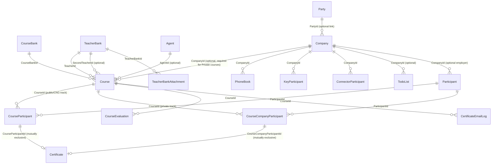

# Training System (Trn) — Overview & Shared Conventions

> Read this file first. It applies to every other spec file in this folder. Each numbered spec file (`01-...` … `10-...`) is otherwise self-contained, but assumes the schema code, enum tables, and conventions defined here.

## 1. Purpose

This is a migration spec set for bringing the legacy HTS ("Hts Project") **"سیستم آموزش" (Training System)** module into HavayarApp (the new .NET system), as a normal Panel CRUD module, following the exact same architecture as existing modules (`Sale`, `Rpr`, `Pln`, `Edms`, ...).

Source system: `D:\Projects\Hts Project\Hts Project\HtsProject\Presentation\WebApplication\HtsWebApplication\Areas\TrainingSystem\` (ASP.NET MVC5 + Kendo UI + DevExpress reports, EF6 Database-First).

Target system: `D:\Projects\Havayar\HavayarApp\` (ASP.NET Core MVC, EF Core Code-First, jQuery/Bootstrap Panel framework). See the workspace rules `havayar-add-new-page.mdc` and `havayar-js-jquery-conventions.mdc` for the canonical "add a new Panel page" workflow — every spec file below follows that workflow (Entity → Controller → Views → menu/permissions).

## 2. Schema / module naming

- New schema code: **`Trn`** (matches abbreviated schema modules like `Rpr`, `Pln`, `Sup`, `Bom`, `Inv`).
- C# namespace root: `Entities.App.Trn`
- Table schema in SQL Server: `Trn` (e.g. `[Trn].[Course]`)
- Controllers: `WebApp/Controllers/Dynamic/Trn/...Controller.cs`, route prefix `Panel/Trn/[controller]`
- Views: `WebApp/Views/Panel/Trn/{EntityName}/{Edit,List}.cshtml`
- Enums: `Entities/App/Trn/Enums/{Name}Enum.cs`
- Menu group in the new Panel: a new top-level (or nested, TBD by whoever wires up the menu) group named **"سیستم آموزش"**, mirroring the legacy menu structure (see §5).

All entities inherit `Entities.Base.BaseEntity` (gives `Id`, `CreatedById/Name`, `ModifiedById/Name`, `CreatedOnMiladiDateTime/ShamsiDateTime`, `ModifiedDateMiladiDateTime/ShamsiDateTime`, `IsActive`). **Do not** hand-rewrite audit fields (`CreatedUserId`, `CreatedDate`, `CreatedDateInText` in the legacy schema) — the framework fills these automatically via `unitOfWork.Repository<T>().SaveAsync/UpdateAsync`. Legacy code that force-overwrites `CreatedUserId`/`CreatedDate` on every Update is a legacy quirk and must **not** be ported — use the framework's real audit trail instead.

## 3. Scope

### In scope (this spec set covers all of these — one file each, see §6)
| Legacy entity/controller | New entity | Spec file |
|---|---|---|
| `Training_CourseBank` | `Trn.CourseBank` | `01-CourseBank.md` |
| `Training_TeacherBank` + `Training_TeacherBank_Attachment` | `Trn.TeacherBank` + `Trn.TeacherBankAttachment` | `02-TeacherBank.md` |
| `Training_Agent` | `Trn.Agent` | `03-Agent.md` |
| `Training_Company` + `Training_PhoneBook` + `Training_KeyParticipant` + `Training_ConnectorParticipant` + `Training_TodoList` | `Trn.Company` + `Trn.PhoneBook` + `Trn.KeyParticipant` + `Trn.ConnectorParticipant` + `Trn.TodoList` | `04-Company.md` |
| `Training_Participant` | `Trn.Participant` | `05-Participant.md` |
| `Training_Course` | `Trn.Course` | `06-Course.md` |
| `Training_CourseParticipant` + `Training_CourseCompanyParticipant` | `Trn.CourseParticipant` + `Trn.CourseCompanyParticipant` | `07-CourseParticipant-and-CourseCompanyParticipant.md` |
| `Training_CourseEvaluation` (+ views `VwTrainingCourseEvaluation*`) | `Trn.CourseEvaluation` | `08-CourseEvaluation.md` |
| `Training_Certificate` + `Training_CertificateEmailLog` + `Certificate1..10`/`Cng`/`CourseEvaluationChart` reports | `Trn.Certificate` + `Trn.CertificateEmailLog` + ReportBuilder templates | `09-Certificate-and-CertificateEmailLog.md` |
| `CourseReportController` + `ParticipantReportController` + statistical/total report | ReportBuilder SavedQuery-backed report pages | `10-Reports.md` |

### Explicitly out of scope (do NOT implement — documented here so the decision is traceable)
| Legacy item | Why excluded |
|---|---|
| `Training_Proposal`, `Training_ProposalCourse`, `ProposalController`, `_Proposal.cshtml` | Menu entry is commented out in legacy `_TrainingSystemMenu.cshtml`; feature is only partially built (course-linking junction table has zero application code); user decided to skip. |
| `Training_CourseInquiry`, `CourseInquiryController`, `_CourseInquiry.cshtml` | Same — menu entry commented out in legacy system; user decided to skip. |
| `Training_Financial`, `Training_FinancialDetail` | Schema exists in legacy DB but **zero controller/service/view/UI** anywhere — dead schema. Course-level financial tracking is covered by `Course.FinancialStatus` only (see `06-Course.md`). |
| `Training_TaskManager`, `Training_TaskManagerComment` | Schema exists but **no controller/view/menu anywhere** in the legacy codebase — never implemented. |
| `Training_University`, `Training_Software`, `Training_Language` (+ `UniversityManagementController`, `SoftwareManagementController`, `LanguageManagementController`) | Confirmed via code research: these are **not** part of the Training System menu at all — they live under the legacy **Human Resource System** menu and feed `HRM_Resume`/`HRM_StaffRequest` (HR recruitment), not the Training/Participant flow. Unrelated to this migration. |
| `_CourseTotalReport.cshtml` | Orphaned legacy view, never loaded by any controller action. Superseded by the live `_StatisticalReport.cshtml` flow (ported in `10-Reports.md`). |
| DevExpress report classes (`Certificate1.cs`…`Certificate10.cs`, `Cng.cs`, `CourseEvaluationChart.cs`) as **code** | Not ported as C# classes — HavayarApp has no DevExpress reporting; use the **ReportBuilder (Stimulsoft)** module instead (see §7 and `09-Certificate-and-CertificateEmailLog.md`). |

If the business later wants Proposal/CourseInquiry/Financial, add them as new spec files following the same pattern — do not silently add them while implementing the files above.

## 4. Entity relationship diagram (target system)



**Key business rule carried over from the legacy system:** a Course has two mutually-exclusive participant tracks depending on `ExecutingMethod`:
- **Public/CNG courses** (`ExecutingMethod = PublicCall`, or course belongs to the CNG course field) → participants registered via `CourseParticipant`.
- **Private courses** (`ExecutingMethod = Private`) → participants registered via `CourseCompanyParticipant`, always tied to `Course.CompanyId`.

`Certificate` is a single shared entity; exactly one of `CourseParticipantId` / `CourseCompanyParticipantId` is set per row (the other stays null) — same as the legacy schema.

## 5. Legacy menu structure → new Panel menu (for reference; actual menu/permission wiring is done by whoever assigns roles per `havayar-add-new-page.mdc` Steps 7–9, not part of these entity/controller/view specs)

```
سیستم آموزش (Training System)
├── اطلاعات پایه (Base Information)
│   ├── بانک‌ها (Banks)
│   │   ├── بانک دوره‌ها (CourseBank)      → 01-CourseBank.md
│   │   └── بانک مدرسین (TeacherBank)      → 02-TeacherBank.md
│   └── مشتریان (Customers)
│       ├── حقوقی (Legal / Company)        → 04-Company.md
│       └── حقیقی (Real / Participant)     → 05-Participant.md
├── عملیات (Operation)
│   ├── تاریخچه مذاکرات (TodoList)         → 04-Company.md (§ standalone list)
│   └── دوره (Course)                      → 06-Course.md (+ 07, 08, 09 as course sub-pages)
└── گزارش‌ها (Reports)
    ├── گزارش دوره‌ها (CourseReport)        → 10-Reports.md
    ├── گزارش شرکت‌کنندگان (ParticipantReport) → 10-Reports.md
    └── گزارش آماری (StatisticalReport)     → 10-Reports.md
```

`Agent` (`03-Agent.md`) has no legacy menu entry either — it was only ever managed as a plain dropdown from the Course page. Give it a normal List/Edit page under Base Information anyway (a real master table needs a real CRUD page, even if the legacy UI never exposed one directly), and additionally allow selecting/creating it inline from the Course edit page exactly as the legacy system did.

## 6. Shared enum conversion table

The legacy system stores almost every "status/type" field as a `short` FK into a single generic `Gnr_Lookup` table (rows filtered by `LookupType_FK`). HavayarApp does **not** use a generic lookup table for this — it uses real C# enums with `[Display(Name = "...")]` per value (see `Entities/App/Sale/Enums/SaleOrderStatusEnum.cs` for the pattern). Every field below must become a proper enum in `Entities/App/Trn/Enums/`.

**Important:** the exact Persian label text and the *complete* set of values for each `LookupType_FK` below could not be extracted from static code analysis alone (the legacy system stores label text in `Gnr_Lookup` table rows, not in code). Before finalizing each enum, run this query against the legacy HTS database and use the real row set/labels for enum members:

```sql
SELECT gl.Lookup_ID, gl.Lookup_Title_Fa, gl.Lookup_Title_En, glt.LookupType_Title
FROM Gnr_Lookup gl
JOIN Gnr_LookupType glt ON gl.LookupType_FK = glt.LookupType_ID
WHERE gl.LookupType_FK = <TypeId>   -- e.g. 108
ORDER BY gl.Lookup_ID;
```

Confirmed values — queried 2026-09-09 from the legacy HTS database (`TotalSystem.dbo.Gnr_Lookup` joined to `Gnr_LookupType`, 81 rows total, exact Persian labels kept). Use the numeric `Lookup_ID` as the C# enum member value with `[Display(Name = "...")]` set to the Persian label.

| `LookupType_FK` (`LookupType_Title_Fa`) | Legacy field | Entity | New enum name | Confirmed values (`Lookup_ID` = Persian label) |
|---|---|---|---|---|
| 108 (وضعیت دوره) | `StatusId` | Course | `CourseStatusEnum` | `617` = برنامه ریزی, `618` = بازاریابی, `619` = در حال برگزاری, `620` = اجرا شده, `621` = به تعویق افتاده |
| 109 (وضعیت مالی دوره) | `FinancialStatusId` | Course | `CourseFinancialStatusEnum` | `622` = بدهکار, `623` = تسویه |
| 110 (وضعیت ثبت نام) | `ParticipantRegisterStatusId` | CourseParticipant | `ParticipantRegisterStatusEnum` | `624` = رزرو, `625` = قطعی |
| 113 (فراخوان دوره) | `ExecutingMethod` (stored as **free text**, not an FK — but `Gnr_Lookup` rows `635`/`636` confirm the only two labels) | Course | `CourseExecutingMethodEnum` | `PublicCall` = فراخوان عمومی (legacy row `635`), `Private` = اختصاصی (legacy row `636`). Convert the free-text field to a real enum in the new system. |
| 123 (نوع دوره سی ان جی) | `CngCourseType` | Course | `CourseTypeEnum` | `701` = آموزش و صدور, `702` = بازآموزی, `703` = گارانتی (Warranty), `1184` = آنلاین (Online), `2411` = سمینار آموزشی (Training Seminar), `2412` = هوایار سوخت (Havayar Fuel), `2787` = سمینار مشتریان حقوقی (Legal-Customers Seminar), `2788` = سمینار مشتریان حقیقی (Real-Customers Seminar). Note: two previously-unknown members discovered — `701` = آموزش و صدور, `702` = بازآموزی. Treat any other DB value as a generic/default type — needs a catch-all member, e.g. `General`. |
| 316 (روش برگزاری) | `MethodOfHoldingId` | Course | `CourseMethodOfHoldingEnum` | `2379` = اختصاصی, `2380` = آنلاین, `2381` = در محل شرکت هوایار |
| 319 (نحوه ارسال دعوت نامه) | `SendInvitationId` | Course | `CourseSendInvitationEnum` | `2390` = پست الکترونیک, `2391` = نمابر, `2392` = شبکه های اجتماعی |
| 320 (وضعیت گواهینامه پایان دوره آموزشی) | `CertificateStatusId` | Course | `CourseCertificateStatusEnum` | `2393` = صدور و ارسال, `2394` = عدم صدور, `2395` = صدور |
| 321 (نوع پرداخت) | `PaymentTypeId` | Course | `CoursePaymentTypeEnum` | `2396` = رایگان, `2397` = اخذ هزینه |
| 322 (وضعیت حضور) | `AttendanceStatusId` | Course | `CourseAttendanceStatusEnum` | `2398` = اعلام عدم نیاز, `2399` = عدم حضور, `2400` = حضور قطعی, `2401` = عدم پاسخگویی |
| 99 (زمینه دوره) | `CourseFieldId` | CourseBank | `CourseFieldEnum` | `502` = سی ان جی (CNG — drives `TRCNG` training-code prefix and CNG-specific certificate templates, see `06-Course.md` / `09-Certificate-and-CertificateEmailLog.md`), `504` = فنی مهندسی, `505` = سایر |
| 122 (نوع دوره) | `Type` | CourseBank | `CourseBankTypeEnum` | `698` = اپراتوری, `699` = تکنسینی, `700` = غیر سی ان جی |
| 100 (تحصیلات) | `EducationId` | TeacherBank, Participant | `EducationEnum` (shared) | `506` = دیپلم, `507` = فوق دیپلم, `508` = لیسانس, `509` = فوق لیسانس, `510` = دکترا, `2457` = فوق دکتری, `2458` = دانشجوی (فوق دیپلم), `2459` = دانشجوی (لیسانس), `2460` = دانشجوی (فوق لیسانس), `2461` = دانشجوی (دکتری) |
| 121 (جنسیت) | `Gender` | Participant | `GenderEnum` | `695` = آقا (Male), `696` = خانم (Female) — only two rows exist, matches the certificate-generation SQL salutation logic. |
| 103 (زمینه فعالیت شرکت) | `ActivityFieldId` | Company | *(optional — see `04-Company.md`, this field is loaded but never shown in the legacy UI)* | 29 rows confirmed: `542` = صنایع غذایی و آشامیدنی, `543` = فولاد, `544` = پزشکی, `545` = دارویی و بهداشتی, `546` = نساجی, `547` = صنایع خودرو, `548` = رنگ و رزین, `549` = سیمان, `550` = نفت، گاز، پالایش و پتروشیمی, `551` = صنایع شیمیایی, `552` = کاشی و سرامیک, `553` = بهداشتی و آرایشی, `554` = لاستیک و پلاستیک, `555` = نیروگاهی، برق و الکترونیک, `556` = سایر, `730` = آهن, `731` = سلولزی, `732` = آرد, `733` = ماشین آلات, `734` = چینی بهداشتی, `735` = صنایع چوب, `736` = تولید بتن, `737` = تولید کفش, `738` = صنعت شیشه, `739` = صنعت گچ, `740` = فرش و موکت, `741` = لوازم خانگی, `742` = لوله و اتصالات, `743` = چاپ و بسته بندی کاغذ. Still excluded from implementation unless the business asks (see `04-Company.md`). |

`Gnr_Lookup`-typed navigation properties in the legacy schema (`Gnr_City` for `Course.LocationId`, `HRM_OrgUnit` for `Course.RelatedUnitId`) map to **existing HavayarApp entities**, not new lookups:
- `Course.LocationId` (legacy FK → `Gnr_City`) → new FK to `Entities.App.Gnr.Region` (already used the same way by `Entities.App.SLS.Customer.City`).
- `Course.RelatedUnitId` (legacy FK → `HRM_OrgUnit`) → new FK to `Entities.App.Hrm.OrgUnit` (already exists in HavayarApp).
- `Agent.ZoneId` (legacy FK → `Crm_Zone`) → new FK to `Entities.App.Gnr.Region`, or a free-text field if a clean regional mapping doesn't make sense — decide per `03-Agent.md`.

## 7. Reporting strategy (see `havayar-reports.mdc`)

Pick the implementation from the kind of report — do **not** send everything through Stimulsoft:

- **Tabular** (filterable grid + Excel) → Data Profile on a List page (`havayar-dataprofile-savedquery.mdc`).
- **Charts / dashboard** → a dedicated Report page using the existing ApexCharts (`CourseStatisticalReport`, `PlnTimelyDeliveryReport`).
- **Print / certificates / official documents only** → ReportBuilder + Stimulsoft (`ReportBuilder.WebApp`, `ViewReport` / `ViewReportByName` / `StimulSoftViewReport`). Data from a SavedQuery or `ReportBuilderTable`. **No new C# report-rendering code** and no DevExpress/Crystal.

Certificate print layouts (`Certificate1`…`Certificate10`, `Cng`) stay Stimulsoft templates (see `09-Certificate-and-CertificateEmailLog.md`). On-screen statistical charts are **not** Stimulsoft — they are the ApexCharts page in `10-Reports.md`.

## 8. General implementation conventions (apply to every file below)

- **Controller pattern:** every entity gets a controller following the exact shape shown in `CourseController.cs` / `TeacherBankAttachmentController.cs`: `Save` (dispatches to Add/Update), `Add`, `Update`, `Delete`, `Edit(long? id)`, `New()`, `List()`, `FetchData` (DataTable), `ExportToExcel`. Add custom actions only for legacy business rules that don't fit plain CRUD (documented per-file).
- **Views:** `List.cshtml` = `<datatableprofile entity-Type="typeof(Entity)"></datatableprofile>`. `Edit.cshtml` = `form-action-buttons` + fields with `data-bind`/`asp-for` + `data-invalidmessagespan`, per `havayar-js-jquery-conventions.mdc`.
- **FK pickers:** always `Html.EntitySelector<TRelated>(...)`, never a plain server-rendered `<select>` for anything beyond a small enum.
- **Child entities (attachments, comments, phone book rows, etc.):** follow the `TeacherBankAttachment` / `PhoneBook` pattern — separate entity + own controller with `ListByParentId`/`ListBy?parentId=` view opened via `appController.addPage(...)` from a `form-action-buttons` button on the parent Edit page (see `Course/Edit.cshtml`'s `openSubPage` helper for the exact JS wiring pattern).
- **Business-rule triggers ("must always run on save regardless of caller"):** use a `WebApp/Actions/Trn/{Entity}Action.cs` class with `[EntityAction(...)]` per `havayar-add-new-page.mdc` §Step 4, not inline controller code, whenever the legacy rule is described as something that must happen on every save (e.g. capacity adjustment, training-code generation). Controller-only logic is fine for rules that are clearly page-specific one-off actions (e.g. a dedicated "Send Certificate Email" button).
- **Persian dates:** any legacy `*InText` Shamsi string field becomes the standard HavayarApp Shamsi/Miladi pair (`XxxShamsiDate` bound via `data-bind`, `XxxMiladiDate` bound via `value="@Model?.XxxMiladiDate"`) — never keep a legacy free-text date column.
- **File/attachment fields:** use `[DisplayInfo(..., type: SystemType.File, ...)]` + `FileEntity`, never a raw `byte[]` column (legacy `Attachment_FileContent byte[]` columns must become `FileEntity` FKs).
- **No service layer:** per project convention, write logic directly in controllers/Actions — do not introduce `Data/Services/Trn/...Service.cs` classes for these CRUD pages.

## 9. Suggested implementation order

Because of FK dependencies, implement in this order (matches the file numbering): `01-CourseBank` → `02-TeacherBank` → `03-Agent` → `04-Company` → `05-Participant` → `06-Course` → `07-CourseParticipant/CourseCompanyParticipant` → `08-CourseEvaluation` → `09-Certificate/CertificateEmailLog` → `10-Reports`.
